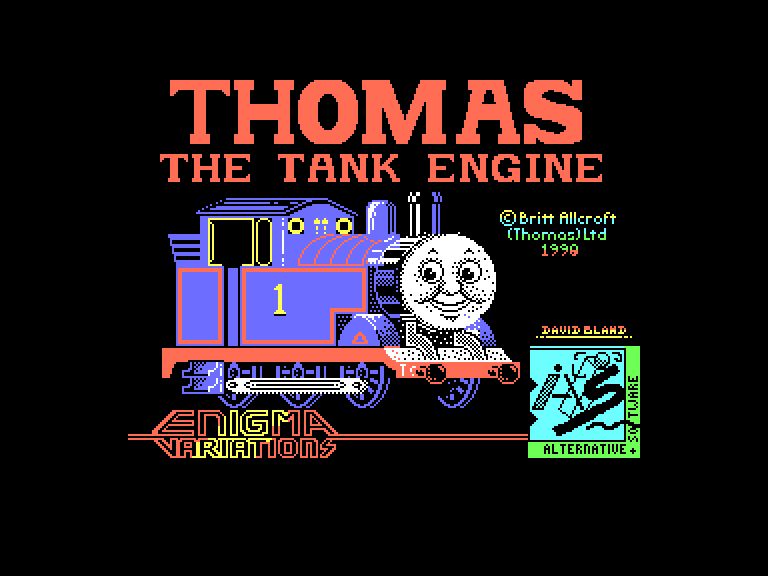
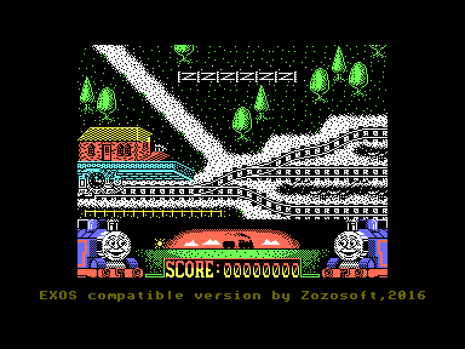
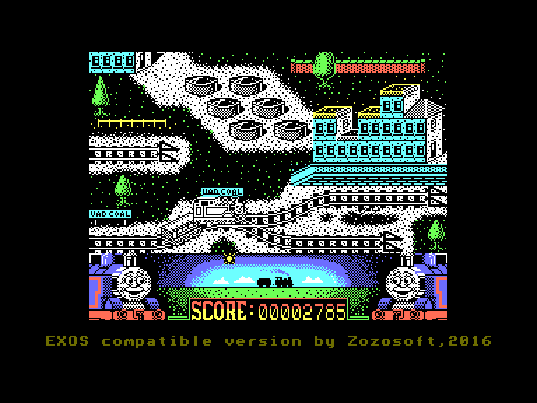
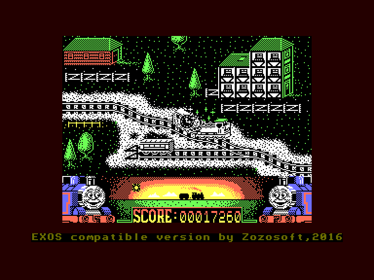

[0-9](../0/games-0.md) - [A](../a/games-a.md) - [B](../b/games-b.md) - [C](../c/games-c.md) - [D](../d/games-d.md) - [E](../e/games-e.md) - [F](../f/games-f.md) - [G](../g/games-g.md) - [H](../h/games-h.md) - [I](../i/games-i.md) - [J](../j/games-j.md) - [K](../k/games-k.md) - [L](../l/games-l.md) - [M](../m/games-m.md) - [N](../n/games-n.md) - [O](../o/games-o.md) - [P](../p/games-p.md) - [Q](../q/games-q.md) - [R](../r/games-r.md) - [S](../s/games-s.md) - [T](../t/games-t.md) - [U](../u/games-u.md) - [V](../v/games-v.md) - [W](../w/games-w.md) - [X](../x/games-x.md) - [Y](../y/games-y.md) - [Z](../z/games-z.md)

Ігри для [Enterprise 64k](../games-ep64.md) - [Enterprise 128k+RAMexp](../games-epramexp.md)

Ігри для систем [IS-DOS](../games-is-dos.md) - [SymbOS](../games-symbos.md) - [EDC Windows](../games-edcw.md)

Ігри для емуляторів [ZX Spectrum 48k/128k](../zxemu/games-zxemu.md) - [Amstrad CPC](../cpcemu/games-cpc.md) - [Sinclair ZX81](../zx81emu/games-zx81.md) - [Videoton TVC](../tvcemu/games-tvc.md) - [Commodore VIC-20](../vic20emu/games-vic20.md)

----------

# Thomas the Tank Engine & Friends

**Альтернативні назви:**
 - Thomas the Tank Engine

**ID:** thomas-the-tank-engine-zx

## Скріншоти

## Опис

(temporary description generated by AI [ChatGPT])

**Опис гри:**
У грі "Томас, паровозик" ви стаєте на місце веселого паровозика Томаса на цілий тиждень. Протягом цього часу вам потрібно виконати різноманітні завдання, такі як перевезення дітей на пляж, доставка ліків до лікарні, транспортування нафти на нафтопереробний завод, доставка пошти до міста, перевезення трактора до зруйнованого мосту, перевезення вугілля та дерев'яних балок до лісопилки. Завдання виконуються в будь-якому порядку, але їх потрібно завершити до заходу сонця.

**Правила гри:**
1. Щодня обирайте одне з доступних завдань, яке ще не виконали.
2. Починайте з лівого боку залізничної колії та рухайтеся вправо.
3. Прикріплюйте вантажний вагон, який знаходиться на півдорозі до вашої мети.
4. Уникайте зіткнень з іншими поїздами та перешкодами (великі камені) на колії.
5. Якщо ви зіткнетеся, ви можете повернутися на два екрани назад, але можливе повернення на початкову станцію.
6. Збирайте бонусні бали, які випадково розміщуються на колії.
7. Завершуйте завдання в межах відведеного часу, стежте за зміною дня на екрані гри.
8. Гра має два рівні складності: легкий (менше трафіку та без каменів) і нормальний (більше трафіку та камені).
9. Управління можливе з клавіатури або через Kempston/Sinclair адаптери.

Удачі на колії!

## Основна інформація
- **Оригінальна платформа:** ZX Spectrum

## Посилання
- [Опис гри на ep128.hu (угорською)](http://www.ep128.hu/Games/Thomas_the_Tank_Engine.htm)
- [Інформація про оригінальну версію](https://spectrumcomputing.co.uk/entry/5237/ZX-Spectrum/Thomas_the_Tank_Engine_Friends)
- [Завантажити гру](http://www.ep128.hu/Ep_Games/Prg/Thomas_the_Tank_Engine.rar)

