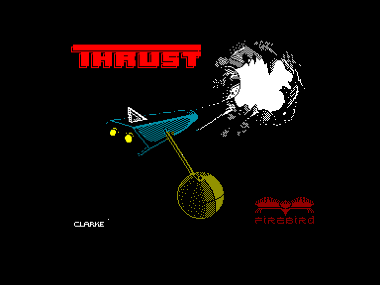
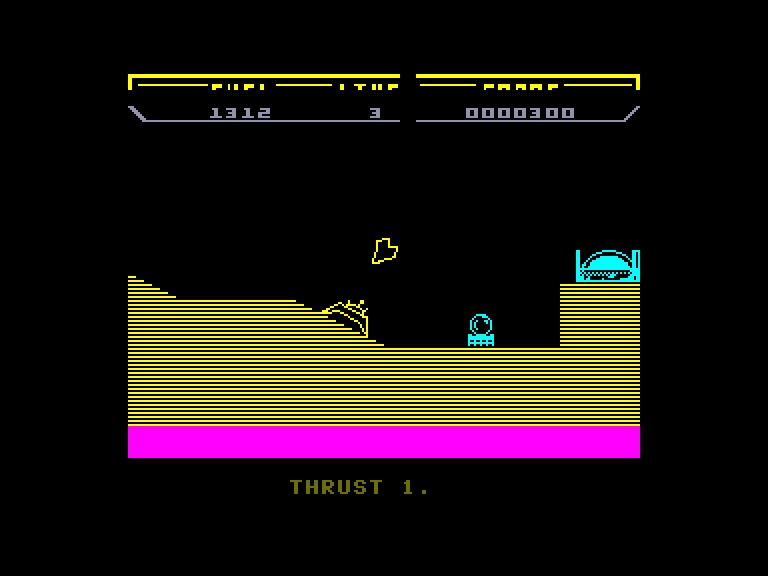
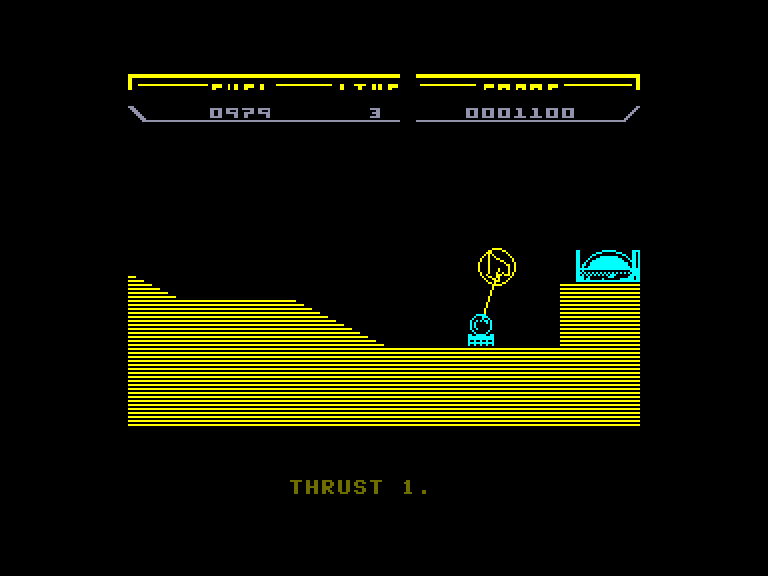
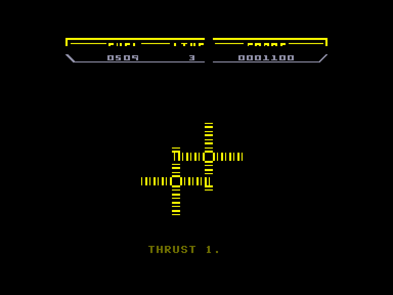

[0-9](../0/games-0.md) - [A](../a/games-a.md) - [B](../b/games-b.md) - [C](../c/games-c.md) - [D](../d/games-d.md) - [E](../e/games-e.md) - [F](../f/games-f.md) - [G](../g/games-g.md) - [H](../h/games-h.md) - [I](../i/games-i.md) - [J](../j/games-j.md) - [K](../k/games-k.md) - [L](../l/games-l.md) - [M](../m/games-m.md) - [N](../n/games-n.md) - [O](../o/games-o.md) - [P](../p/games-p.md) - [Q](../q/games-q.md) - [R](../r/games-r.md) - [S](../s/games-s.md) - [T](../t/games-t.md) - [U](../u/games-u.md) - [V](../v/games-v.md) - [W](../w/games-w.md) - [X](../x/games-x.md) - [Y](../y/games-y.md) - [Z](../z/games-z.md)

Ігри для [Enterprise 64k](../games-ep64.md) - [Enterprise 128k+RAMexp](../games-epramexp.md)

Ігри для систем [IS-DOS](../games-is-dos.md) - [SymbOS](../games-symbos.md) - [EDC Windows](../games-edcw.md)

Ігри для емуляторів [ZX Spectrum 48k/128k](../zxemu/games-zxemu.md) - [Amstrad CPC](../cpcemu/games-cpc.md) - [Sinclair ZX81](../zx81emu/games-zx81.md) - [Videoton TVC](../tvcemu/games-tvc.md) - [Commodore VIC-20](../vic20emu/games-vic20.md)

----------

# Thrust

**ID:** thrust-zx

## Скріншоти

## Опис

(temporary description generated by AI [ChatGPT])

**Опис гри:**

У грі "Thrust" ваше завдання полягає в тому, щоб викрасти загадковий Klystron Pod з добре захищених космічних станцій ворога. Ви керуєте маленьким, але потужним космічним кораблем, здатним до маневрування за допомогою ракетного двигуна. Гравці повинні враховувати обмежений запас пального та гравітацію Місяця, яка впливає на їхній корабель. Ваша мета — зібрати Klystron Pod і вийти з бази, уникаючи зіткнень з ворогами та обстрілу захисних гармат.

**Правила гри:**

1. **Управління кораблем:**
   - A - Поворот ліворуч
   - S - Поворот праворуч
   - I - Запуск двигуна (тримати натиснутим)
   - P - Вогонь
   - M - Підбір Klystron Pod / активація щита

2. **Обмеження:**
   - Пальне обмежене; закінчення пального призводить до закінчення гри.
   - Корабель може бути знищений при зіткненні з об'єктами або обстрілі гармат.

3. **Цілі:**
   - Зібрати Klystron Pod та покинути базу.
   - Обстрілювати атомну електростанцію для тимчасового зупинення гармат.
   - Уникайте надмірного обстрілу електростанції, щоб уникнути її вибуху.

4. **Набір очок:**
   - Знищення гармати: 750 очок
   - Знищення паливного резервуара: 150 очок
   - Підбір паливного резервуара: 300 очок
   - Знищення бази: 2000 очок

Використовуйте свої навички для успішного виконання місії та отримання високих балів!

## Основна інформація
- **Оригінальна платформа:** ZX Spectrum

## Посилання
- [Опис гри на ep128.hu (угорською)](http://www.ep128.hu/Games/Thrust.htm)
- [Інформація про оригінальну версію](https://spectrumcomputing.co.uk/entry/5245/ZX-Spectrum/Thrust)

