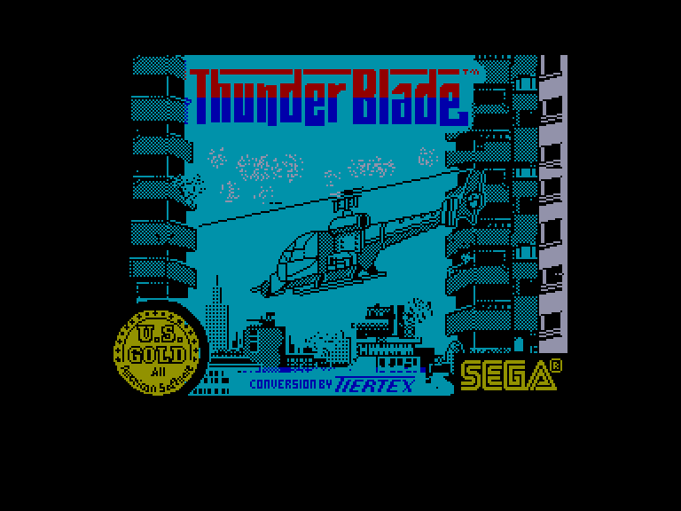
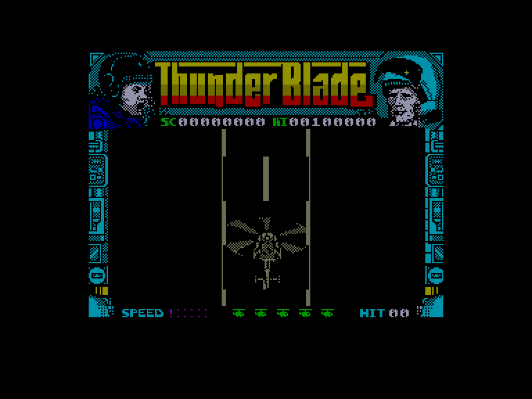
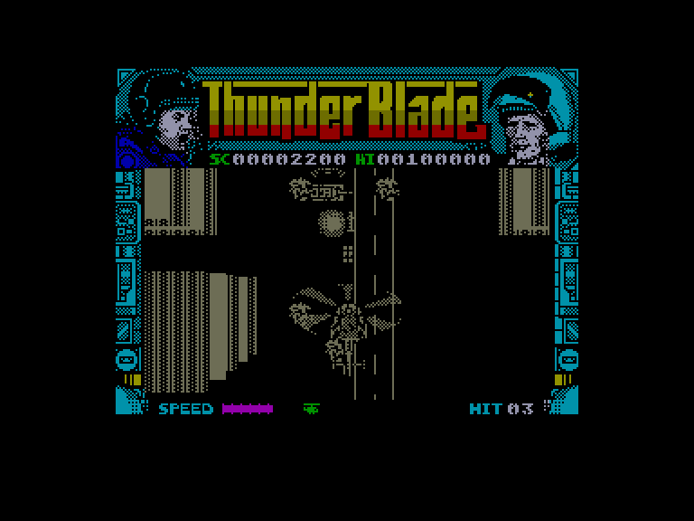
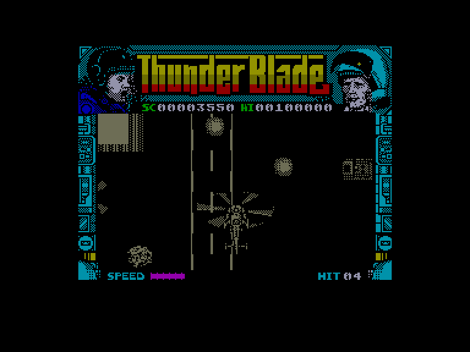

[0-9](../0/games-0.md) - [A](../a/games-a.md) - [B](../b/games-b.md) - [C](../c/games-c.md) - [D](../d/games-d.md) - [E](../e/games-e.md) - [F](../f/games-f.md) - [G](../g/games-g.md) - [H](../h/games-h.md) - [I](../i/games-i.md) - [J](../j/games-j.md) - [K](../k/games-k.md) - [L](../l/games-l.md) - [M](../m/games-m.md) - [N](../n/games-n.md) - [O](../o/games-o.md) - [P](../p/games-p.md) - [Q](../q/games-q.md) - [R](../r/games-r.md) - [S](../s/games-s.md) - [T](../t/games-t.md) - [U](../u/games-u.md) - [V](../v/games-v.md) - [W](../w/games-w.md) - [X](../x/games-x.md) - [Y](../y/games-y.md) - [Z](../z/games-z.md)

Ігри для [Enterprise 64k](../games-ep64.md) - [Enterprise 128k+RAMexp](../games-epramexp.md)

Ігри для систем [IS-DOS](../games-is-dos.md) - [SymbOS](../games-symbos.md) - [EDC Windows](../games-edcw.md)

Ігри для емуляторів [ZX Spectrum 48k/128k](../zxemu/games-zxemu.md) - [Amstrad CPC](../cpcemu/games-cpc.md) - [Sinclair ZX81](../zx81emu/games-zx81.md) - [Videoton TVC](../tvcemu/games-tvc.md) - [Commodore VIC-20](../vic20emu/games-vic20.md)

----------

# Thunder Blade

**ID:** thunder-blade-zx

## Скріншоти

## Опис

(temporary description generated by AI [ChatGPT])

**Thunder Blade** – це класична аркадна гра, випущена у 1988 році компанією US Gold для платформи Spectrum (48k). Гравець виступає в ролі пілота сучасного бойового вертольота, виконуючи небезпечні місії з метою знищення самопроголошеного диктатора, генерала Чоржельського, та його армії. Гра складається з трьох етапів, де потрібно атакувати різні цілі, такі як військові кораблі та великі наземні транспортні засоби.

**Правила гри:**
1. Гравець управляє вертольотом за допомогою клавіатури або джойстика. Рекомендується використовувати джойстик для зручності.
2. Гра має два режими управління швидкістю: 
   - **Joystick Speed Control**: швидкість регулюється комбінаціями клавіш.
   - **Keyboard Speed Control**: швидкість регулюється окремими клавішами 'E' та 'D'.
3. Гравець може запускати гру натисканням клавіші "вогонь" (SPACE).
4. Гра складається з трьох частин: 
   - Перша частина: вид зверху, з кулеметом і ракетами.
   - Друга частина: вид ззаду, лише з кулеметом.
   - Третя частина: бій з великим наземним транспортом.
5. Гравець втрачає життя, якщо його вертоліт підбивають або він зіткнеться з перешкодами.
6. В кінці кожного рівня гравець отримує бали в залежності від результатів.

Гра пропонує динамічний геймплей, але може бути складною через труднощі при цілевказуванні.

## Основна інформація
- **Оригінальна платформа:** ZX Spectrum

## Посилання
- [Опис гри на ep128.hu (угорською)](http://www.ep128.hu/Games/ThunderBlade.htm)
- [Інформація про оригінальну версію](https://spectrumcomputing.co.uk/entry/5249/ZX-Spectrum/Thunder_Blade)
- [Завантажити гру](http://www.ep128.hu/Ep_Games/Prg/Thunder_Blade.rar)

**Дата генерації:** 29.07.2026

