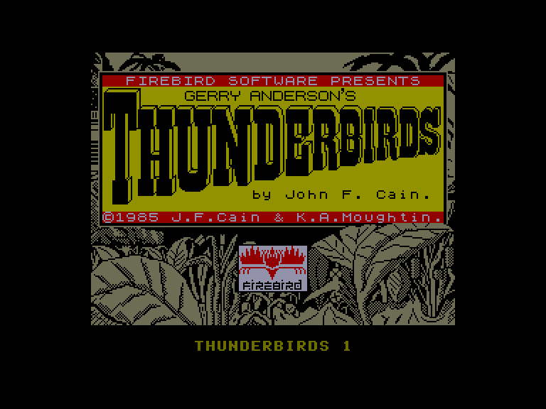
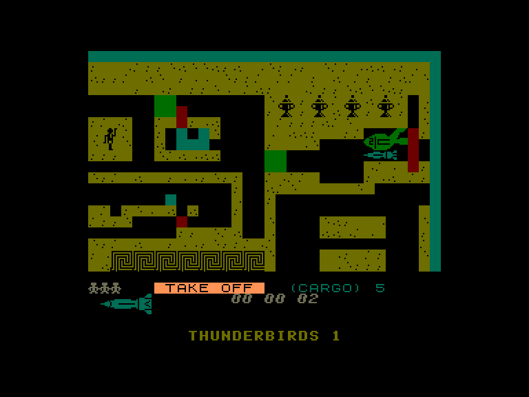
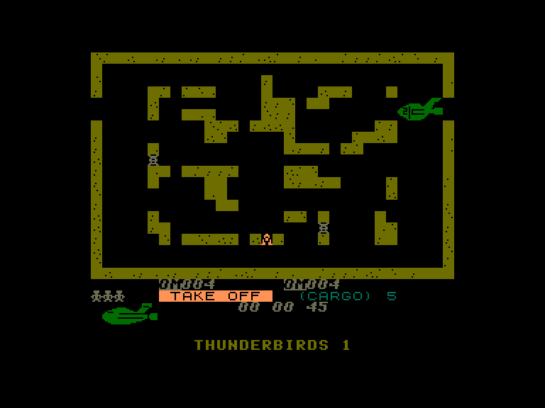
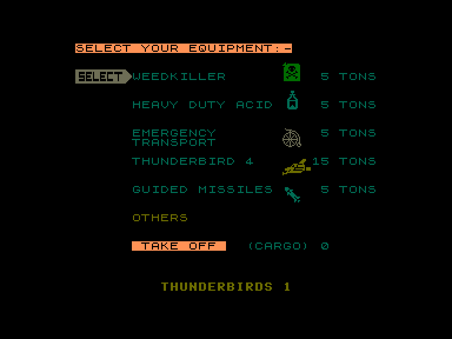

[0-9](../0/games-0.md) - [A](../a/games-a.md) - [B](../b/games-b.md) - [C](../c/games-c.md) - [D](../d/games-d.md) - [E](../e/games-e.md) - [F](../f/games-f.md) - [G](../g/games-g.md) - [H](../h/games-h.md) - [I](../i/games-i.md) - [J](../j/games-j.md) - [K](../k/games-k.md) - [L](../l/games-l.md) - [M](../m/games-m.md) - [N](../n/games-n.md) - [O](../o/games-o.md) - [P](../p/games-p.md) - [Q](../q/games-q.md) - [R](../r/games-r.md) - [S](../s/games-s.md) - [T](../t/games-t.md) - [U](../u/games-u.md) - [V](../v/games-v.md) - [W](../w/games-w.md) - [X](../x/games-x.md) - [Y](../y/games-y.md) - [Z](../z/games-z.md)

Ігри для [Enterprise 64k](../games-ep64.md) - [Enterprise 128k+RAMexp](../games-epramexp.md)

Ігри для систем [IS-DOS](../games-is-dos.md) - [SymbOS](../games-symbos.md) - [EDC Windows](../games-edcw.md)

Ігри для емуляторів [ZX Spectrum 48k/128k](../zxemu/games-zxemu.md) - [Amstrad CPC](../cpcemu/games-cpc.md) - [Sinclair ZX81](../zx81emu/games-zx81.md) - [Videoton TVC](../tvcemu/games-tvc.md) - [Commodore VIC-20](../vic20emu/games-vic20.md)

----------

# Thunderbirds

**ID:** thunderbirds-fb-zx

## Скріншоти

## Опис

(temporary description generated by AI [ChatGPT])

**Опис гри: Thunderbirds**

Thunderbirds — це гра-головоломка для одного гравця. Гравець бере на себе роль рятувальної команди, яка повинна врятувати групу єгиптологів, що застрягли в стародавній гробниці. Вони потребують допомоги, оскільки їх запас повітря закінчується. Гравець повинен вибрати обладнання для завантаження в літальний апарат Thunderbird 2, враховуючи обмеження по вазі та вартість кожної тонни. Після запуску гравець керує літаком через лабіринти гробниці, очищаючи шляхи від блоків різного кольору та управляючи паливом, яке використовується під час польоту. Гравець також може збирати скарби, які залишилися від попередніх експедицій.

**Правила гри:**
1. Виберіть обладнання для завантаження в Thunderbird 2, враховуючи обмеження по вазі.
2. Керуйте літаком через лабіринти гробниці, використовуючи різні Thunderbird для переміщення блоків:
   - Thunderbird 1 — для синіх блоків.
   - Thunderbird 2 — для зелених блоків.
   - Обидва можуть переміщувати червоні блоки.
3. Управляйте паливом, щоб не вичерпати його під час польоту.
4. Збирайте скарби, які можуть допомогти в рятувальній операції.
5. Грайте на кольорових або чорно-білих моніторах, використовуючи клавіатуру або джойстик. 

Успіх у грі залежить від стратегічного управління ресурсами та вміння вирішувати головоломки.

## Основна інформація
- **Оригінальна платформа:** ZX Spectrum

## Посилання
- [Інформація про оригінальну версію](https://spectrumcomputing.co.uk/entry/5253/ZX-Spectrum/Thunderbirds)
- [Завантажити гру](http://www.ep128.hu/Ep_Games/Prg/Thunderbirds_(Firebirds).rar)

**Дата генерації:** 29.07.2026

