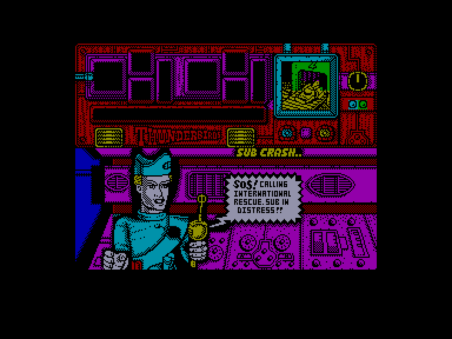
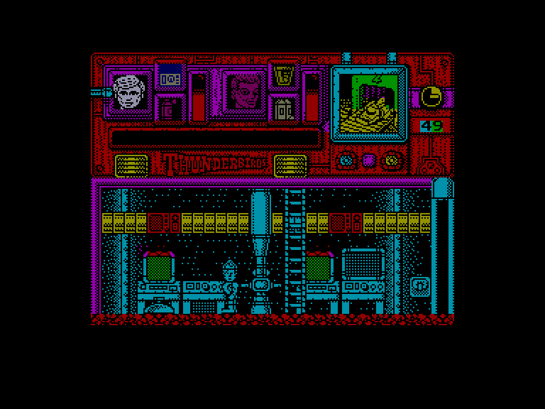
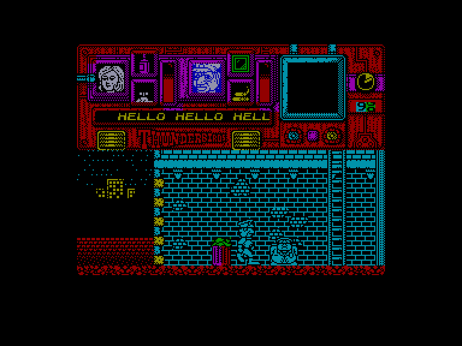
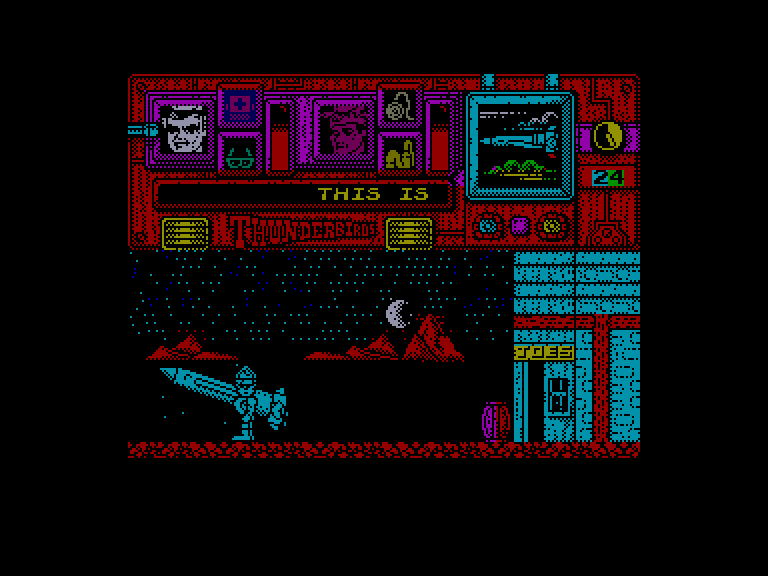

[0-9](../0/games-0.md) - [A](../a/games-a.md) - [B](../b/games-b.md) - [C](../c/games-c.md) - [D](../d/games-d.md) - [E](../e/games-e.md) - [F](../f/games-f.md) - [G](../g/games-g.md) - [H](../h/games-h.md) - [I](../i/games-i.md) - [J](../j/games-j.md) - [K](../k/games-k.md) - [L](../l/games-l.md) - [M](../m/games-m.md) - [N](../n/games-n.md) - [O](../o/games-o.md) - [P](../p/games-p.md) - [Q](../q/games-q.md) - [R](../r/games-r.md) - [S](../s/games-s.md) - [T](../t/games-t.md) - [U](../u/games-u.md) - [V](../v/games-v.md) - [W](../w/games-w.md) - [X](../x/games-x.md) - [Y](../y/games-y.md) - [Z](../z/games-z.md)

Ігри для [Enterprise 64k](../games-ep64.md) - [Enterprise 128k+RAMexp](../games-epramexp.md)

Ігри для систем [IS-DOS](../games-is-dos.md) - [SymbOS](../games-symbos.md) - [EDC Windows](../games-edcw.md)

Ігри для емуляторів [ZX Spectrum 48k/128k](../zxemu/games-zxemu.md) - [Amstrad CPC](../cpcemu/games-cpc.md) - [Sinclair ZX81](../zx81emu/games-zx81.md) - [Videoton TVC](../tvcemu/games-tvc.md) - [Commodore VIC-20](../vic20emu/games-vic20.md)

----------

# Thunderbirds

**ID:** thunderbirds-zx

## Скріншоти

## Опис

(temporary description generated by AI [your name])

**Thunderbirds** – це гра, основана на популярному ляльковому серіалі, що розповідає про команду International Rescue, яка рятує людей у різних небезпечних ситуаціях. Гравець керує двома членами команди у кожному епізоді, вирішуючи головоломки та використовуючи предмети для виконання місій.

**Правила гри:**
1. Гравець вибирає двох персонажів з команди для виконання завдань.
2. У кожному епізоді доступні лише певні предмети, які можна використовувати для розв'язання головоломок.
3. Гравець повинен чергувати персонажів, щоб використовувати їхні унікальні здібності.
4. Час виконання завдання обмежений, тому потрібно діяти швидко.
5. Епізоди виконуються послідовно, і для доступу до наступного потрібно ввести код, отриманий в кінці попереднього епізоду. 

Гра включає чотири епізоди: 
1. Рятування в шахті
2. Аварія підводного човна
3. Напад на банк
4. Зупинка ракетного запуску

## Основна інформація
- **Оригінальна платформа:** ZX Spectrum

## Посилання
- [Опис гри на ep128.hu (угорською)](http://www.ep128.hu/Games/Thunderbirds.htm)
- [Інформація про оригінальну версію](https://spectrumcomputing.co.uk/entry/5255/ZX-Spectrum/Thunderbirds)
- [Завантажити гру](http://www.ep128.hu/Ep_Games/Prg/Thunderbirds_(Grandslam).rar)

