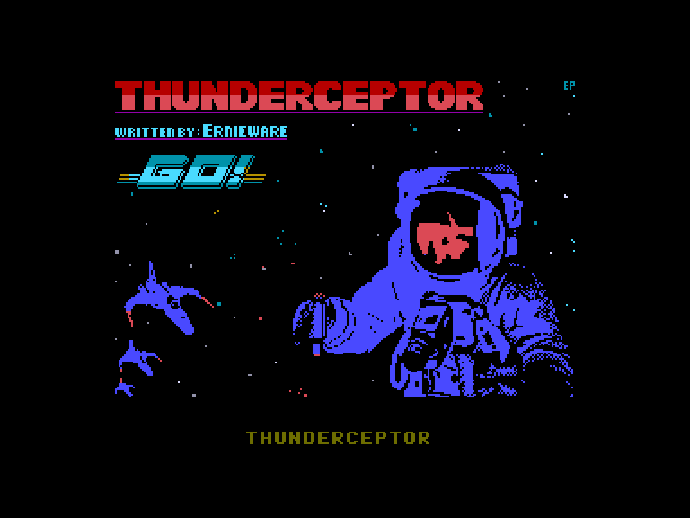
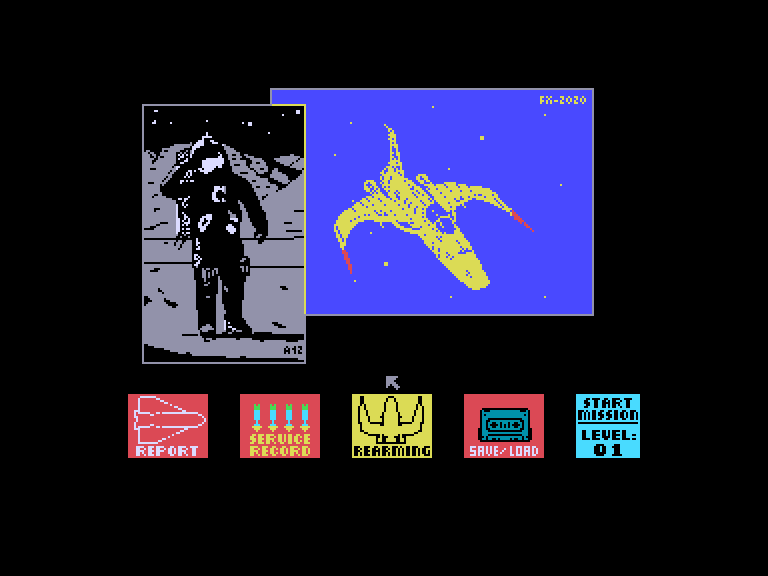
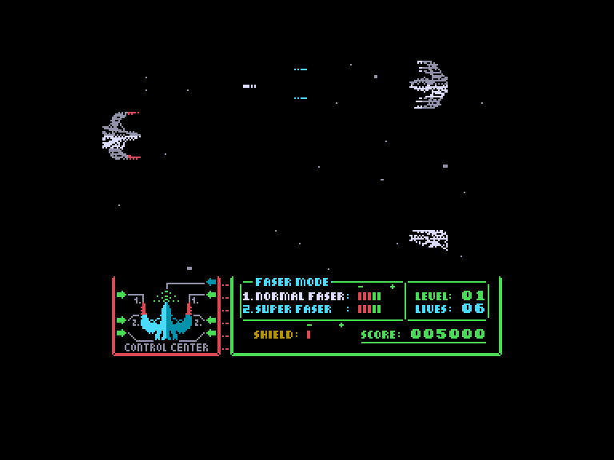
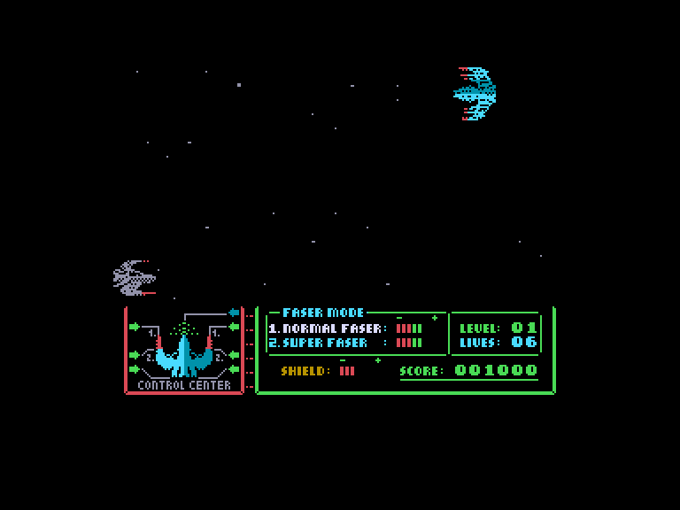

[0-9](../0/games-0.md) - [A](../a/games-a.md) - [B](../b/games-b.md) - [C](../c/games-c.md) - [D](../d/games-d.md) - [E](../e/games-e.md) - [F](../f/games-f.md) - [G](../g/games-g.md) - [H](../h/games-h.md) - [I](../i/games-i.md) - [J](../j/games-j.md) - [K](../k/games-k.md) - [L](../l/games-l.md) - [M](../m/games-m.md) - [N](../n/games-n.md) - [O](../o/games-o.md) - [P](../p/games-p.md) - [Q](../q/games-q.md) - [R](../r/games-r.md) - [S](../s/games-s.md) - [T](../t/games-t.md) - [U](../u/games-u.md) - [V](../v/games-v.md) - [W](../w/games-w.md) - [X](../x/games-x.md) - [Y](../y/games-y.md) - [Z](../z/games-z.md)

Ігри для [Enterprise 64k](../games-ep64.md) - [Enterprise 128k+RAMexp](../games-epramexp.md)

Ігри для систем [IS-DOS](../games-is-dos.md) - [SymbOS](../games-symbos.md) - [EDC Windows](../games-edcw.md)

Ігри для емуляторів [ZX Spectrum 48k/128k](../zxemu/games-zxemu.md) - [Amstrad CPC](../cpcemu/games-cpc.md) - [Sinclair ZX81](../zx81emu/games-zx81.md) - [Videoton TVC](../tvcemu/games-tvc.md) - [Commodore VIC-20](../vic20emu/games-vic20.md)

----------

# Thunderceptor

**ID:** thunderceptor-zx

## Скріншоти

## Опис

(temporary description generated by AI [ChatGPT])

**Опис гри: 1987 - Go!**

1987 - Go! — це захоплююча гра в жанрі космічного шутера, де гравці беруть на себе роль пілота космічного корабля, стикаючись із ворогами та небезпечними метеоритами. Хоча гра не пропонує нових ідей у жанрі, її відзначає відмінна графіка та швидка реакція. Гравці можуть налаштувати управління, обираючи з кількох варіантів, і використовувати різні іконки в головному меню для досягнення своїх цілей.

**Правила гри:**

1. **Управління:** Перед початком гри виберіть спосіб управління. Після цього доступ до цього меню більше не буде можливий.
2. **Меню:** У грі є п'ять основних ікон:
   - **REPORT:** Перегляньте схеми ворожих кораблів та статистику знищених ворогів.
   - **SERVICE RECORD:** Перегляньте свої досягнення та бали.
   - **REARMING:** Перерозподіліть енергію між трьома системами зброї: нормальний лазер, суперлазер та щит.
   - **SAVE / LOAD:** Збережіть або завантажте прогрес гри.
   - **START MISSION:** Розпочніть нову місію.
3. **Геймплей:** Знищуйте ворожі кораблі, ухиляйтесь від метеоритів. Ворожі кораблі витримують більше ударів, ніж ваш.
4. **Енергія:** Слідкуйте за енергією своїх лазерів. Якщо енергія закінчиться, ви не зможете стріляти.
5. **Ушкодження:** Ваш щит може витримати лише кілька ударів. Уникайте зіткнень з ворожими снарядами та метеоритами.
6. **Стратегія:** Обирайте, на які кораблі варто витрачати енергію, адже більші кораблі потребують більше зусиль для знищення.

Гра пропонує вражаючу візуалізацію, проте може швидко набриднути через одноманітність місій.

## Основна інформація
- **Оригінальна платформа:** ZX Spectrum

## Посилання
- [Опис гри на ep128.hu (угорською)](http://www.ep128.hu/Games/Thunderceptor.htm)
- [Інформація про оригінальну версію](https://spectrumcomputing.co.uk/entry/5263/ZX-Spectrum/Thunderceptor)
- [Завантажити гру](http://www.ep128.hu/Ep_Games/Prg/Thunderceptor.rar)

