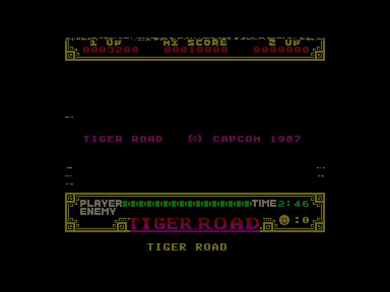
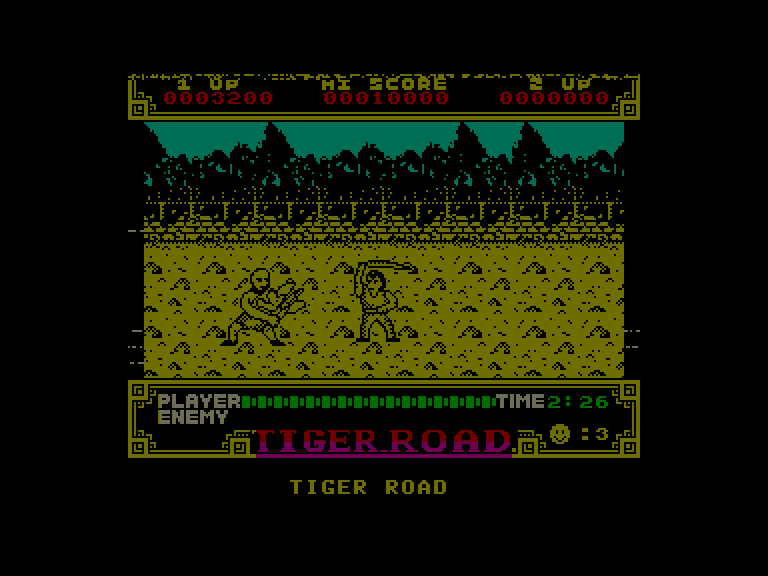
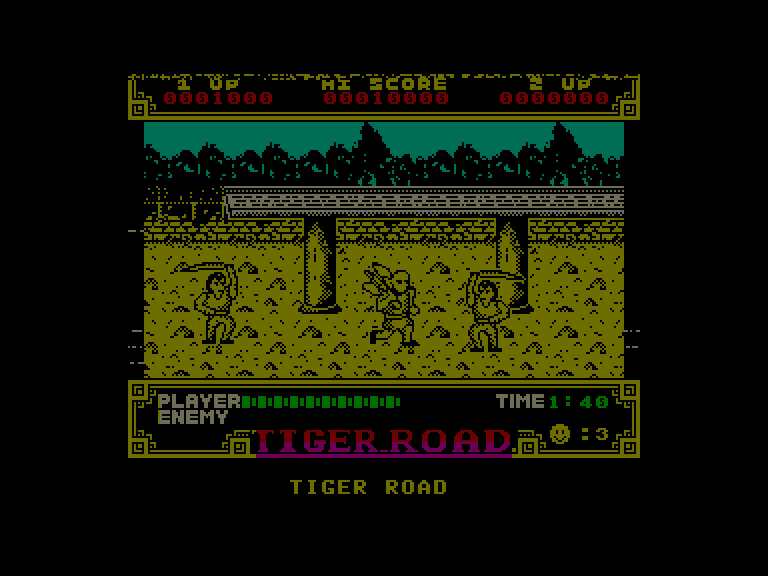
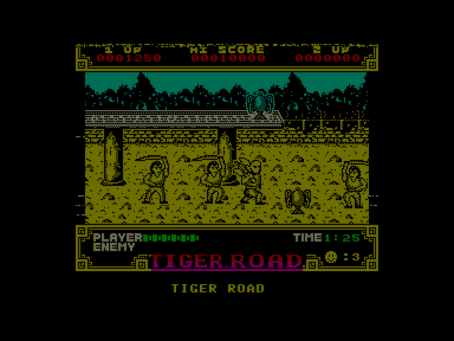

[0-9](../0/games-0.md) - [A](../a/games-a.md) - [B](../b/games-b.md) - [C](../c/games-c.md) - [D](../d/games-d.md) - [E](../e/games-e.md) - [F](../f/games-f.md) - [G](../g/games-g.md) - [H](../h/games-h.md) - [I](../i/games-i.md) - [J](../j/games-j.md) - [K](../k/games-k.md) - [L](../l/games-l.md) - [M](../m/games-m.md) - [N](../n/games-n.md) - [O](../o/games-o.md) - [P](../p/games-p.md) - [Q](../q/games-q.md) - [R](../r/games-r.md) - [S](../s/games-s.md) - [T](../t/games-t.md) - [U](../u/games-u.md) - [V](../v/games-v.md) - [W](../w/games-w.md) - [X](../x/games-x.md) - [Y](../y/games-y.md) - [Z](../z/games-z.md)

Ігри для [Enterprise 64k](../games-ep64.md) - [Enterprise 128k+RAMexp](../games-epramexp.md) - [2dfx](../games-2dfx.md)

Ігри для систем [IS-DOS](../games-is-dos.md) - [SymbOS](../games-symbos.md) - [EDC Windows](../games-edcw.md)

Ігри для емуляторів [ZX Spectrum 48k/128k](../zxemu/games-zxemu.md) - [Amstrad CPC](../cpcemu/games-cpc.md) - [Sinclair ZX81](../zx81emu/games-zx81.md) - [Videoton TVC](../tvcemu/games-tvc.md) - [Commodore VIC-20](../vic20emu/games-vic20.md)

----------

# Tiger Road

**ID:** tiger-road-zx

## Скріншоти

## Опис

(temporary description generated by AI [your name])

**Опис гри: Tiger Road**

У грі "Tiger Road" ви берете на себе роль самурая, який має врятувати двох дітей, викрадених злим Руй Кеном. Гра поділена на вісім сцен, у кожній з яких вам потрібно перемогти ворогів, що атакують з обох боків, і подолати різні перешкоди. Використовуючи свою бойову сокиру, ви повинні знищити ворогів, уникати їх атак і збирати зброю, щоб посилити свої можливості. Якщо ваша енергія закінчується, ви втрачаєте життя, і вам доведеться починати сцену спочатку.

**Правила гри:**
1. Гра лінійна, ви рухаєтеся тільки вправо, уникаючи ворогів.
2. Вороги можуть бути знищені одним або кількома ударами, в залежності від їх сили.
3. Збирайте зброю, щоб покращити свої шанси в бою, хоча це не завжди призводить до значного збільшення шкоди.
4. Якщо ваша енергія закінчується, ви втрачаєте життя і починаєте сцену знову.
5. У грі немає можливості відновлення енергії, але іноді ви отримуєте додаткове життя як винагороду.
6. Для управління використовуйте клавіші, призначені у меню (1 - один гравець, 2 - два гравці, 3 - вибір клавіатури, 4 - KEMPSTON, 5 - SINCLAIR).

Ваша мета - досягти фіналу, перемігши всіх ворогів і здолавши Руй Кена, щоб звільнити дітей.

## Основна інформація
- **Оригінальна платформа:** ZX SPectrum

## Посилання
- [Опис на ep128.hu (угорською)](http://www.ep128.hu/Games/Tiger_Road.htm)
- [Інформація про оригінальну версію](https://spectrumcomputing.co.uk/entry/9439/ZX-Spectrum/Tiger_Road)
- [Завантажити](http://www.ep128.hu/Ep_Games/Prg/Tiger_Road.rar)

