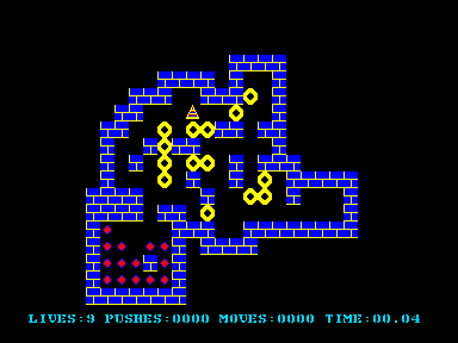
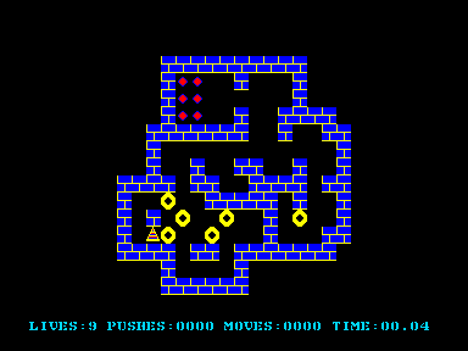

[0-9](../0/games-0.md) - [A](../a/games-a.md) - [B](../b/games-b.md) - [C](../c/games-c.md) - [D](../d/games-d.md) - [E](../e/games-e.md) - [F](../f/games-f.md) - [G](../g/games-g.md) - [H](../h/games-h.md) - [I](../i/games-i.md) - [J](../j/games-j.md) - [K](../k/games-k.md) - [L](../l/games-l.md) - [M](../m/games-m.md) - [N](../n/games-n.md) - [O](../o/games-o.md) - [P](../p/games-p.md) - [Q](../q/games-q.md) - [R](../r/games-r.md) - [S](../s/games-s.md) - [T](../t/games-t.md) - [U](../u/games-u.md) - [V](../v/games-v.md) - [W](../w/games-w.md) - [X](../x/games-x.md) - [Y](../y/games-y.md) - [Z](../z/games-z.md)

Ігри для [Enterprise 64k](../games-ep64.md) - [Enterprise 128k+RAMexp](../games-epramexp.md)

Ігри для систем [IS-DOS](../games-is-dos.md) - [SymbOS](../games-symbos.md) - [EDC Windows](../games-edcw.md)

Ігри для емуляторів [ZX Spectrum 48k/128k](../zxemu/games-zxemu.md) - [Amstrad CPC](../cpcemu/games-cpc.md) - [Sinclair ZX81](../zx81emu/games-zx81.md) - [Videoton TVC](../tvcemu/games-tvc.md) - [Commodore VIC-20](../vic20emu/games-vic20.md)

----------

# Tili-Toli

**ID:** tili-toli

## Скріншоти

## Опис

(temporary description generated by AI [ChatGPT])

**Опис гри: Tili-Toli**

Tili-Toli — це захоплююча гра в жанрі Soko-Ban, що вийшла в оригінальній версії Eo у 1989 році. Гра має привабливу графіку та супроводжується приємною музикою. Гравці повинні переміщати ящики в складних кімнатах, вирішуючи завдання, які потребують логічного мислення. 

**Правила гри:**
1. Гравець керує кольоровим трикутником, який замінює персонажа.
2. Мета гри — розмістити всі ящики в призначених для них місцях.
3. Якщо ви зробили помилку, натисніть ESC, щоб повернутися на один крок назад.
4. Якщо ситуація стане безвихідною, натисніть STOP, щоб почати рівень спочатку (один раз за життя).
5. Музику можна вмикати/вимикати за допомогою клавіш F7/F8.
6. Гра починається після натискання кнопки на джойстику, попередньо вибравши рівень складності.
7. У грі є 33 складних рівні, і гравці можуть змагатися за високі результати, які відображаються на таблиці лідерів.

Гра Tili-Toli обіцяє багато викликів і вимагає терпіння та стратегічного мислення!

## Посилання
- [Опис гри на ep128.hu (угорською)](http://www.ep128.hu/Ep_Games/Leiras/TiliToli.htm)
- [Завантажити гру](http://www.ep128.hu/Ep_Games/Prg/Tilitoli.rar)

