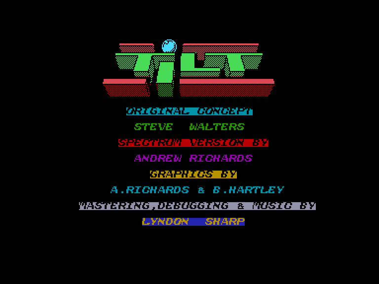
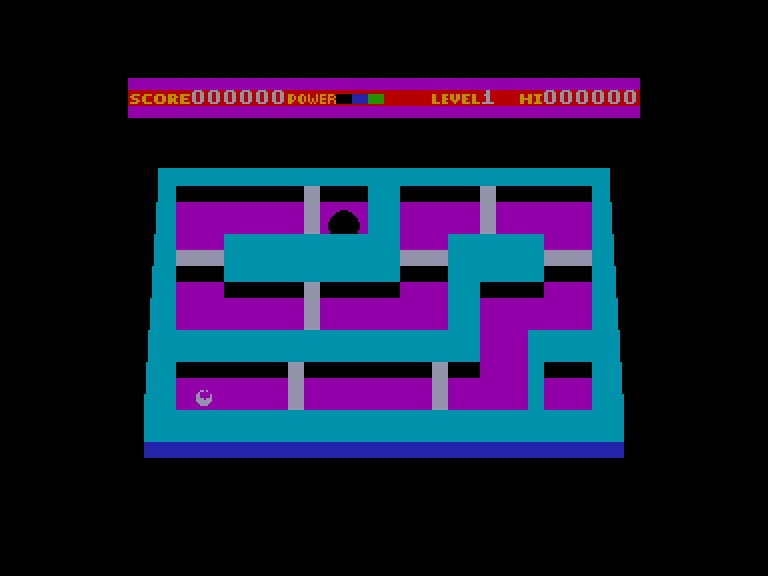

[0-9](../0/games-0.md) - [A](../a/games-a.md) - [B](../b/games-b.md) - [C](../c/games-c.md) - [D](../d/games-d.md) - [E](../e/games-e.md) - [F](../f/games-f.md) - [G](../g/games-g.md) - [H](../h/games-h.md) - [I](../i/games-i.md) - [J](../j/games-j.md) - [K](../k/games-k.md) - [L](../l/games-l.md) - [M](../m/games-m.md) - [N](../n/games-n.md) - [O](../o/games-o.md) - [P](../p/games-p.md) - [Q](../q/games-q.md) - [R](../r/games-r.md) - [S](../s/games-s.md) - [T](../t/games-t.md) - [U](../u/games-u.md) - [V](../v/games-v.md) - [W](../w/games-w.md) - [X](../x/games-x.md) - [Y](../y/games-y.md) - [Z](../z/games-z.md)

Ігри для [Enterprise 64k](../games-ep64.md) - [Enterprise 128k+RAMexp](../games-epramexp.md)

Ігри для систем [IS-DOS](../games-is-dos.md) - [SymbOS](../games-symbos.md) - [EDC Windows](../games-edcw.md)

Ігри для емуляторів [ZX Spectrum 48k/128k](../zxemu/games-zxemu.md) - [Amstrad CPC](../cpcemu/games-cpc.md) - [Sinclair ZX81](../zx81emu/games-zx81.md) - [Videoton TVC](../tvcemu/games-tvc.md) - [Commodore VIC-20](../vic20emu/games-vic20.md)

----------

# Tilt

**ID:** tilt-zx

## Скріншоти

## Опис

(temporary description generated by AI [ChatGPT])

**Опис гри: Tilt**

Tilt — це класична гра на вміння, де гравець повинен провести кулю через лабіринт, нахиляючи ігрове поле. Гравець може нахиляти поле в восьми різних напрямках, включаючи діагональні. Гра містить чотири різних таблиці, але завдяки варіаціям воріт, доступні 16 рівнів складності. Гравець повинен уникати зіткнень зі стінами та ворітьми, які відкриваються на короткий час.

**Правила гри:**
1. Нахиляйте ігрове поле, щоб перемістити кулю до фінішу.
2. Уникайте зіткнень зі стінами та ворітьми.
3. Використовуйте кнопку "вогонь" для відкриття воріт.
4. Гра вимірює вашу енергію (POWER); кожне нахилення зменшує енергію.
5. Якщо енергія вичерпується, гра закінчується.
6. Повернення до стартової позиції відбувається після зіткнення, але вже відкриті ворота не з'являться знову.
7. Отримуйте енергію за досягнення цілі та подолані ворота.

**Управління:**
- 0 - вогонь (запуск кулі, відкриття воріт)
- K - вгору
- M - вниз
- Z - вліво
- X - вправо
- Q - вихід з гри

Для версії Enterprise управління можливе лише за допомогою джойстика, клавіатура не працює (окрім клавіші Q).

## Основна інформація
- **Мови:** Англійська
- **Оригінальна платформа:** ZX Spectrum

## Посилання
- [Опис гри на ep128.hu (угорською)](http://www.ep128.hu/Games/Tilt.htm)
- [Інформація про оригінальну версію](https://spectrumcomputing.co.uk/entry/9440/ZX-Spectrum/Tilt)
- [Завантажити гру](http://www.ep128.hu/Ep_Games/Prg/Tilt.rar)

