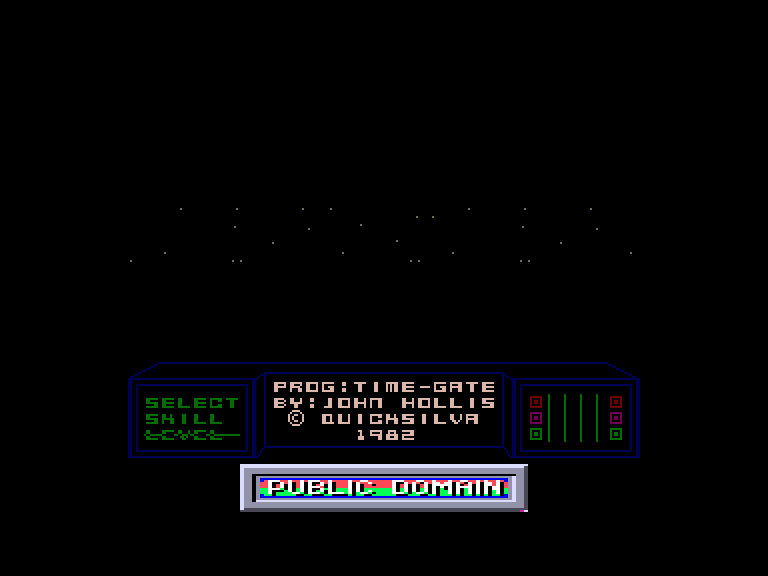
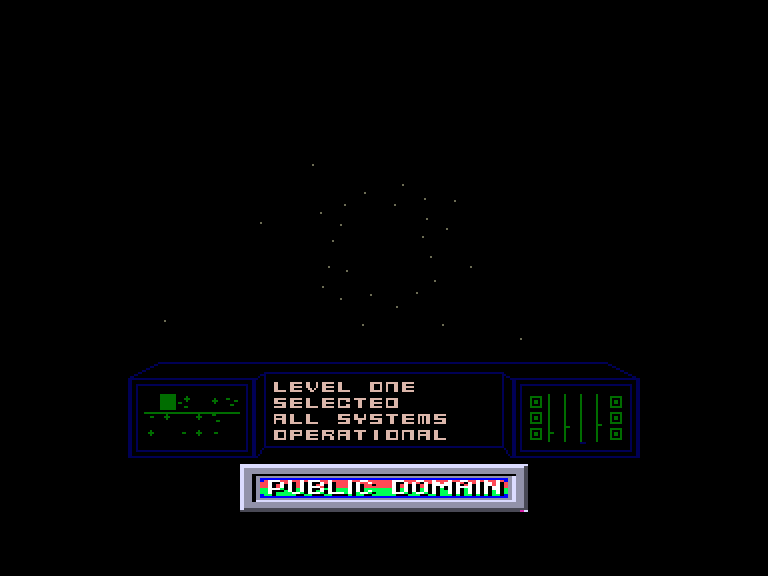
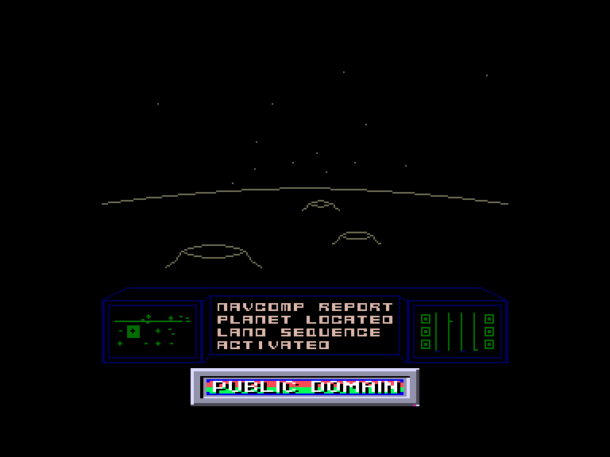

[0-9](../0/games-0.md) - [A](../a/games-a.md) - [B](../b/games-b.md) - [C](../c/games-c.md) - [D](../d/games-d.md) - [E](../e/games-e.md) - [F](../f/games-f.md) - [G](../g/games-g.md) - [H](../h/games-h.md) - [I](../i/games-i.md) - [J](../j/games-j.md) - [K](../k/games-k.md) - [L](../l/games-l.md) - [M](../m/games-m.md) - [N](../n/games-n.md) - [O](../o/games-o.md) - [P](../p/games-p.md) - [Q](../q/games-q.md) - [R](../r/games-r.md) - [S](../s/games-s.md) - [T](../t/games-t.md) - [U](../u/games-u.md) - [V](../v/games-v.md) - [W](../w/games-w.md) - [X](../x/games-x.md) - [Y](../y/games-y.md) - [Z](../z/games-z.md)

Ігри для [Enterprise 64k](../games-ep64.md) - [Enterprise 128k+RAMexp](../games-epramexp.md) - [2dfx](games-2dfx.md)

Ігри для систем [IS-DOS](../games-is-dos.md) - [SymbOS](../games-symbos.md) - [EDC Windows](../games-edcw.md)

Ігри для емуляторів [ZX Spectrum 48k/128k](../zxemu/games-zxemu.md) - [Amstrad CPC](../cpcemu/games-cpc.md) - [Sinclair ZX81](../zx81emu/games-zx81.md) - [Videoton TVC](../tvcemu/games-tvc.md) - [Commodore VIC-20](../vic20emu/games-vic20.md)

----------

# Time-Gate

**ID:** time-gate-zx

## Скріншоти

## Опис

(temporary description generated by AI [ChatGPT])

**Опис гри: Timegate**

Timegate — це класична гра, випущена у 1982 році компанією Quicksilva для Sinclair Spectrum. Гравець виступає в ролі космічного пілота, чия місія полягає в очищенні галактики від ворожих космічних кораблів. Гра має простий інтерфейс і управління, що робить її доступною для новачків, але при цьому вона пропонує цікаві виклики.

**Правила гри:**

1. **Вибір рівня складності:** Після завантаження гри натисніть клавіші 1-5, щоб вибрати рівень складності.
2. **Управління:** 
   - Ліва панель показує 18 секторів, які потрібно захищати. Ваш корабель розташований у миготливому секторі.
   - Використовуйте клавішу L для вибору нового сектора та J для стрибка до нього.
   - Клавіші 6-9 використовуються для пошуку ворожих кораблів, а клавіша 0 — для атаки.
   - Якщо ваш корабель пошкоджено, натисніть P для приземлення на планету для ремонту.
3. **Моніторинг стану:** Слідкуйте за станом вашого корабля за допомогою індикаторів на правій панелі. Зелений — в порядку, фіолетовий — незначні пошкодження, червоний — серйозні пошкодження, синій — знищений.
4. **Мета гри:** Знищити всі ворожі кораблі у вашій галактиці, після чого ви зможете перейти в іншу галактику через часову браму.

Гра пропонує просте, але захоплююче космічне пригода, що дозволяє гравцям відчути себе справжніми космічними героями.

## Основна інформація
- **Оригінальна платформа:** ZX Spectrum

## Посилання
- [Опис на ep128.hu (угорською)](http://www.ep128.hu/Games/Timegate.htm)
- [Інформація про оригінальну версію](https://spectrumcomputing.co.uk/entry/5286/ZX-Spectrum/Time-Gate)
- [Завантажити](http://www.ep128.hu/Ep_Games/Prg/TimeGate.rar)

