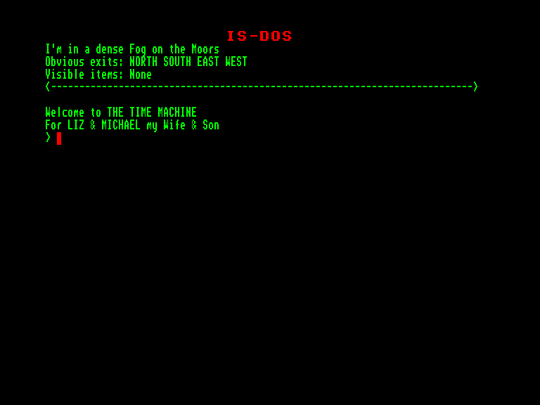
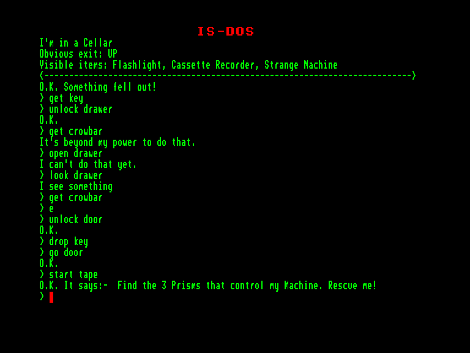
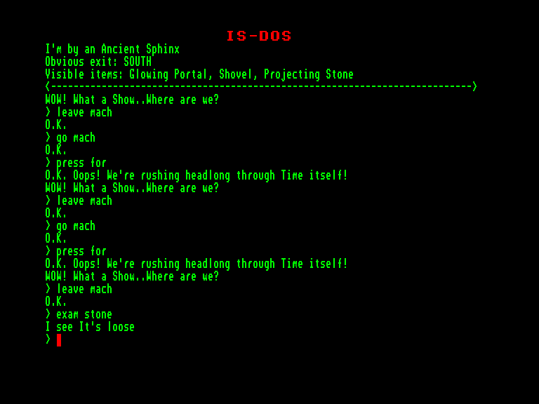

[0-9](../0/games-0.md) - [A](../a/games-a.md) - [B](../b/games-b.md) - [C](../c/games-c.md) - [D](../d/games-d.md) - [E](../e/games-e.md) - [F](../f/games-f.md) - [G](../g/games-g.md) - [H](../h/games-h.md) - [I](../i/games-i.md) - [J](../j/games-j.md) - [K](../k/games-k.md) - [L](../l/games-l.md) - [M](../m/games-m.md) - [N](../n/games-n.md) - [O](../o/games-o.md) - [P](../p/games-p.md) - [Q](../q/games-q.md) - [R](../r/games-r.md) - [S](../s/games-s.md) - [T](../t/games-t.md) - [U](../u/games-u.md) - [V](../v/games-v.md) - [W](../w/games-w.md) - [X](../x/games-x.md) - [Y](../y/games-y.md) - [Z](../z/games-z.md)

Ігри для [Enterprise 64k](../games-ep64.md) - [Enterprise 128k+RAMexp](../games-epramexp.md) - [2dfx](../games-2dfx.md)

Ігри для систем [IS-DOS](../games-is-dos.md) - [SymbOS](../games-symbos.md) - [EDC Windows](../games-edcw.md)

Ігри для емуляторів [ZX Spectrum 48k/128k](../zxemu/games-zxemu.md) - [Amstrad CPC](../cpcemu/games-cpc.md) - [Sinclair ZX81](../zx81emu/games-zx81.md) - [Videoton TVC](../tvcemu/games-tvc.md) - [Commodore VIC-20](../vic20emu/games-vic20.md)

----------

# The Time Machine

**Альтернативні назви:**
 - Mysterious Adventures 2 - The Time Machine

**ID:** time-machine-zcode

**Жанри:** Текстова пригода

## Примітка

ℹ Мультиплатформенна гра на рушії Z-machine від Infocom.

## Скріншоти

## Опис

Як місцевому репортеру новин газети «Tulkingham & Dunsby Gazette», вашу роботу навряд чи можна назвати «захопливою». Власне, найяскравішим моментом вашої журналістської діяльності за останні кілька років був випадок, коли кіт мера застряг на даху ратуші, а місцевим пожежникам довелося згаяти чотири ганебні години, намагаючись його врятувати. Відтоді запанувала цілковита нудьга, і практично жодної вартої уваги історії більше не траплялося.  

Тому з великим ентузіазмом ви вирушаєте на це нове завдання — розслідувати дивні події навколо старого будинку на Вересових звалищах...  

Першою зупинкою у вашому завданні став будинок Вентвортів — саме вони першими висловили занепокоєння щодо дивних подій. Від Вентвортів ви дізналися, що будинок на звалищах нещодавно придбав якийсь доктор Поттер, екцентричний науковець, який тримався абсолютно осторонь від усіх і рідко з кимось розмовляв. Занепокоєння Вентвортів викликали поодинокі «дивні спалахи світла», що лунали з будинку, та «химерні звуки». Одно разу Вентвортам навіть здалося, що вони бачили фігуру в лицарських обладунках, яка ходила навколо будинку, хоча вони й зізналися, що того вечора був сильний туман, а самі вони поверталися з вечірки.  

Зараз ви перебуваєте на Вересових звалищах і без особливого успіху шукаєте старий будинок. Густий туман огорнув звалища, і стемніло. Попри залишки ентузіазму, ви вже кілька годин блукаєте колами й починаєте трохи хвилюватися...

## Основна інформація
- **Мови:** Англійська
### Загальні системні вимоги
- **Апаратні:** EXDOS
- **Програмні:** IS-DOS
### Геймплей
- **Керування:** Keyboard
- **Кількість гравців:** 1 player
- **Додаткові теги:** Z-code
### Розробка
- **Рік випуску:** 1981
- **Автор:** Brian Howarth

## Посилання
- [Інформація про гру (SolutionArchive.com)](https://solutionarchive.com/game/id%2C545/Time+Machine%2C+The.html)
- [Завантажити](https://www.ifarchive.org/if-archive/games/inform/mysterious_inform.zip)

## [Керування](../controllers.md)

`Keyboard`

## Детальна інформація

### Історія розробки  

Друга гра у серії «Mysterious Adventures»  

Браян Гаварт написав свої одинадцять текстових пригод «Mysterious Adventures» у 1981–1983 роках, початково як суто текстові ігри (саме так вони представлені тут). Пізніші версії (Spectrum, C64) мали контурну графіку. Усі файли даних є конверсіями з версій для Spectrum/C64 (але без графіки). Браян Гаварт дав свій дозвіл на завантаження ігор до IF Archive.