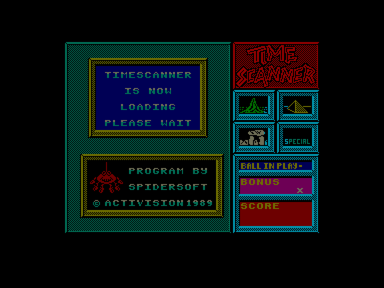
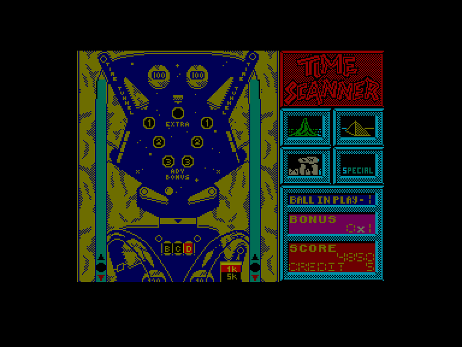
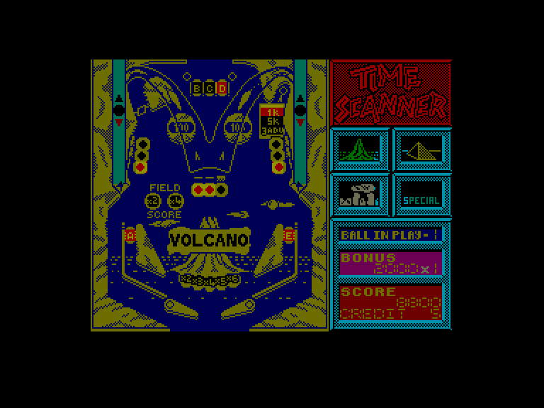

[0-9](../0/games-0.md) - [A](../a/games-a.md) - [B](../b/games-b.md) - [C](../c/games-c.md) - [D](../d/games-d.md) - [E](../e/games-e.md) - [F](../f/games-f.md) - [G](../g/games-g.md) - [H](../h/games-h.md) - [I](../i/games-i.md) - [J](../j/games-j.md) - [K](../k/games-k.md) - [L](../l/games-l.md) - [M](../m/games-m.md) - [N](../n/games-n.md) - [O](../o/games-o.md) - [P](../p/games-p.md) - [Q](../q/games-q.md) - [R](../r/games-r.md) - [S](../s/games-s.md) - [T](../t/games-t.md) - [U](../u/games-u.md) - [V](../v/games-v.md) - [W](../w/games-w.md) - [X](../x/games-x.md) - [Y](../y/games-y.md) - [Z](../z/games-z.md)

Ігри для [Enterprise 64k](../games-ep64.md) - [Enterprise 128k+RAMexp](../games-epramexp.md)

Ігри для систем [IS-DOS](../games-is-dos.md) - [SymbOS](../games-symbos.md) - [EDC Windows](../games-edcw.md)

Ігри для емуляторів [ZX Spectrum 48k/128k](../zxemu/games-zxemu.md) - [Amstrad CPC](../cpcemu/games-cpc.md) - [Sinclair ZX81](../zx81emu/games-zx81.md) - [Videoton TVC](../tvcemu/games-tvc.md) - [Commodore VIC-20](../vic20emu/games-vic20.md)

----------

# Time Scanner

**ID:** time-scanner-zx

## Скріншоти

## Опис

(temporary description generated by AI [Assistant])

**Опис гри:**
Time Scanner — це захоплююча гра в стилі фліппера, що дозволяє гравцям подорожувати через час, рятуючись від чорної діри через різні рівні. Гравці мають виконувати різні завдання на кожному з чотирьох рівнів, щоб просунутися далі в грі.

**Правила гри:**
1. **Вулкан:** Активуйте всі літери в слові "VOLCANO", прокочуючи м'яч через прозорі доріжки над вулканом. Коли всі лампочки загоряться, вулкан вибухне, і м'яч потрібно направити в один з часопросторових тунелів.
2. **Саккара:** Загоріть всі лампочки вгорі, а потім направте м'яч у канал для збору кульок, щоб збудувати піраміду. Коли піраміда буде готова, випустіть три кульки в тунель часу.
3. **Руїни:** Направте м'яч у центральний канал для збору кульок. Після збору двох кульок і знищення всіх стін, ви отримаєте вогняну кулю. Надішліть її в канал, щоб звільнити всі три кульки.
4. **Спеціальний рівень:** Послідовно знищуйте літери в слові "SPECIAL".

Гра має всі елементи, які ви очікуєте від якісного фліппера, включаючи тристороннє вібрування столу. Гравці можуть грати одночасно з трьома кульками, насолоджуючись чудовою музикою та звуковими ефектами. 

**Керування:**
- **Фліпери:** W, O (Spectrum) / SHIFT (Enterprise)
- **Вібрація столу:** O, P, SPACE (Spectrum) / joystick (Enterprise)
- **Початок гри:** ENTER
- **Пауза:** H (Spectrum) / HOLD (Enterprise)
- **Вихід з гри:** BREAK (Spectrum) / U + I (Enterprise)

На версії Enterprise гравці можуть отримати безкінечні кульки, натиснувши клавішу 'ESC' під час гри. 

Гравці можуть вибрати рівень, натиснувши відповідні цифри (1-4) після завантаження файлу "TSCANNER.TRN".

## Основна інформація
- **Оригінальна платформа:** ZX Spectrum

## Посилання
- [Опис гри на ep128.hu (угорською)](http://www.ep128.hu/Games/Time_Scanner.htm)
- [Інформація про оригінальну версію](https://spectrumcomputing.co.uk/entry/5279/ZX-Spectrum/Time_Scanner)
- [Завантажити гру](http://www.ep128.hu/Ep_Games/Prg/Time_Scanner.rar)

