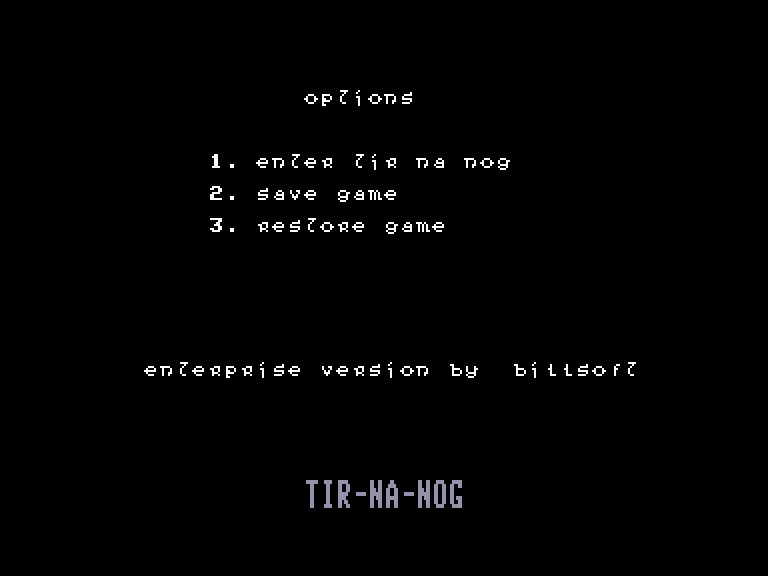
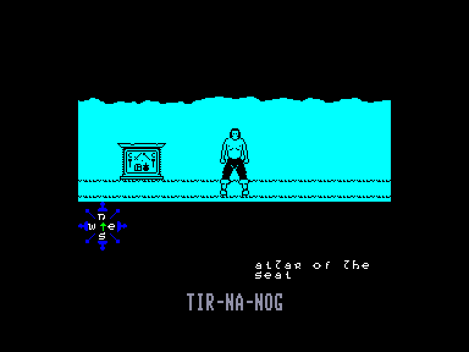
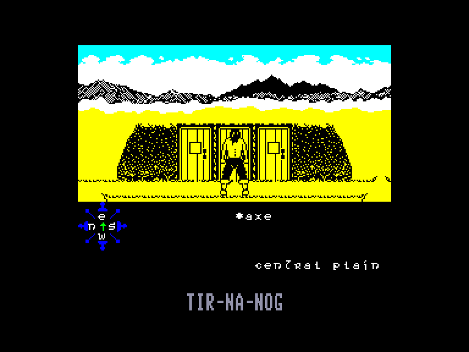
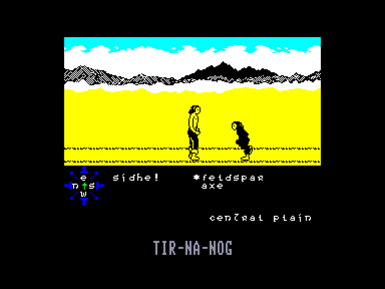

[0-9](../0/games-0.md) - [A](../a/games-a.md) - [B](../b/games-b.md) - [C](../c/games-c.md) - [D](../d/games-d.md) - [E](../e/games-e.md) - [F](../f/games-f.md) - [G](../g/games-g.md) - [H](../h/games-h.md) - [I](../i/games-i.md) - [J](../j/games-j.md) - [K](../k/games-k.md) - [L](../l/games-l.md) - [M](../m/games-m.md) - [N](../n/games-n.md) - [O](../o/games-o.md) - [P](../p/games-p.md) - [Q](../q/games-q.md) - [R](../r/games-r.md) - [S](../s/games-s.md) - [T](../t/games-t.md) - [U](../u/games-u.md) - [V](../v/games-v.md) - [W](../w/games-w.md) - [X](../x/games-x.md) - [Y](../y/games-y.md) - [Z](../z/games-z.md)

Ігри для [Enterprise 64k](../games-ep64.md) - [Enterprise 128k+RAMexp](../games-epramexp.md)

Ігри для систем [IS-DOS](../games-is-dos.md) - [SymbOS](../games-symbos.md) - [EDC Windows](../games-edcw.md)

Ігри для емуляторів [ZX Spectrum 48k/128k](../zxemu/games-zxemu.md) - [Amstrad CPC](../cpcemu/games-cpc.md) - [Sinclair ZX81](../zx81emu/games-zx81.md) - [Videoton TVC](../tvcemu/games-tvc.md) - [Commodore VIC-20](../vic20emu/games-vic20.md)

----------

# Tir Na Nog

**ID:** tir-na-nog-zx

## Скріншоти

## Опис

(temporary description generated by AI Assistant)

**Опис гри: Tir-Na-Nog**

Tir-Na-Nog — це класична комп'ютерна гра в жанрі пригод, випущена у 1984 році компанією Gargoyle. Гравець управляє персонажем на ім'я Кухулін, і його мета — подорожувати в містичний світ Тір На Ног, щоб отримати мову для свого народу, зустрічаючи при цьому різних істот і вирішуючи головоломки.

**Правила гри:**
1. **Управління:** Використовуйте клавіші 'Z' та 'X' для переміщення Кухуліна вліво та вправо відповідно. Для доступу до меню натисніть '6'.
2. **Збір предметів:** Ви можете підбирати предмети, натискаючи 'Q', та залишати їх, натискаючи 'W'. У вас може бути до 4 предметів одночасно.
3. **Взаємодія з об'єктами:** Деякі двері відкриваються тільки при наявності певних предметів. Досліджуйте світ, щоб знайти необхідні предмети.
4. **Смерть персонажа:** Якщо Кухулін зустрічає небезпеку, його можуть знищити, і він повернеться до початкової точки — ALTAR OF THE SEAL. 
5. **Використання предметів:** Кожен предмет має своє призначення, і їх правильне використання є ключем до проходження гри.

Досліджуйте незвичайний світ Тір На Ног, вирішуйте головоломки та виконуйте завдання, щоб повернутися до живих!

## Основна інформація
- **Оригінальна платформа:** ZX Spectrum

## Посилання
- [Опис гри на ep128.hu (угорською)](http://www.ep128.hu/Games/TirNaNog.htm)
- [Інформація про оригінальну версію](https://spectrumcomputing.co.uk/entry/5292/ZX-Spectrum/Tir_Na_Nog)
- [Завантажити гру](http://www.ep128.hu/Ep_Games/Prg/TirNaNog.rar)

