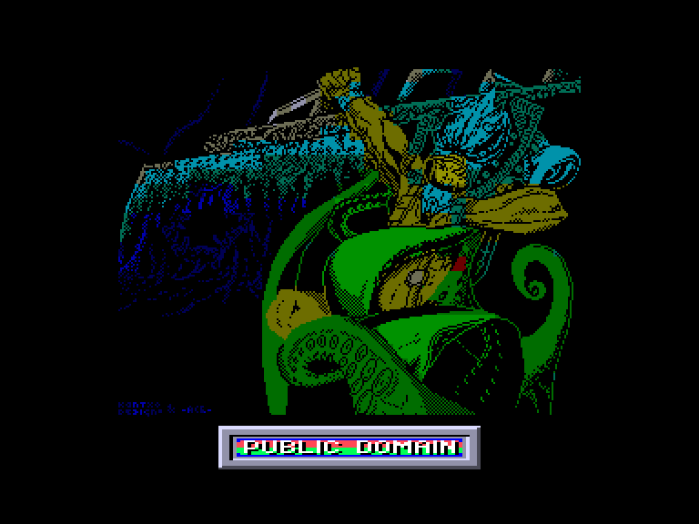
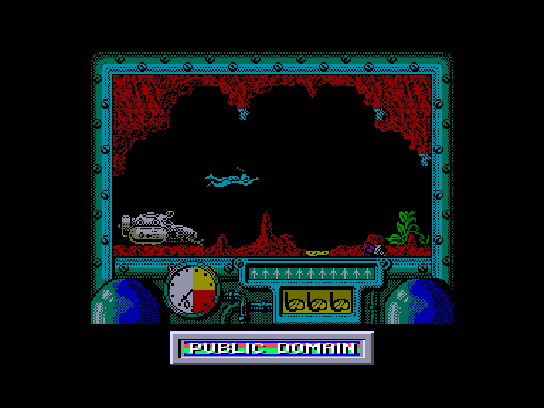
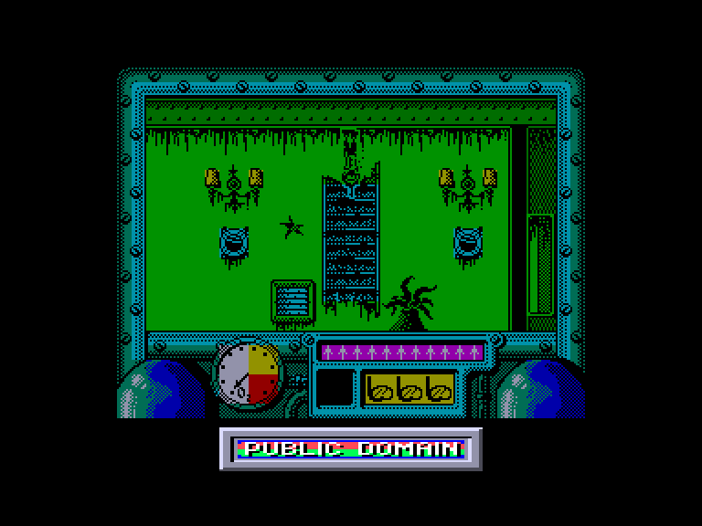
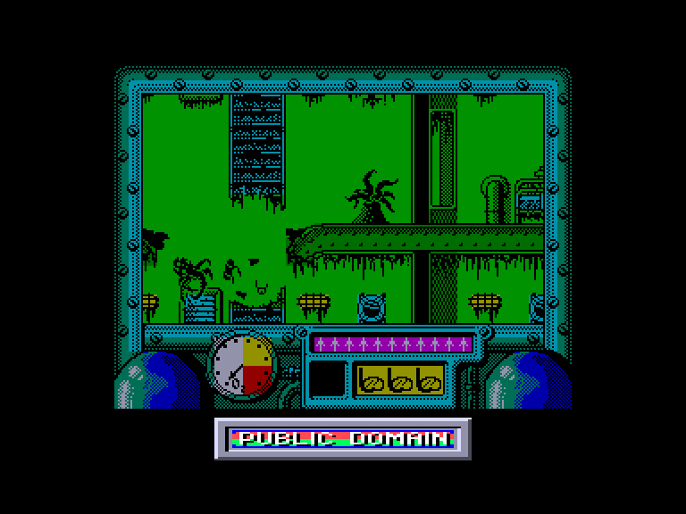

[0-9](../0/games-0.md) - [A](../a/games-a.md) - [B](../b/games-b.md) - [C](../c/games-c.md) - [D](../d/games-d.md) - [E](../e/games-e.md) - [F](../f/games-f.md) - [G](../g/games-g.md) - [H](../h/games-h.md) - [I](../i/games-i.md) - [J](../j/games-j.md) - [K](../k/games-k.md) - [L](../l/games-l.md) - [M](../m/games-m.md) - [N](../n/games-n.md) - [O](../o/games-o.md) - [P](../p/games-p.md) - [Q](../q/games-q.md) - [R](../r/games-r.md) - [S](../s/games-s.md) - [T](../t/games-t.md) - [U](../u/games-u.md) - [V](../v/games-v.md) - [W](../w/games-w.md) - [X](../x/games-x.md) - [Y](../y/games-y.md) - [Z](../z/games-z.md)

Ігри для [Enterprise 64k](../games-ep64.md) - [Enterprise 128k+RAMexp](../games-epramexp.md) - [2dfx](games-2dfx.md)

Ігри для систем [IS-DOS](../games-is-dos.md) - [SymbOS](../games-symbos.md) - [EDC Windows](../games-edcw.md)

Ігри для емуляторів [ZX Spectrum 48k/128k](../zxemu/games-zxemu.md) - [Amstrad CPC](../cpcemu/games-cpc.md) - [Sinclair ZX81](../zx81emu/games-zx81.md) - [Videoton TVC](../tvcemu/games-tvc.md) - [Commodore VIC-20](../vic20emu/games-vic20.md)

----------

# Titanic

**ID:** titanic-zx

## Скріншоти

## Опис

(temporary description generated by AI [ChatGPT])

**Опис гри: Titanic**

Гравці стають учасниками ризикованої експедиції з метою дослідження затонулого корабля "Титанік". Гравці повинні знайти уламки корабля на дні океану, відкрити сейф і отримати захопливі скарби, які він приховує. Гра складається з двох частин: у першій частині необхідно знайти самі уламки, а в другій - дослідити внутрішні приміщення корабля.

**Правила гри:**
1. Гравці повинні уникати небезпечних морських істот, які можуть загрожувати їхньому життю.
2. Основні предмети для виживання: 
   - **Балон з киснем**: необхідний для підтримки рівня кисню. Знайдені балони повертають запас кисню до початкового рівня.
   - **Гарпун**: використовується для захисту від хижих риб. Кількість гарпунів обмежена, тому їх слід використовувати економно.
3. Гравці повинні слідкувати за трьома важливими показниками: запасом кисню, кількістю гарпунів та життями.
4. У першій частині гри потрібно знайти уламки "Титаніка" і уникати небезпечних зон, таких як радіоактивні відходи.
5. У другій частині потрібно активувати перемикачі, щоб відкрити двері, знайти вибухівку та дістатися до сейфа, щоб отримати скарби.
6. Управління можливе за допомогою джойстика або клавіатури.

Гра обіцяє бути захоплюючою, з вражаючою графікою та складними завданнями!

## Основна інформація
- **Оригінальна платформа:** ZX Spectrum

## Посилання
- [Опис на ep128.hu (угорською)](http://www.ep128.hu/Games/Titanic.htm)
- [Інформація про оригінальну версію](https://spectrumcomputing.co.uk/entry/5297/ZX-Spectrum/Titanic)
- [Завантажити](http://www.ep128.hu/Ep_Games/Prg/Titanic.rar)

## Відео

<iframe src="https://www.youtube.com/embed/9zPC6LS_-y0"  
style="width:75%; aspect-ratio:16/9;" allowfullscreen></iframe>

- [Відео](https://youtu.be/gHv1lAnaXTk)

