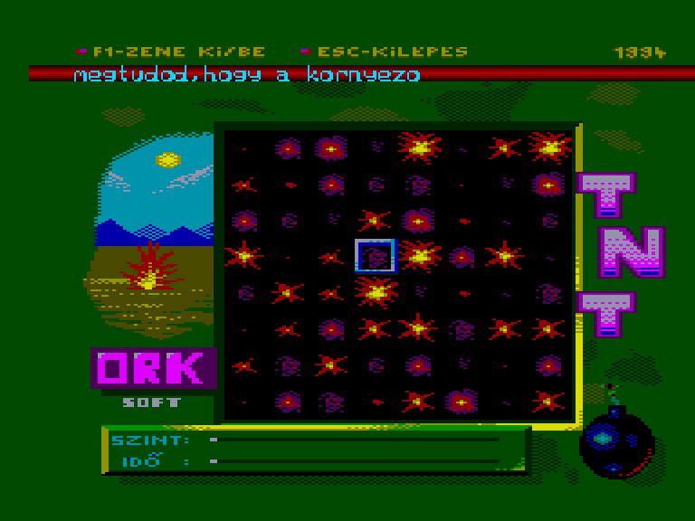
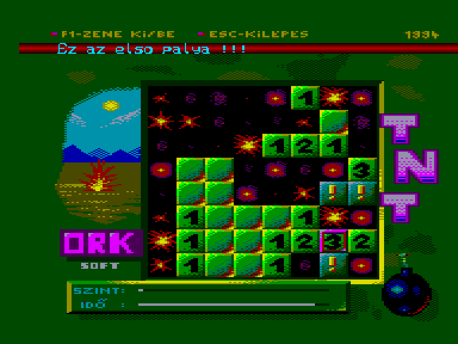
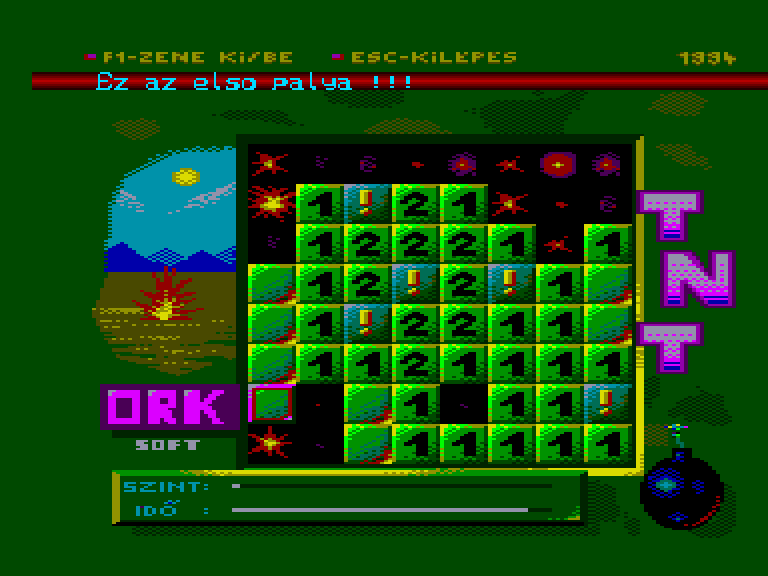
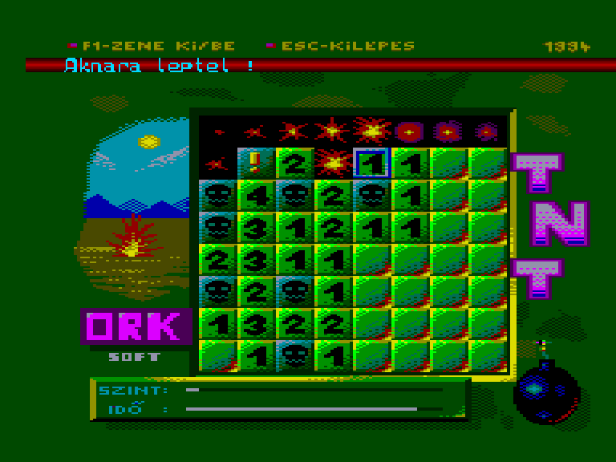

[0-9](../0/games-0.md) - [A](../a/games-a.md) - [B](../b/games-b.md) - [C](../c/games-c.md) - [D](../d/games-d.md) - [E](../e/games-e.md) - [F](../f/games-f.md) - [G](../g/games-g.md) - [H](../h/games-h.md) - [I](../i/games-i.md) - [J](../j/games-j.md) - [K](../k/games-k.md) - [L](../l/games-l.md) - [M](../m/games-m.md) - [N](../n/games-n.md) - [O](../o/games-o.md) - [P](../p/games-p.md) - [Q](../q/games-q.md) - [R](../r/games-r.md) - [S](../s/games-s.md) - [T](../t/games-t.md) - [U](../u/games-u.md) - [V](../v/games-v.md) - [W](../w/games-w.md) - [X](../x/games-x.md) - [Y](../y/games-y.md) - [Z](../z/games-z.md)

Ігри для [Enterprise 64k](../games-ep64.md) - [Enterprise 128k+RAMexp](../games-epramexp.md)

Ігри для систем [IS-DOS](../games-is-dos.md) - [SymbOS](../games-symbos.md) - [EDC Windows](../games-edcw.md)

Ігри для емуляторів [ZX Spectrum 48k/128k](../zxemu/games-zxemu.md) - [Amstrad CPC](../cpcemu/games-cpc.md) - [Sinclair ZX81](../zx81emu/games-zx81.md) - [Videoton TVC](../tvcemu/games-tvc.md) - [Commodore VIC-20](../vic20emu/games-vic20.md)

----------

# TNT

**ID:** tnt

**Жанри:** Логічна

## Скріншоти

## Опис

(temporary description generated by AI [ChatGPT])

Ця гра належить до небагатьох, в якій, напевно, вже грав кожен, хто провів за комп'ютером більше 30 секунд. "Сапер" — це класична логічна гра, яка може викликати як розчарування, так і захоплення. 

**Правила гри:**
1. Мета гри — виявити всі міни на ігровому полі, не натрапивши на жодну з них.
2. Після завантаження гри натисніть пробіл для початку. Спочатку виберіть бажаний рівень складності (1-4).
3. Ігрове поле з'явиться, і ви зможете переміщати курсор. Натискаючи пробіл, ви можете "клікнути" на клітинку.
4. Якщо ви натрапите на міну, гра закінчується. Якщо ж клітинка порожня, з'явиться число, яке вказує, скільки мін розташовано в сусідніх клітинках (включаючи кути).
5. Якщо клітинка не має числа, це означає, що поряд немає мін.
6. На кожен хід у вас є обмежений час. Ви можете вмикати і вимикати музику за допомогою клавіші F1.

Гра має приємні звукові ефекти та графіку, що робить її ще більш привабливою для нових гравців. Спробуйте "Сапер" і перевірте свої логічні здібності!

## Основна інформація
- **Мови:** Угорська
- **Оригінальна платформа:** Enterprise
### Геймплей
- **Кількість гравців:** 1 player
- **Додаткові теги:** 16-color mode
### Розробка
- **Рік випуску:** 1994
- **Автор:** Endi, Szabo Zoltan
- **Компанія:** Ork Software

## Посилання
- [Опис гри на ep128.hu (угорською)](http://www.ep128.hu/Ep_Games/Leiras/TNT.htm)
- [Завантажити гру](http://www.ep128.hu/Ep_Games/Prg/TNT.rar)
- [Easy Load&Play](https://t.me/EP128k_Load_n_Play/722) *(Telegram-канал Vibrant Waves)*

## Відео

<iframe src="https://www.youtube.com/embed/TZNVgXYcwsw"  
style="width:75%; aspect-ratio:16/9;" allowfullscreen></iframe>

