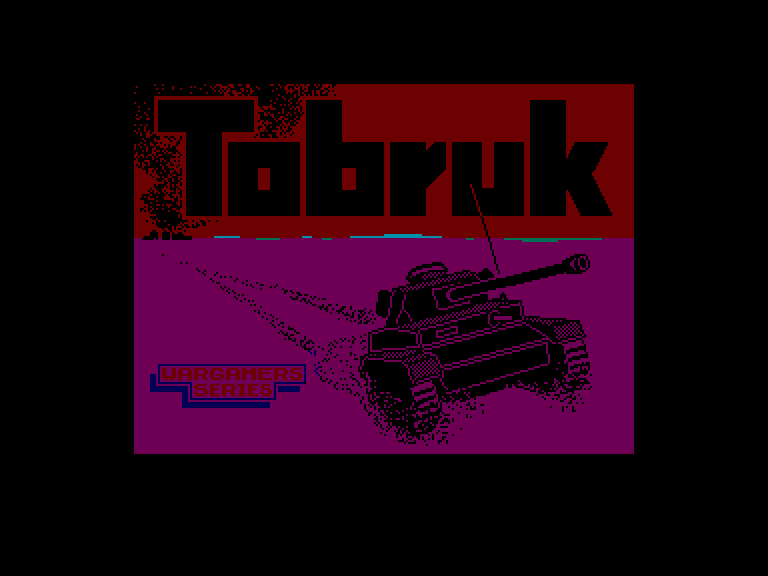
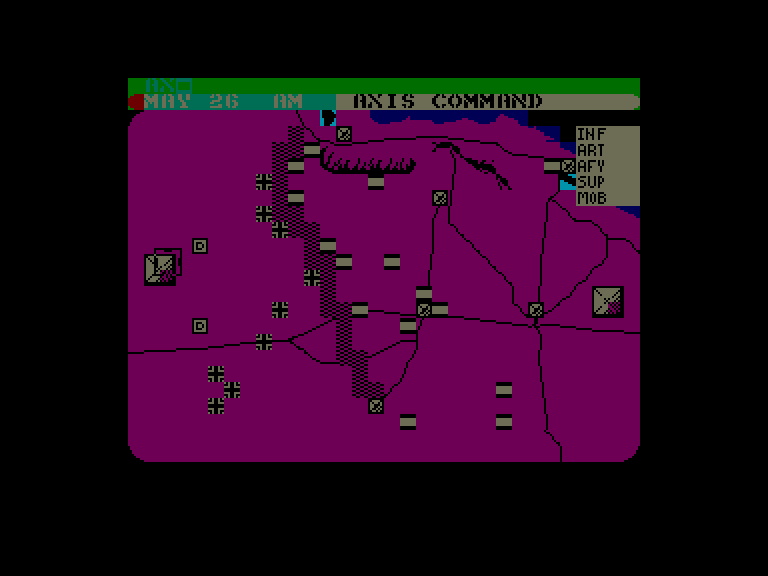

[0-9](../0/games-0.md) - [A](../a/games-a.md) - [B](../b/games-b.md) - [C](../c/games-c.md) - [D](../d/games-d.md) - [E](../e/games-e.md) - [F](../f/games-f.md) - [G](../g/games-g.md) - [H](../h/games-h.md) - [I](../i/games-i.md) - [J](../j/games-j.md) - [K](../k/games-k.md) - [L](../l/games-l.md) - [M](../m/games-m.md) - [N](../n/games-n.md) - [O](../o/games-o.md) - [P](../p/games-p.md) - [Q](../q/games-q.md) - [R](../r/games-r.md) - [S](../s/games-s.md) - [T](../t/games-t.md) - [U](../u/games-u.md) - [V](../v/games-v.md) - [W](../w/games-w.md) - [X](../x/games-x.md) - [Y](../y/games-y.md) - [Z](../z/games-z.md)

Ігри для [Enterprise 64k](../games-ep64.md) - [Enterprise 128k+RAMexp](../games-epramexp.md)

Ігри для систем [IS-DOS](../games-is-dos.md) - [SymbOS](../games-symbos.md) - [EDC Windows](../games-edcw.md)

Ігри для емуляторів [ZX Spectrum 48k/128k](../zxemu/games-zxemu.md) - [Amstrad CPC](../cpcemu/games-cpc.md) - [Sinclair ZX81](../zx81emu/games-zx81.md) - [Videoton TVC](../tvcemu/games-tvc.md) - [Commodore VIC-20](../vic20emu/games-vic20.md)

----------

# Tobruk

**Альтернативні назви:**
 - Tobruk 1942
 - Tobruk: The Clash of Armour

**ID:** tobruk1942-zx

## Скріншоти

## Опис

(temporary description generated by AI [ChatGPT])

**Tobruk: The Clash of Armour** - це тактична військова гра, в якій гравці беруть участь у битві за Тобрук під час Другої світової війни. Гравець керує рухом і атаками своїх підрозділів, намагаючись захопити шість союзних постачальних пунктів, що є ключовим для успіху місії. Гра є покроковою, де кожен гравець по черзі віддає накази. Гравці можуть викликати авіацію та інженерну підтримку, а також контролювати пересувні постачальники.

**Правила гри:**
1. Гравець повинен захопити шість союзних постачальних пунктів.
2. Гра проходить по чергах: спочатку один гравець віддає накази, потім інший.
3. Гравець може викликати авіацію та інженерну підтримку для допомоги.
4. Пошкодження підрозділів розраховується поступово.
5. Гравець керує пересувними постачальниками, які повинні бути в межах досяжності своїх підрозділів.
6. Додаткові дії, такі як навігація та стрільба, можна практикувати поза основною грою.
7. У версії для Amstrad є режим для двох гравців, де один з них представляє союзників.

## Основна інформація
- **Оригінальна платформа:** ZX Spectrum

## Посилання
- [Інформація про оригінальну версію](https://spectrumcomputing.co.uk/entry/5308/ZX-Spectrum/Tobruk)

**Дата генерації:** 29.07.2026

