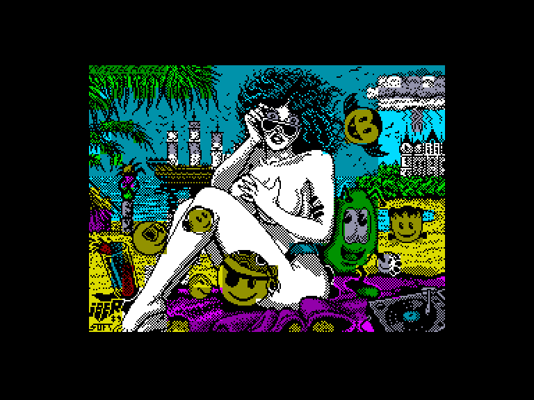
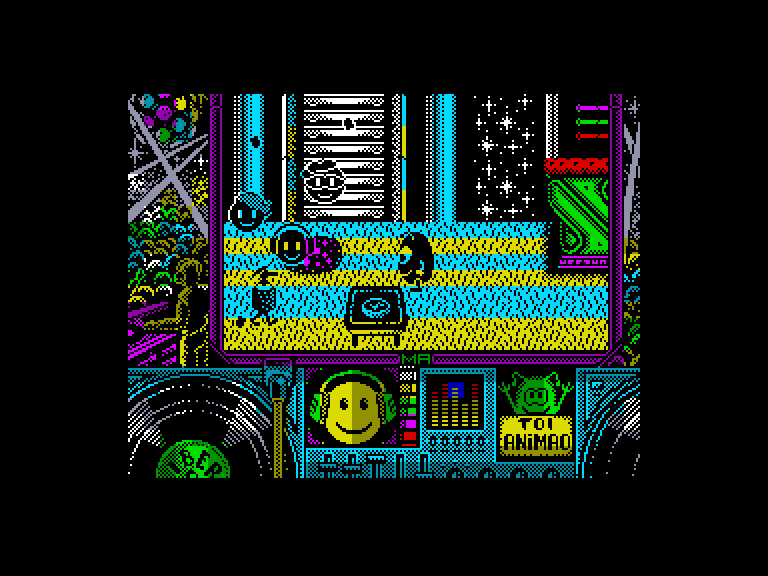
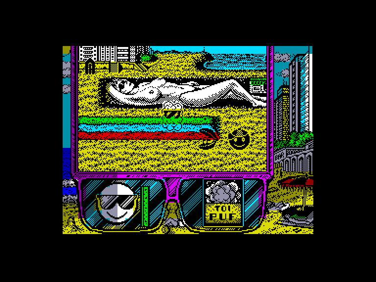
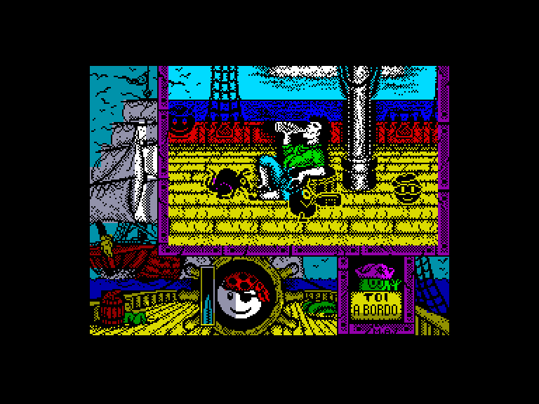

[0-9](../0/games-0.md) - [A](../a/games-a.md) - [B](../b/games-b.md) - [C](../c/games-c.md) - [D](../d/games-d.md) - [E](../e/games-e.md) - [F](../f/games-f.md) - [G](../g/games-g.md) - [H](../h/games-h.md) - [I](../i/games-i.md) - [J](../j/games-j.md) - [K](../k/games-k.md) - [L](../l/games-l.md) - [M](../m/games-m.md) - [N](../n/games-n.md) - [O](../o/games-o.md) - [P](../p/games-p.md) - [Q](../q/games-q.md) - [R](../r/games-r.md) - [S](../s/games-s.md) - [T](../t/games-t.md) - [U](../u/games-u.md) - [V](../v/games-v.md) - [W](../w/games-w.md) - [X](../x/games-x.md) - [Y](../y/games-y.md) - [Z](../z/games-z.md)

Ігри для [Enterprise 64k](../games-ep64.md) - [Enterprise 128k+RAMexp](../games-epramexp.md)

Ігри для систем [IS-DOS](../games-is-dos.md) - [SymbOS](../games-symbos.md) - [EDC Windows](../games-edcw.md)

Ігри для емуляторів [ZX Spectrum 48k/128k](../zxemu/games-zxemu.md) - [Amstrad CPC](../cpcemu/games-cpc.md) - [Sinclair ZX81](../zx81emu/games-zx81.md) - [Videoton TVC](../tvcemu/games-tvc.md) - [Commodore VIC-20](../vic20emu/games-vic20.md)

----------

# Toi Acid Game

**ID:** toi-acid-game-zx

## Примітка

Parts: 1, 2, 3.

## Скріншоти

## Опис

(temporary description generated by AI [ChatGPT])

**Опис гри: Toi Acid Game**

Toi Acid Game починається, коли головний герой, Тої, має побачення в дискотечному клубі зі своєю дівчиною Зої. Раптом з'являється божевільний вчений, на цей раз на ім'я Доктор Кислотний, який викрадає дівчину героя з наміром відволікти його своїми діаболічними творіннями. Маленький і круглий друг не може цього допустити, тому він швидко вирушає на її порятунок.

Щоб досягти мети, Тої доведеться подолати чотири різні рівні, де всілякі дрібні істоти намагатимуться завадити йому. На першому етапі, в дискотечному клубі, він повинен уникати грубих хлопців, сифона, напоїв, які падають зверху тощо, поки безнадійно шукає вісім тарілок, які дозволять йому перейти до наступних рівнів: пляж, піратський корабель і, нарешті, Кислотний Дім.

**Правила гри:**
1. Гравець контролює персонажа Тої, який повинен уникати ворогів та перешкод.
2. Збирайте вісім тарілок на кожному рівні, щоб отримати доступ до наступного.
3. Пройдіть чотири рівні: дискотека, пляж, піратський корабель та Кислотний Дім.
4. Уникайте контактів з ворогами, щоб не втратити життя.
5. Використовуйте швидкість і спритність, щоб долати перешкоди на шляху до порятунку Зої.

## Основна інформація
- **Мови:** Англійська
- **Оригінальна платформа:** ZX Spectrum

## Посилання
- [Інформація про оригінальну версію](https://spectrumcomputing.co.uk/entry/5310/ZX-Spectrum/Toi_Acid_Game)
- [Завантажити гру](http://www.ep128.hu/Ep_Games/Prg/Toi_Acid_Game.rar)

