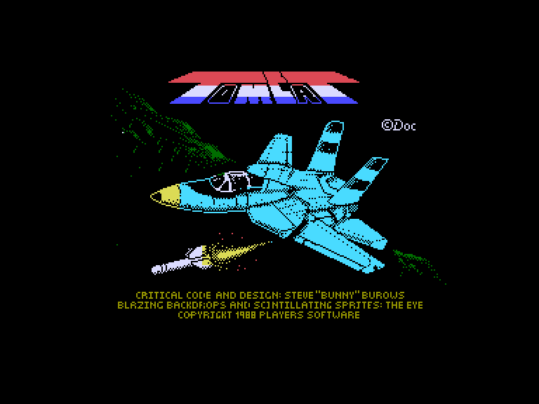
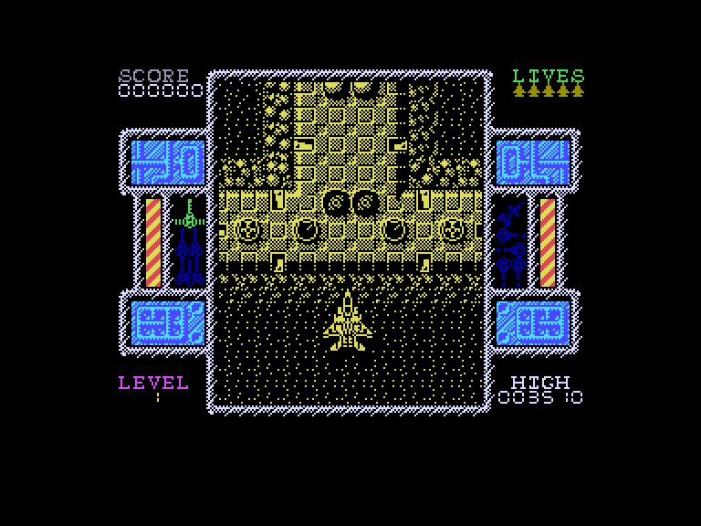
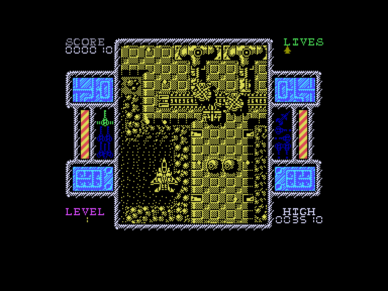

[0-9](../0/games-0.md) - [A](../a/games-a.md) - [B](../b/games-b.md) - [C](../c/games-c.md) - [D](../d/games-d.md) - [E](../e/games-e.md) - [F](../f/games-f.md) - [G](../g/games-g.md) - [H](../h/games-h.md) - [I](../i/games-i.md) - [J](../j/games-j.md) - [K](../k/games-k.md) - [L](../l/games-l.md) - [M](../m/games-m.md) - [N](../n/games-n.md) - [O](../o/games-o.md) - [P](../p/games-p.md) - [Q](../q/games-q.md) - [R](../r/games-r.md) - [S](../s/games-s.md) - [T](../t/games-t.md) - [U](../u/games-u.md) - [V](../v/games-v.md) - [W](../w/games-w.md) - [X](../x/games-x.md) - [Y](../y/games-y.md) - [Z](../z/games-z.md)

Ігри для [Enterprise 64k](../games-ep64.md) - [Enterprise 128k+RAMexp](../games-epramexp.md)

Ігри для систем [IS-DOS](../games-is-dos.md) - [SymbOS](../games-symbos.md) - [EDC Windows](../games-edcw.md)

Ігри для емуляторів [ZX Spectrum 48k/128k](../zxemu/games-zxemu.md) - [Amstrad CPC](../cpcemu/games-cpc.md) - [Sinclair ZX81](../zx81emu/games-zx81.md) - [Videoton TVC](../tvcemu/games-tvc.md) - [Commodore VIC-20](../vic20emu/games-vic20.md)

----------

# Tomcat

**Альтернативні назви:**
 - F14 Tomcat

**ID:** tomcat-zx

## Скріншоти

## Опис

(temporary description generated by AI [ChatGPT])

**Опис гри: TOMCAT**

TOMCAT – це традиційна гра жанру shoot'em up, яка пропонує гравцям захоплюючу стрілянину в небі. Гравці повинні знищувати всі рухомі об'єкти, уникаючи при цьому ворожих снарядів та зіткнень з літальними апаратами. Гра містить 12 рівнів, які потрібно пройти, перш ніж почати все спочатку. Хоча графіка не погана, гра не має музики чи звукових ефектів, а також може страждати від проблем з видимістю снарядів на жовтому фоні.

**Правила гри:**
1. Використовуйте клавіші 'Q', 'A', 'O', 'P', 'M' для управління літаком (можна також підключити джойстик).
2. Ваша мета – знищувати всі рухомі об'єкти та уникати ворожих снарядів.
3. Збирайте предмети, які підвищують вашу вогневу потужність.
4. Пройдіть всі 12 рівнів і підготуйтеся до повторного проходження.
5. Для власників Enterprise рекомендується налаштувати клавіатуру на внутрішній джойстик.

Гра також має можливість введення чит-кодів для безсмертя та невразливості.

## Основна інформація
- **Оригінальна платформа:** ZX Spectrum

## Посилання
- [Опис гри на ep128.hu (угорською)](http://www.ep128.hu/Games/Tomcat.htm)
- [Інформація про оригінальну версію](https://spectrumcomputing.co.uk/entry/5322/ZX-Spectrum/Tomcat)
- [Завантажити гру](http://www.ep128.hu/Ep_Games/Prg/Tomcat.rar)

**Дата генерації:** 28.07.2026

