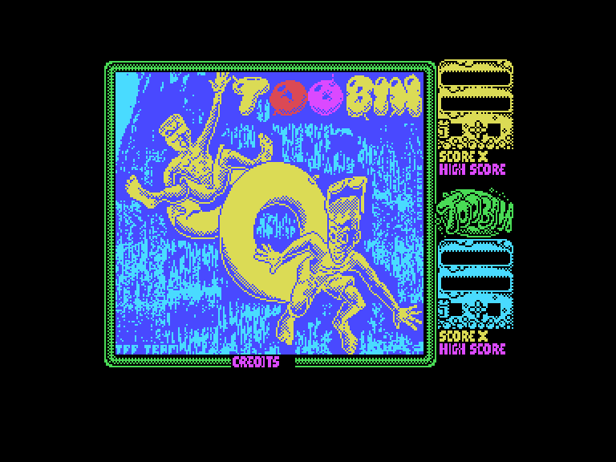
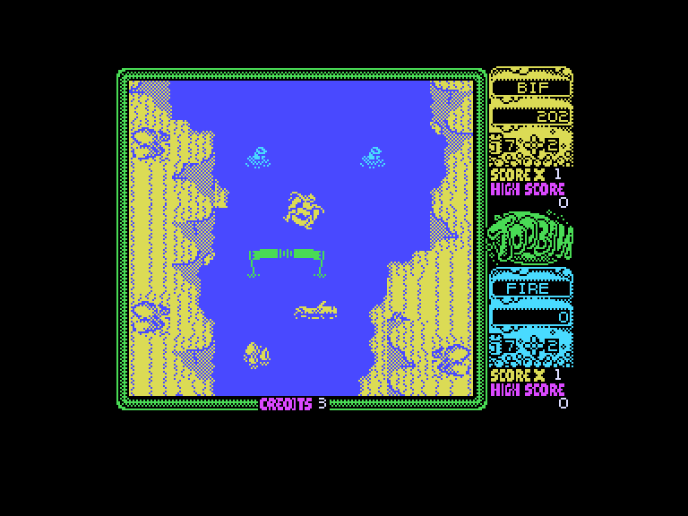
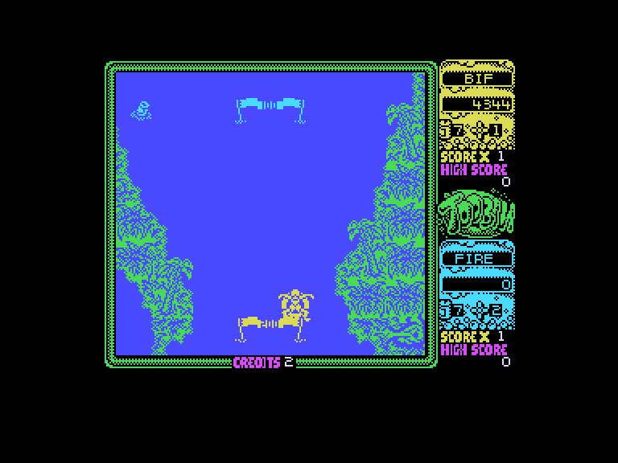
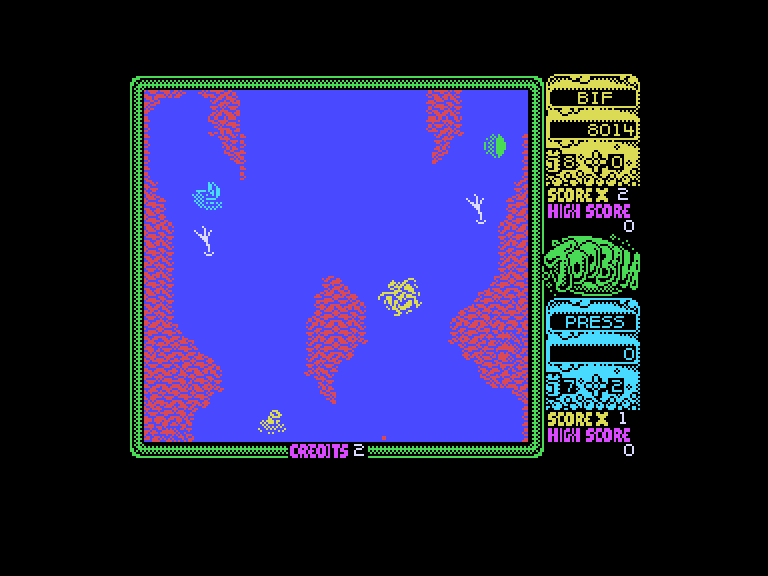

[0-9](../0/games-0.md) - [A](../a/games-a.md) - [B](../b/games-b.md) - [C](../c/games-c.md) - [D](../d/games-d.md) - [E](../e/games-e.md) - [F](../f/games-f.md) - [G](../g/games-g.md) - [H](../h/games-h.md) - [I](../i/games-i.md) - [J](../j/games-j.md) - [K](../k/games-k.md) - [L](../l/games-l.md) - [M](../m/games-m.md) - [N](../n/games-n.md) - [O](../o/games-o.md) - [P](../p/games-p.md) - [Q](../q/games-q.md) - [R](../r/games-r.md) - [S](../s/games-s.md) - [T](../t/games-t.md) - [U](../u/games-u.md) - [V](../v/games-v.md) - [W](../w/games-w.md) - [X](../x/games-x.md) - [Y](../y/games-y.md) - [Z](../z/games-z.md)

Ігри для [Enterprise 64k](../games-ep64.md) - [Enterprise 128k+RAMexp](../games-epramexp.md) - [2dfx](games-2dfx.md)

Ігри для систем [IS-DOS](../games-is-dos.md) - [SymbOS](../games-symbos.md) - [EDC Windows](../games-edcw.md)

Ігри для емуляторів [ZX Spectrum 48k/128k](../zxemu/games-zxemu.md) - [Amstrad CPC](../cpcemu/games-cpc.md) - [Sinclair ZX81](../zx81emu/games-zx81.md) - [Videoton TVC](../tvcemu/games-tvc.md) - [Commodore VIC-20](../vic20emu/games-vic20.md)

----------

# Toobin'

**ID:** toobin-zx

## Скріншоти

## Опис

(temporary description generated by AI [ChatGPT])

**Опис гри: Toobin'**

Toobin' - це гра, в якій гравці, керуючи персонажами Біффом і Джетом, змагаються у спуску по річковим порогам, сидячи на камерах. Вам потрібно обертати свою камеру вліво або вправо та дрейфувати за течією, уникаючи берегів річки та розділових ліній. На вашому шляху зустрінуться небезпеки, такі як крокодили, випадкові колоди, гілки та рибалки. Ви озброєні обмеженою кількістю консервних банок для боротьби з цими перешкодами. На шляху вниз є ворота, через які потрібно пройти, щоб отримати бонусні бали. Кожен рівень має строгий ліміт часу, але в кінці вас чекає чудова вечірка, якщо ви впораєтеся!

**Правила гри:**
1. Керуйте камерою, обертаючи її вліво або вправо.
2. Уникайте зіткнень з берегами річки, розділовими лініями та небезпеками.
3. Використовуйте консервні банки для усунення загроз.
4. Пройдіть через ворота для отримання бонусних балів.
5. Завершіть рівень до закінчення відведеного часу, щоб потрапити на вечірку.

## Основна інформація
- **Мови:** Англійська
- **Оригінальна платформа:** ZX Spectrum

## Посилання
- [Інформація про оригінальну версію](https://spectrumcomputing.co.uk/entry/5325/ZX-Spectrum/Toobin)
- [Завантажити](http://www.ep128.hu/Ep_Games/Prg/Toobin.rar)

