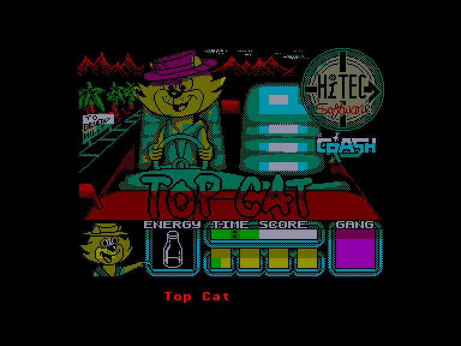
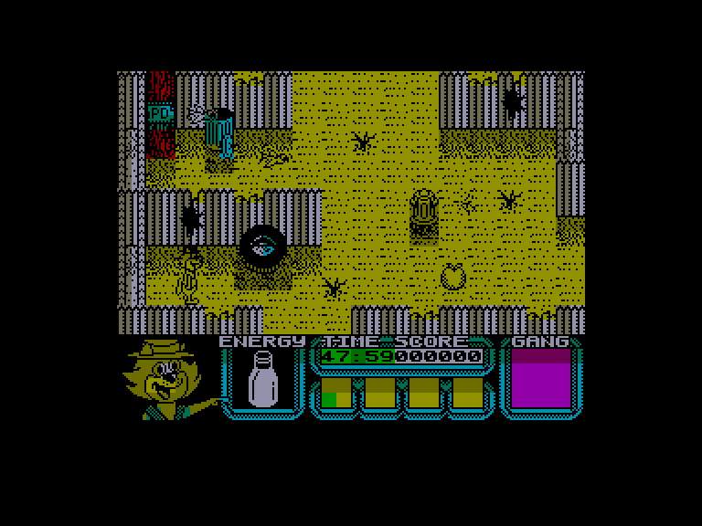
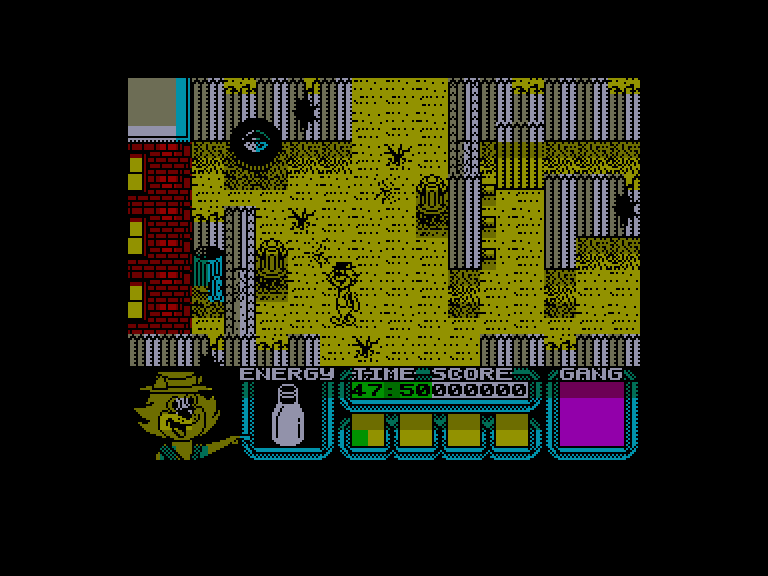
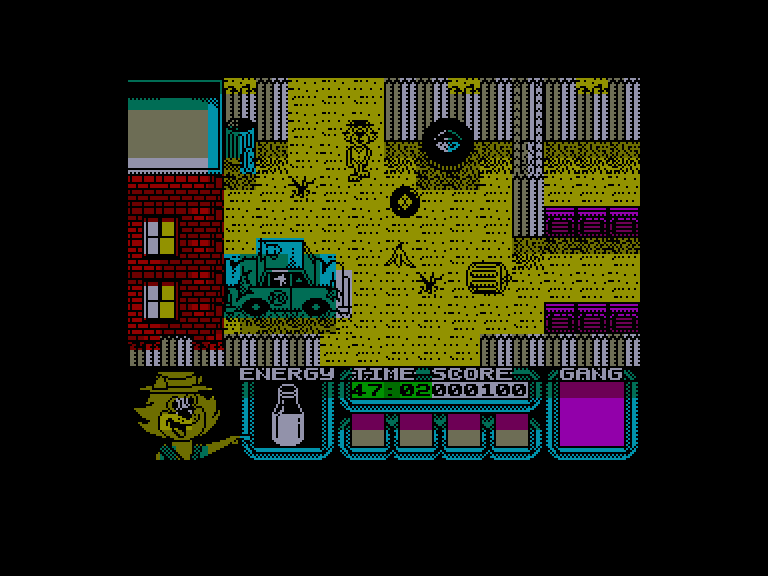

[0-9](../0/games-0.md) - [A](../a/games-a.md) - [B](../b/games-b.md) - [C](../c/games-c.md) - [D](../d/games-d.md) - [E](../e/games-e.md) - [F](../f/games-f.md) - [G](../g/games-g.md) - [H](../h/games-h.md) - [I](../i/games-i.md) - [J](../j/games-j.md) - [K](../k/games-k.md) - [L](../l/games-l.md) - [M](../m/games-m.md) - [N](../n/games-n.md) - [O](../o/games-o.md) - [P](../p/games-p.md) - [Q](../q/games-q.md) - [R](../r/games-r.md) - [S](../s/games-s.md) - [T](../t/games-t.md) - [U](../u/games-u.md) - [V](../v/games-v.md) - [W](../w/games-w.md) - [X](../x/games-x.md) - [Y](../y/games-y.md) - [Z](../z/games-z.md)

Ігри для [Enterprise 64k](../games-ep64.md) - [Enterprise 128k+RAMexp](../games-epramexp.md)

Ігри для систем [IS-DOS](../games-is-dos.md) - [SymbOS](../games-symbos.md) - [EDC Windows](../games-edcw.md)

Ігри для емуляторів [ZX Spectrum 48k/128k](../zxemu/games-zxemu.md) - [Amstrad CPC](../cpcemu/games-cpc.md) - [Sinclair ZX81](../zx81emu/games-zx81.md) - [Videoton TVC](../tvcemu/games-tvc.md) - [Commodore VIC-20](../vic20emu/games-vic20.md)

----------

# Top Cat in Beverly Hills Cats

**ID:** top-cat-zx

## Скріншоти

## Опис

(temporary description generated by AI [ChatGPT])

**Опис гри:**
Top Cat - це відеогра, заснована на популярному американському мультсеріалі Hanna-Barbera, в якій гравець керує персонажем на ім'я Турпі, котрий намагається врятувати дівчину на ім'я Емі, викрадену зловмисницею Мадам Ван Дер Гелт. Гравець повинен зібрати команду з чотирьох персонажів, використовуючи різні предмети, щоб дістатися до Емі, яка утримується в будинку в Беверлі-Гіллз.

**Правила гри:**
1. У вас є одне життя, а енергію можна виміряти за допомогою молочного пляшки в нижній частині екрану.
2. Зустрічі з іншими істотами та рухомими об'єктами витрачають енергію, але її можна відновити.
3. Ви можете носити до чотирьох предметів одночасно, які відображаються в нижній частині екрану.
4. Щоб підняти предмет, натисніть кнопку вогню. Для використання предмета утримуйте кнопку вогню і виберіть предмет за допомогою стрілок.
5. Збирайте членів команди, натискаючи кнопку вогню на їх зображеннях.
6. У вас є обмежений час для виконання завдання, інакше Мадам Ван Дер Гелт позбавить Емі спадщини.
7. Гра складається з трьох рівнів: сміттєзвалище, вулиця та будинок, кожен з яких має свої труднощі та завдання.
8. Використовуйте різні предмети, щоб відкрити двері, обійти ворогів і досягти мети. 

Успіхів у грі!

## Основна інформація
- **Оригінальна платформа:** ZX Spectrum

## Посилання
- [Опис гри на ep128.hu (угорською)](http://www.ep128.hu/Games/Top_Cat.htm)
- [Інформація про оригінальну версію](https://spectrumcomputing.co.uk/entry/5329/ZX-Spectrum/Top_Cat_in_Beverly_Hills_Cats)
- [Завантажити гру](http://www.ep128.hu/Ep_Games/Prg/Top_Cat.rar)

