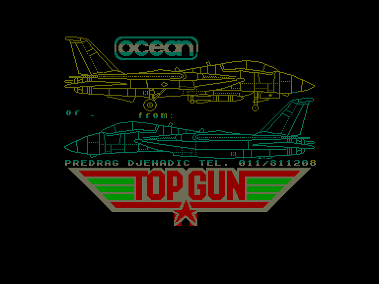
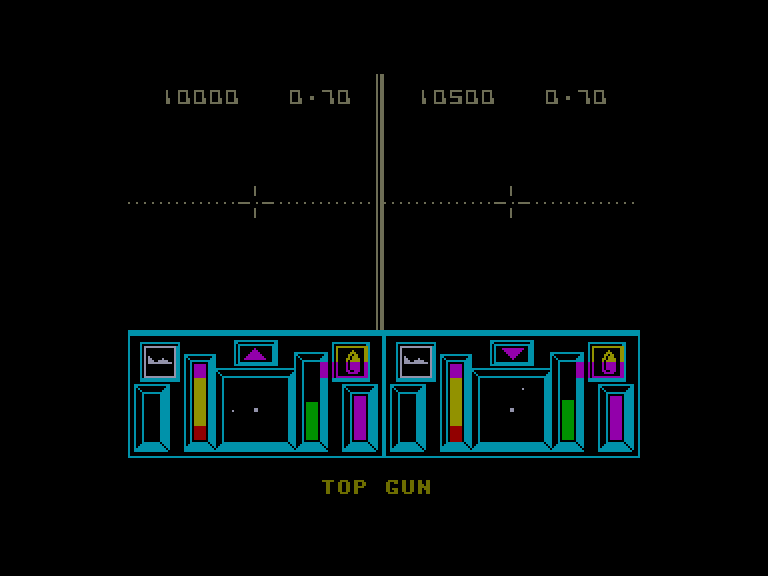
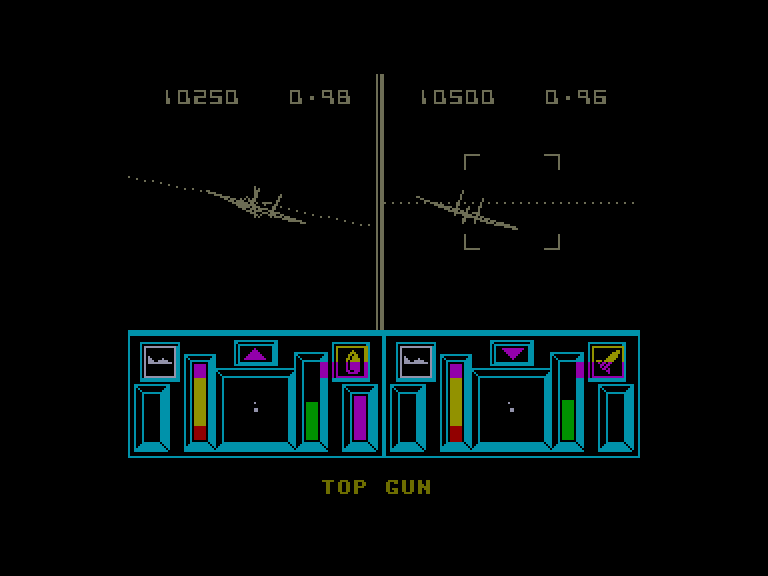

[0-9](../0/games-0.md) - [A](../a/games-a.md) - [B](../b/games-b.md) - [C](../c/games-c.md) - [D](../d/games-d.md) - [E](../e/games-e.md) - [F](../f/games-f.md) - [G](../g/games-g.md) - [H](../h/games-h.md) - [I](../i/games-i.md) - [J](../j/games-j.md) - [K](../k/games-k.md) - [L](../l/games-l.md) - [M](../m/games-m.md) - [N](../n/games-n.md) - [O](../o/games-o.md) - [P](../p/games-p.md) - [Q](../q/games-q.md) - [R](../r/games-r.md) - [S](../s/games-s.md) - [T](../t/games-t.md) - [U](../u/games-u.md) - [V](../v/games-v.md) - [W](../w/games-w.md) - [X](../x/games-x.md) - [Y](../y/games-y.md) - [Z](../z/games-z.md)

Ігри для [Enterprise 64k](../games-ep64.md) - [Enterprise 128k+RAMexp](../games-epramexp.md)

Ігри для систем [IS-DOS](../games-is-dos.md) - [SymbOS](../games-symbos.md) - [EDC Windows](../games-edcw.md)

Ігри для емуляторів [ZX Spectrum 48k/128k](../zxemu/games-zxemu.md) - [Amstrad CPC](../cpcemu/games-cpc.md) - [Sinclair ZX81](../zx81emu/games-zx81.md) - [Videoton TVC](../tvcemu/games-tvc.md) - [Commodore VIC-20](../vic20emu/games-vic20.md)

----------

# Top Gun

**ID:** top-gun-zx

## Скріншоти

## Опис

(temporary description generated by AI [ChatGPT])

Гра "Top Gun" - це екшн-симулятор, випущений у 1986 році, який базується на популярному фільмі з Томом Крузом. Гравці беруть на себе роль пілота винищувача F-14 Tomcat, змагаючись проти комп'ютера або іншого гравця в повітряних боях. Гра пропонує повноцінний 3D-огляд з кабіни літака, де потрібно стратегічно використовувати ракети, флеєри та гармати, щоб перемогти противника. Гравці повинні також стежити за швидкістю та висотою, адже це впливає на їх шанси на перемогу.

**Правила гри:**
1. Гравець може обирати гру проти комп'ютера або іншого гравця.
2. Кожен гравець має три "життя".
3. Використовуйте ракети, флеєри та гармати, але будьте обережні, адже надмірне використання гармат може призвести до їх перегріву.
4. Залишайтеся в контрольованій зоні над противником протягом трьох секунд, щоб вразити його.
5. Слідкуйте за швидкістю та висотою, щоб уникнути поразки.

Відчуйте адреналін повітряних боїв у "Top Gun"!

## Основна інформація
- **Оригінальна платформа:** ZX Spectrum

## Посилання
- [Інформація про оригінальну версію](https://spectrumcomputing.co.uk/entry/5332/ZX-Spectrum/Top_Gun)

