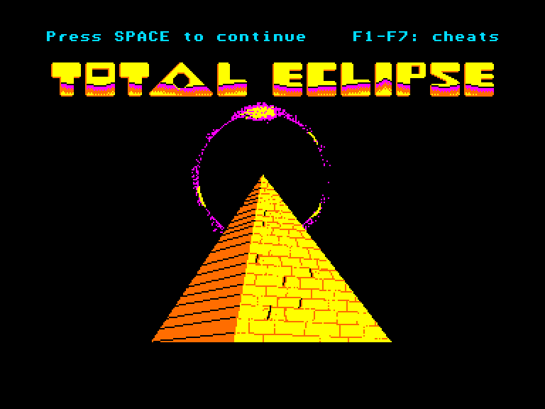
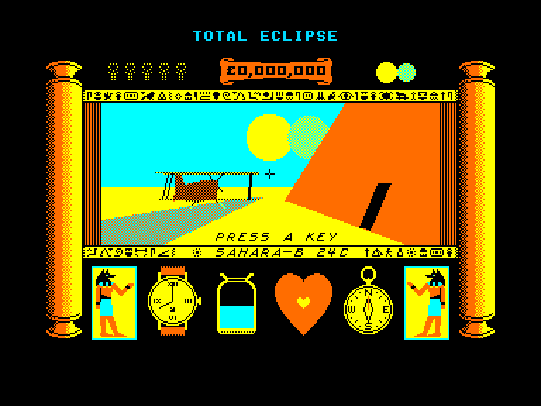
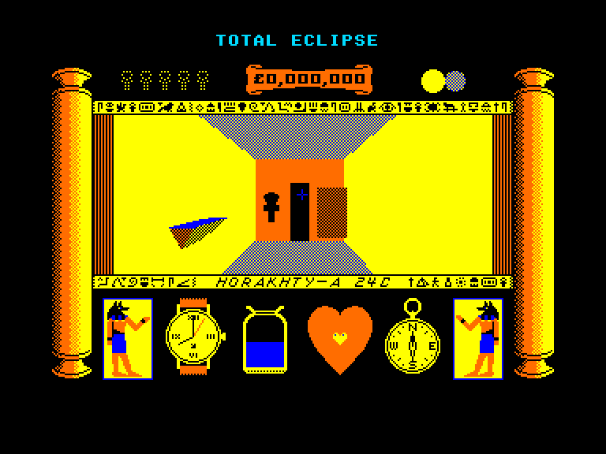
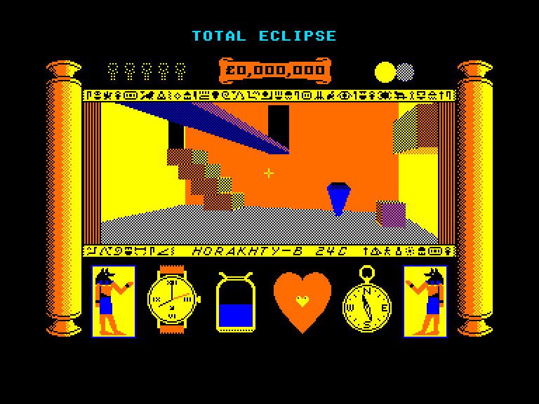

[0-9](../0/games-0.md) - [A](../a/games-a.md) - [B](../b/games-b.md) - [C](../c/games-c.md) - [D](../d/games-d.md) - [E](../e/games-e.md) - [F](../f/games-f.md) - [G](../g/games-g.md) - [H](../h/games-h.md) - [I](../i/games-i.md) - [J](../j/games-j.md) - [K](../k/games-k.md) - [L](../l/games-l.md) - [M](../m/games-m.md) - [N](../n/games-n.md) - [O](../o/games-o.md) - [P](../p/games-p.md) - [Q](../q/games-q.md) - [R](../r/games-r.md) - [S](../s/games-s.md) - [T](../t/games-t.md) - [U](../u/games-u.md) - [V](../v/games-v.md) - [W](../w/games-w.md) - [X](../x/games-x.md) - [Y](../y/games-y.md) - [Z](../z/games-z.md)

Ігри для [Enterprise 64k](../games-ep64.md) - [Enterprise 128k+RAMexp](../games-epramexp.md)

Ігри для систем [IS-DOS](../games-is-dos.md) - [SymbOS](../games-symbos.md) - [EDC Windows](../games-edcw.md)

Ігри для емуляторів [ZX Spectrum 48k/128k](../zxemu/games-zxemu.md) - [Amstrad CPC](../cpcemu/games-cpc.md) - [Sinclair ZX81](../zx81emu/games-zx81.md) - [Videoton TVC](../tvcemu/games-tvc.md) - [Commodore VIC-20](../vic20emu/games-vic20.md)

----------

# Total Eclipse

**ID:** total-eclipse-cpc

## Скріншоти

## Опис

(temporary description generated by AI [Assistant])

**Опис гри: Total Eclipse**

Total Eclipse - це захоплююча гра, що була випущена в 1988 році для платформи Amstrad CPC. Гравці поринають у світ Freescape, де їм потрібно досліджувати, вирішувати головоломки та уникати небезпек. Гра відрізняється яскравою графікою та різноманітними механіками управління, які дозволяють гравцям вільно пересуватися у тривимірному середовищі.

**Правила гри:**
1. Використовуйте джойстик або клавіші:
   - O - вперед
   - K - назад
   - Z - вліво
   - X - вправо
   - 0 - стріляти
   - U - розвернутися назад
2. SPACE - переміщення прицілу/прогулянка.
3. ; - вмикання/вимикання прицілу.
4. P/L - регулювання кута огляду, F - вирівнювання.
5. S - регулювання розміру кроку.
6. A - регулювання руху голови.
7. H - зміна позиції (повзти/іти).
8. R - відпочинок (тримати кнопку).
9. I - меню вводу/виводу.

Гра також містить чити, які можна активувати під час завантаження:
- F1 - безкінечний час.
- F2 - вода не закінчується.
- F3 - не втомлюємося.
- F4 - не отримуємо шкоди при падінні.
- F5 - мумії не завдають шкоди.
- F6 - безкінечний анх.
- F7 - гра не закінчується при програші.

## Основна інформація
- **Оригінальна платформа:** Amstrad CPC

## Посилання
- [Опис гри на ep128.hu (угорською)](http://www.ep128.hu/Ep_Games/Leiras/Total_Eclipse.htm)
- [Інформація про оригінальну версію](https://www.cpc-power.com/index.php?page=detail&num=2268)
- [Завантажити гру](http://www.ep128.hu/Ep_Games/Prg/Total_Eclipse_CPC.rar)

**Дата генерації:** 28.07.2026

## Відео

<iframe src="https://www.youtube.com/embed/mK4hHdEe6CU"  
style="width:75%; aspect-ratio:16/9;" allowfullscreen></iframe>
