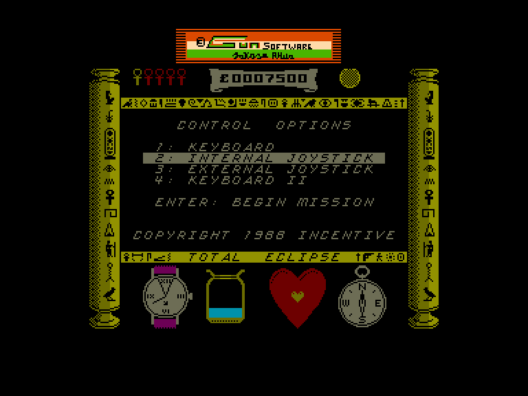
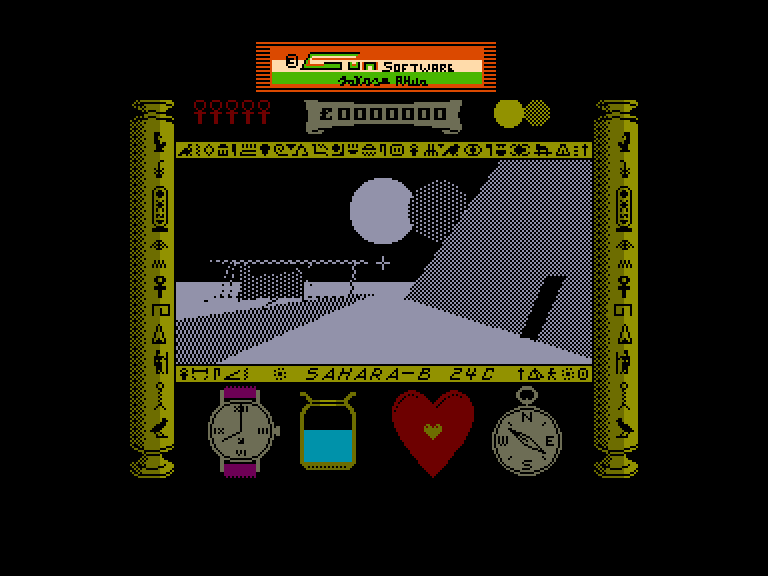
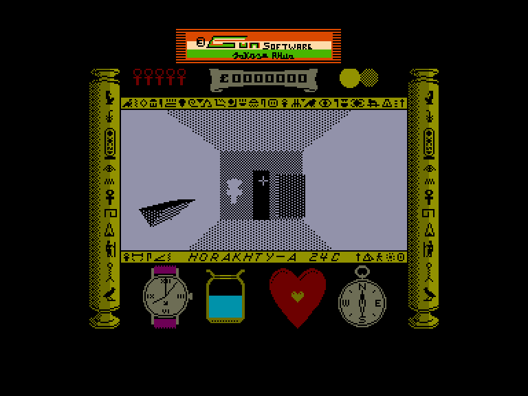
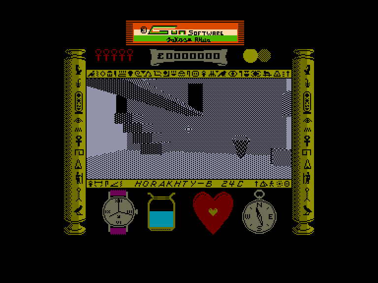

[0-9](../0/games-0.md) - [A](../a/games-a.md) - [B](../b/games-b.md) - [C](../c/games-c.md) - [D](../d/games-d.md) - [E](../e/games-e.md) - [F](../f/games-f.md) - [G](../g/games-g.md) - [H](../h/games-h.md) - [I](../i/games-i.md) - [J](../j/games-j.md) - [K](../k/games-k.md) - [L](../l/games-l.md) - [M](../m/games-m.md) - [N](../n/games-n.md) - [O](../o/games-o.md) - [P](../p/games-p.md) - [Q](../q/games-q.md) - [R](../r/games-r.md) - [S](../s/games-s.md) - [T](../t/games-t.md) - [U](../u/games-u.md) - [V](../v/games-v.md) - [W](../w/games-w.md) - [X](../x/games-x.md) - [Y](../y/games-y.md) - [Z](../z/games-z.md)

Ігри для [Enterprise 64k](../games-ep64.md) - [Enterprise 128k+RAMexp](../games-epramexp.md)

Ігри для систем [IS-DOS](../games-is-dos.md) - [SymbOS](../games-symbos.md) - [EDC Windows](../games-edcw.md)

Ігри для емуляторів [ZX Spectrum 48k/128k](../zxemu/games-zxemu.md) - [Amstrad CPC](../cpcemu/games-cpc.md) - [Sinclair ZX81](../zx81emu/games-zx81.md) - [Videoton TVC](../tvcemu/games-tvc.md) - [Commodore VIC-20](../vic20emu/games-vic20.md)

----------

# Total Eclipse

**ID:** total-eclipse-zx

## Скріншоти

## Опис

(temporary description generated by AI [Assistant])

**Короткий опис гри "Total Eclipse":**

"Total Eclipse" — це тривимірна гра, розроблена компанією Incentive, яка переносить гравця в Єгипет 1930 року. Гравець повинен подолати численні перешкоди в складному лабіринті піраміди, щоб розгадати таємницю давнього прокляття, яке загрожує людству під час сонячного затемнення. У грі важливо управляти часом, водою та здоров'ям персонажа, збираючи анхи та скарби, щоб успішно завершити місію.

**Правила гри:**

1. **Час:** Гра починається о 8:00, і у вас є 2 години для виконання місії.
2. **Вода:** Вода в піску швидко закінчується. Заповнюйте свою пляшку з води в спеціальних місцях.
3. **Здоров'я:** Слідкуйте за серцебиттям. Якщо воно прискорюється, потрібно відпочити, інакше може статися серцевий напад.
4. **Анхи:** Збирайте анхи, щоб проходити через магічні двері.
5. **Скарби:** Збирайте скарби для отримання балів. Використовуйте пістолет для відкриття скринь.
6. **Керування:** Використовуйте клавіші для переміщення, поворотів і стрільби. Важливо вміти швидко реагувати на небезпеки.
7. **Секрети:** Досліджуйте всі кімнати, стріляйте в невідомі предмети, щоб виявити таємниці.

Удачі в розгадуванні таємниці піраміди та запобіганні катастрофі!

## Основна інформація
- **Оригінальна платформа:** ZX Spectrum

## Посилання
- [Опис гри на ep128.hu (угорською)](http://www.ep128.hu/Games/Total_Eclipse.htm)
- [Інформація про оригінальну версію](https://spectrumcomputing.co.uk/entry/5340/ZX-Spectrum/Total_Eclipse)
- [Завантажити гру](http://www.ep128.hu/Ep_Games/Prg/Total_Eclipse.rar)

