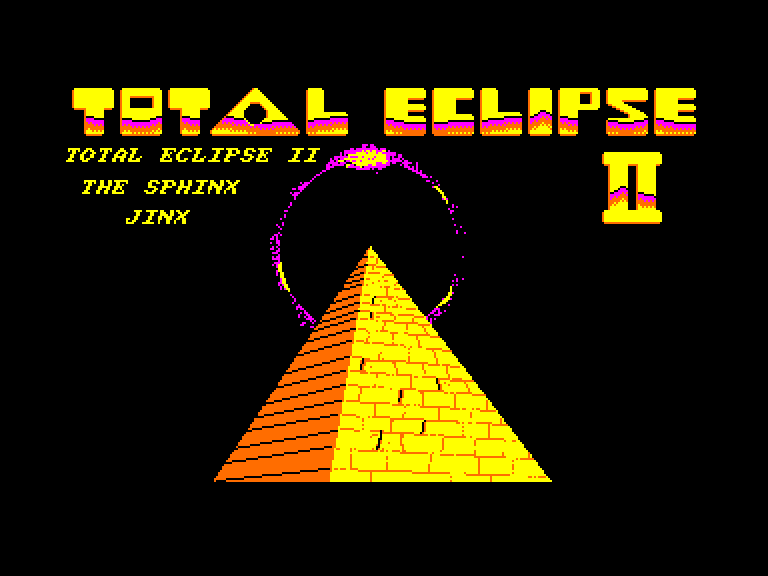
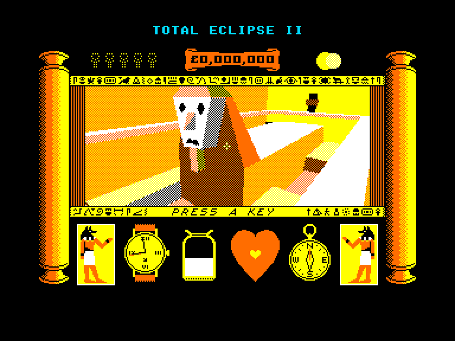
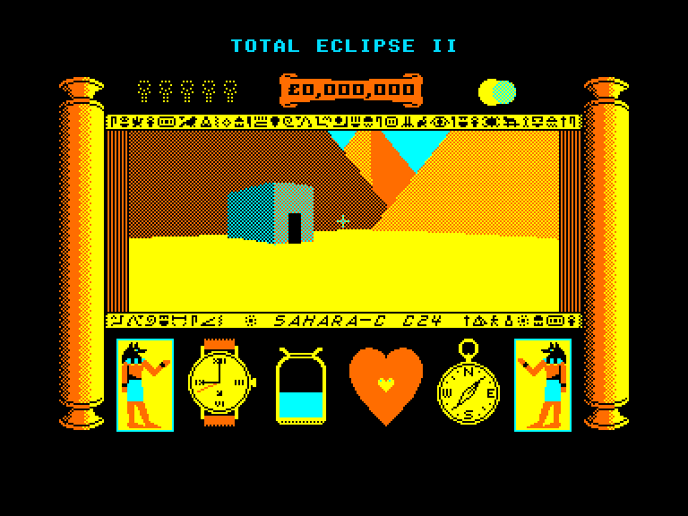
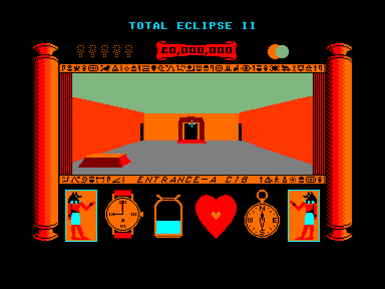

[0-9](../0/games-0.md) - [A](../a/games-a.md) - [B](../b/games-b.md) - [C](../c/games-c.md) - [D](../d/games-d.md) - [E](../e/games-e.md) - [F](../f/games-f.md) - [G](../g/games-g.md) - [H](../h/games-h.md) - [I](../i/games-i.md) - [J](../j/games-j.md) - [K](../k/games-k.md) - [L](../l/games-l.md) - [M](../m/games-m.md) - [N](../n/games-n.md) - [O](../o/games-o.md) - [P](../p/games-p.md) - [Q](../q/games-q.md) - [R](../r/games-r.md) - [S](../s/games-s.md) - [T](../t/games-t.md) - [U](../u/games-u.md) - [V](../v/games-v.md) - [W](../w/games-w.md) - [X](../x/games-x.md) - [Y](../y/games-y.md) - [Z](../z/games-z.md)

Ігри для [Enterprise 64k](../games-ep64.md) - [Enterprise 128k+RAMexp](../games-epramexp.md)

Ігри для систем [IS-DOS](../games-is-dos.md) - [SymbOS](../games-symbos.md) - [EDC Windows](../games-edcw.md)

Ігри для емуляторів [ZX Spectrum 48k/128k](../zxemu/games-zxemu.md) - [Amstrad CPC](../cpcemu/games-cpc.md) - [Sinclair ZX81](../zx81emu/games-zx81.md) - [Videoton TVC](../tvcemu/games-tvc.md) - [Commodore VIC-20](../vic20emu/games-vic20.md)

----------

# Total Eclipse 2: The Sphinx Jinx

**ID:** total-eclipse2-cpc

## Скріншоти

## Опис

(temporary description generated by AI [ChatGPT])

**Опис гри: Total Eclipse: Special Edition**

Total Eclipse: Special Edition — це збірка з двох ігор: Total Eclipse та Total Eclipse 2: The Sphinx Jinx. Гравець повинен знайти 12 частин сфінкса, щоб зняти давнє прокляття, за дві години, досліджуючи підземні проходи під пірамідою. У грі є безліч головоломок, а також небезпеки у вигляді мумій, отруйних стріл і теплового виснаження через обмежений доступ до води. Збирати предмети не можна, але знайдені злитки золота можуть значно збільшити ресурси гравця. У спеціальному виданні також включено кольоровий постер формату A2.

**Правила гри:**
1. Гравець має дві години, щоб знайти 12 частин сфінкса.
2. Досліджуйте підземні проходи, уникаючи небезпек.
3. Не можна збирати предмети, але золото може бути корисним.
4. Розв'язуйте головоломки, щоб просуватися далі.
5. Використовуйте обмежений доступ до води, щоб уникнути теплового виснаження.

Гра пропонує унікальний досвід у жанрі детективної гри з елементами головоломки.

## Основна інформація
- **Оригінальна платформа:** Amstrad CPC

## Посилання
- [Інформація про оригінальну версію](https://www.cpc-power.com/index.php?page=detail&num=2269)
- [Завантажити гру](http://www.ep128.hu/Ep_Games/Prg/Total_Eclipse2_CPC.rar)

