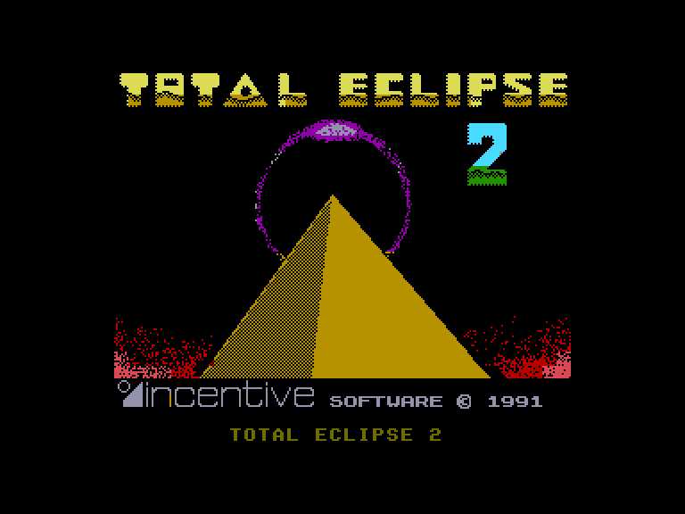
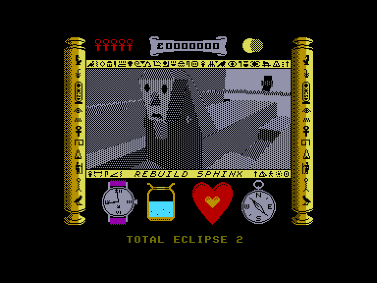
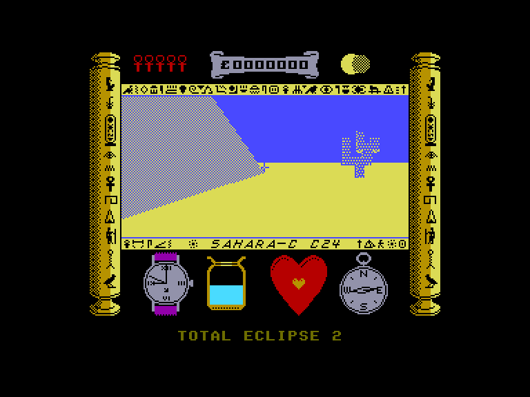
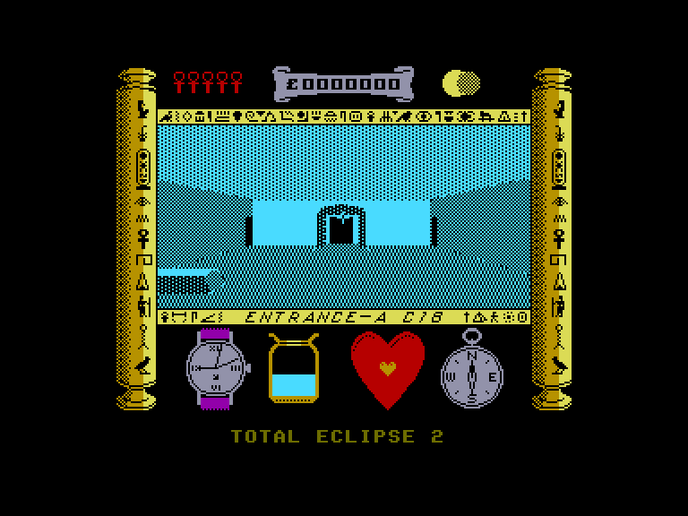

[0-9](../0/games-0.md) - [A](../a/games-a.md) - [B](../b/games-b.md) - [C](../c/games-c.md) - [D](../d/games-d.md) - [E](../e/games-e.md) - [F](../f/games-f.md) - [G](../g/games-g.md) - [H](../h/games-h.md) - [I](../i/games-i.md) - [J](../j/games-j.md) - [K](../k/games-k.md) - [L](../l/games-l.md) - [M](../m/games-m.md) - [N](../n/games-n.md) - [O](../o/games-o.md) - [P](../p/games-p.md) - [Q](../q/games-q.md) - [R](../r/games-r.md) - [S](../s/games-s.md) - [T](../t/games-t.md) - [U](../u/games-u.md) - [V](../v/games-v.md) - [W](../w/games-w.md) - [X](../x/games-x.md) - [Y](../y/games-y.md) - [Z](../z/games-z.md)

Ігри для [Enterprise 64k](../games-ep64.md) - [Enterprise 128k+RAMexp](../games-epramexp.md) - [2dfx](games-2dfx.md)

Ігри для систем [IS-DOS](../games-is-dos.md) - [SymbOS](../games-symbos.md) - [EDC Windows](../games-edcw.md)

Ігри для емуляторів [ZX Spectrum 48k/128k](../zxemu/games-zxemu.md) - [Amstrad CPC](../cpcemu/games-cpc.md) - [Sinclair ZX81](../zx81emu/games-zx81.md) - [Videoton TVC](../tvcemu/games-tvc.md) - [Commodore VIC-20](../vic20emu/games-vic20.md)

----------

# Total Eclipse 2: The Sphinx Jinx

**ID:** total-eclipse2-zx

## Скріншоти

## Опис

(temporary description generated by AI [Assistant])

**Короткий опис гри:**
"Total Eclipse 2" - це гра, в якій гравець досліджує піраміди Єгипту, щоб зібрати шматки магічної сфінкса, які розкидані по різних кімнатах. Гравець стикається з різними перешкодами, розгадує загадки та бореться з небезпеками, щоб успішно зібрати всі частини і відновити сфінкса, перш ніж сонячне затемнення загрожує людству.

**Правила гри:**
1. Гравець починає гру в пустелі поряд з трьома пірамідами.
2. Мета - знайти і зібрати всі 12 частин сфінкса, які розкидані по кімнатах піраміди.
3. У кожній кімнаті можуть бути перешкоди, які потрібно подолати, стріляючи в об'єкти або використовуючи предмети.
4. Гравець може взаємодіяти з об'єктами, щоб отримати підказки або предмети, які допоможуть у прогресі.
5. Для навігації та взаємодії використовуйте клавіші: 
   - A - обертання
   - S - кроки
   - O - вперед
   - K - назад
   - Q/W - обертання вліво/вправо
   - SPACE - режим прицілу
6. Будьте обережні з ворогами та пастками, які можуть завдати шкоди.
7. Збирайте анхи для відкриття нових шляхів і доступу до закритих дверей.
8. Гра закінчується, коли всі частини сфінкса зібрані, або якщо гравець зазнає невдачі.

Почніть гру і досліджуйте таємниці піраміди!

## Основна інформація
- **Оригінальна платформа:** ZX Spectrum

## Посилання
- [Опис на ep128.hu (угорською)](http://www.ep128.hu/Games/Total_Eclipse_2.htm)
- [Інформація про оригінальну версію](https://spectrumcomputing.co.uk/entry/5342/ZX-Spectrum/Total_Eclipse_2_The_Sphinx_Jinx)
- [Завантажити](http://www.ep128.hu/Ep_Games/Prg/Total_Eclipse2.rar)

