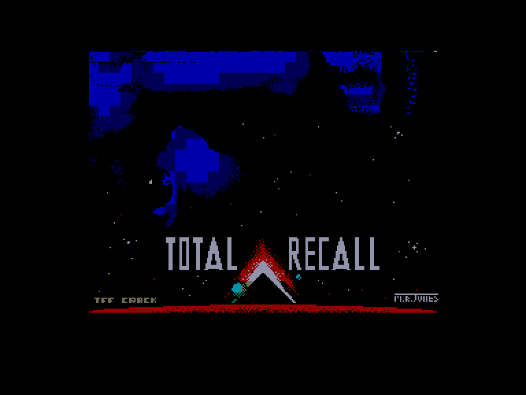
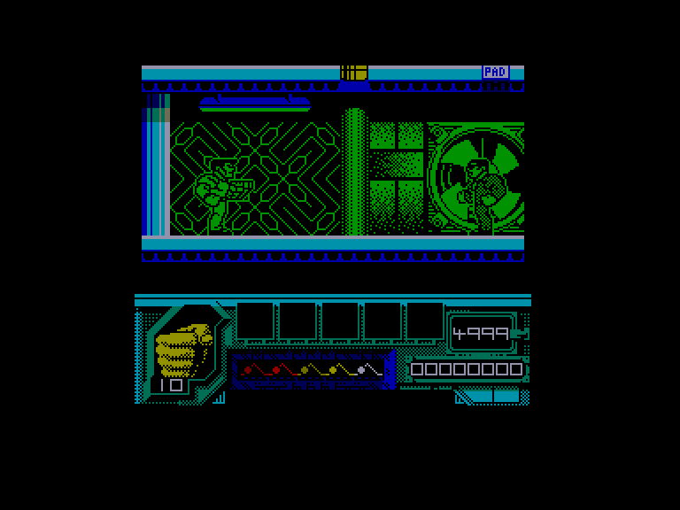
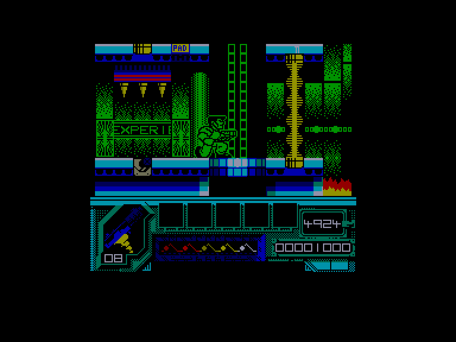

[0-9](../0/games-0.md) - [A](../a/games-a.md) - [B](../b/games-b.md) - [C](../c/games-c.md) - [D](../d/games-d.md) - [E](../e/games-e.md) - [F](../f/games-f.md) - [G](../g/games-g.md) - [H](../h/games-h.md) - [I](../i/games-i.md) - [J](../j/games-j.md) - [K](../k/games-k.md) - [L](../l/games-l.md) - [M](../m/games-m.md) - [N](../n/games-n.md) - [O](../o/games-o.md) - [P](../p/games-p.md) - [Q](../q/games-q.md) - [R](../r/games-r.md) - [S](../s/games-s.md) - [T](../t/games-t.md) - [U](../u/games-u.md) - [V](../v/games-v.md) - [W](../w/games-w.md) - [X](../x/games-x.md) - [Y](../y/games-y.md) - [Z](../z/games-z.md)

Ігри для [Enterprise 64k](../games-ep64.md) - [Enterprise 128k+RAMexp](../games-epramexp.md)

Ігри для систем [IS-DOS](../games-is-dos.md) - [SymbOS](../games-symbos.md) - [EDC Windows](../games-edcw.md)

Ігри для емуляторів [ZX Spectrum 48k/128k](../zxemu/games-zxemu.md) - [Amstrad CPC](../cpcemu/games-cpc.md) - [Sinclair ZX81](../zx81emu/games-zx81.md) - [Videoton TVC](../tvcemu/games-tvc.md) - [Commodore VIC-20](../vic20emu/games-vic20.md)

----------

# Total Recall

**ID:** total-recall-zx

## Скріншоти

## Опис

(temporary description generated by AI [ChatGPT])

**Короткий опис гри: Total Recall**

Total Recall – це відеогра, заснована на науково-фантастичному фільмі 1990 року, що розгортається у 2084 році. Гравець виконує роль Дугласа Квейда, робітника фабрики, який вирішує скористатися послугами компанії Rekall для отримання спогадів про відпустку на Марсі. Однак під час процедури виникають проблеми, які змушують його зіткнутися з правдою про своє життя. Гра складається з п'яти рівнів, на яких гравець проходить різноманітні завдання, включаючи платформерні елементи та автомобільні переслідування.

**Правила гри:**

1. **Персонаж:** Гравець керує Дугласом Квейдом, який повинен пройти через місто, збираючи необхідні предмети.
   
2. **Мета:** Дістатися до визначених точок на рівнях, збираючи предмети, такі як валізи, паспорти та інші важливі речі.

3. **Перешкоди:** Уникайте вогню, небезпечних рідин і ворогів. Гравець має обмежену кількість життів, і якщо енергія закінчується, гра закінчується.

4. **Зброя:** Гравець може використовувати зброю для боротьби з ворогами, але потрібно стежити за наявністю боєприпасів.

5. **Час:** На кожному рівні є обмежений час для завершення завдання. Гравець повинен швидко діяти, щоб уникнути програшу.

6. **Допоміжні предмети:** Збирайте червоні серця для поповнення енергії, жовті патрони для збільшення боєприпасів і інші бонуси для покращення гри.

7. **Управління:** Гравець може використовувати клавіатуру або джойстик для контролю персонажа. 

Гра обіцяє захоплюючу пригоду, наповнену екшеном та складними головоломками!

## Основна інформація
- **Оригінальна платформа:** ZX Spectrum

## Посилання
- [Опис гри на ep128.hu (угорською)](http://www.ep128.hu/Games/Total_Recall.htm)
- [Інформація про оригінальну версію](https://spectrumcomputing.co.uk/entry/5344/ZX-Spectrum/Total_Recall)
- [Завантажити гру](http://www.ep128.hu/Ep_Games/Prg/Total_Recall.rar)

