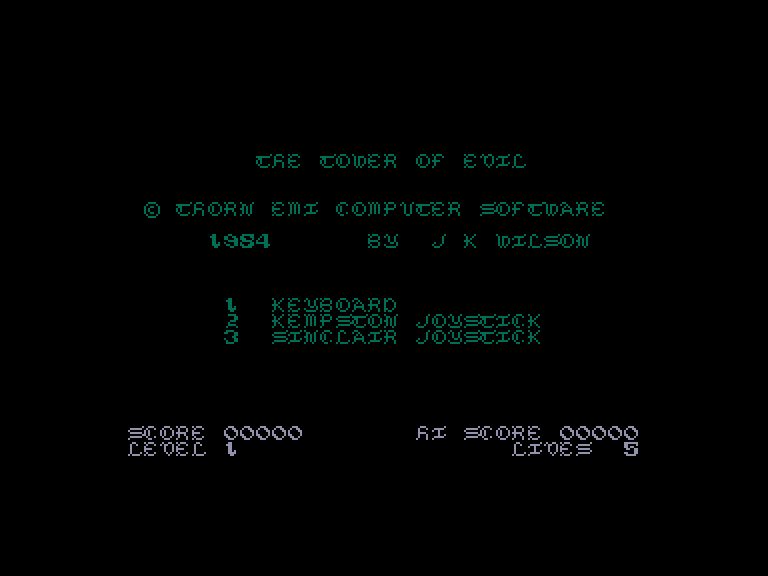
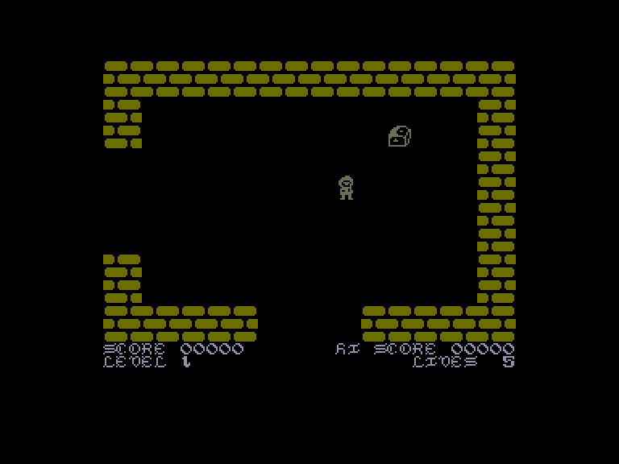
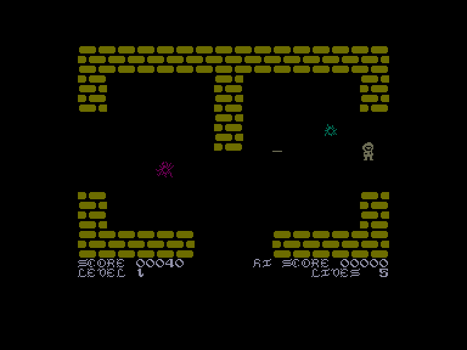
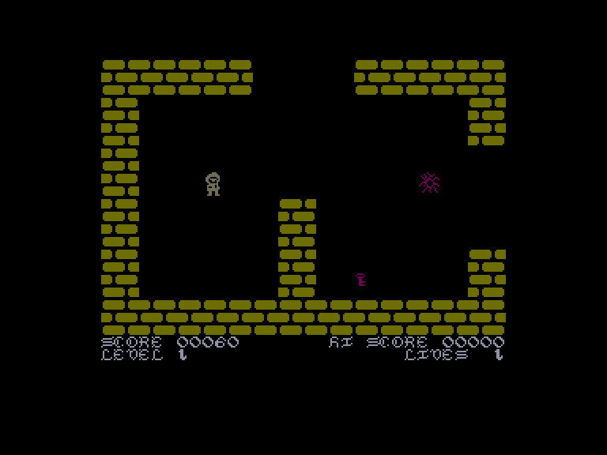

[0-9](../0/games-0.md) - [A](../a/games-a.md) - [B](../b/games-b.md) - [C](../c/games-c.md) - [D](../d/games-d.md) - [E](../e/games-e.md) - [F](../f/games-f.md) - [G](../g/games-g.md) - [H](../h/games-h.md) - [I](../i/games-i.md) - [J](../j/games-j.md) - [K](../k/games-k.md) - [L](../l/games-l.md) - [M](../m/games-m.md) - [N](../n/games-n.md) - [O](../o/games-o.md) - [P](../p/games-p.md) - [Q](../q/games-q.md) - [R](../r/games-r.md) - [S](../s/games-s.md) - [T](../t/games-t.md) - [U](../u/games-u.md) - [V](../v/games-v.md) - [W](../w/games-w.md) - [X](../x/games-x.md) - [Y](../y/games-y.md) - [Z](../z/games-z.md)

Ігри для [Enterprise 64k](../games-ep64.md) - [Enterprise 128k+RAMexp](../games-epramexp.md) - [2dfx](../games-2dfx.md)

Ігри для систем [IS-DOS](../games-is-dos.md) - [SymbOS](../games-symbos.md) - [EDC Windows](../games-edcw.md)

Ігри для емуляторів [ZX Spectrum 48k/128k](../zxemu/games-zxemu.md) - [Amstrad CPC](../cpcemu/games-cpc.md) - [Sinclair ZX81](../zx81emu/games-zx81.md) - [Videoton TVC](../tvcemu/games-tvc.md) - [Commodore VIC-20](../vic20emu/games-vic20.md)

----------

# Tower of Evil

**ID:** tower-of-evil-zx

## Скріншоти

## Опис

(temporary description generated by AI Assistant)

**Опис гри:**

У грі "Tower of Evil" ви граєте за Андроса, якого вигнав король Салімос. Ваше завдання - повернутися, викрадаючи принцесу Діану та втрачені скарби короля, які забрав злий некромант. Ви повинні дослідити сім поверхів "Вежі Зла", збираючи скарби та ключі, щоб підніматися на нові поверхи. Уникайте або знищуйте різних істот, що мешкають на кожному поверсі, адже дотик до них коштує вам життя. Знайдіть чашу, яка надає вам невразливість на короткий час. Коли ви досягнете сьомого поверху, зберіть усі скарби у скриню, перш ніж врятувати принцесу. Гра підтримує двох гравців, які можуть по черзі проходити рівні.

**Правила гри:**

1. Гравець починає на першому поверсі та має знайти всі скарби на кожному поверсі.
2. Уникайте або знищуйте істот, які можуть забрати ваше життя.
3. Збирайте ключі для доступу до магічних сходів, що ведуть на наступні поверхи.
4. Знайдіть чашу для отримання тимчасової невразливості.
5. Після збору всіх скарбів на сьомому поверсі, помістіть їх у скриню, щоб звільнити принцесу.
6. Якщо ви програєте всі життя, гра закінчується.

Гра "Tower of Evil" - це захоплююча пригода, яка вимагає стратегічного мислення та швидкої реакції.

## Основна інформація
- **Оригінальна платформа:** ZX Spectrum

## Посилання
- [Інформація про оригінальну версію](https://spectrumcomputing.co.uk/entry/5353/ZX-Spectrum/Tower_of_Evil)
- [Завантажити](http://www.ep128.hu/Ep_Games/Prg/Tower_of_Evil.rar)

