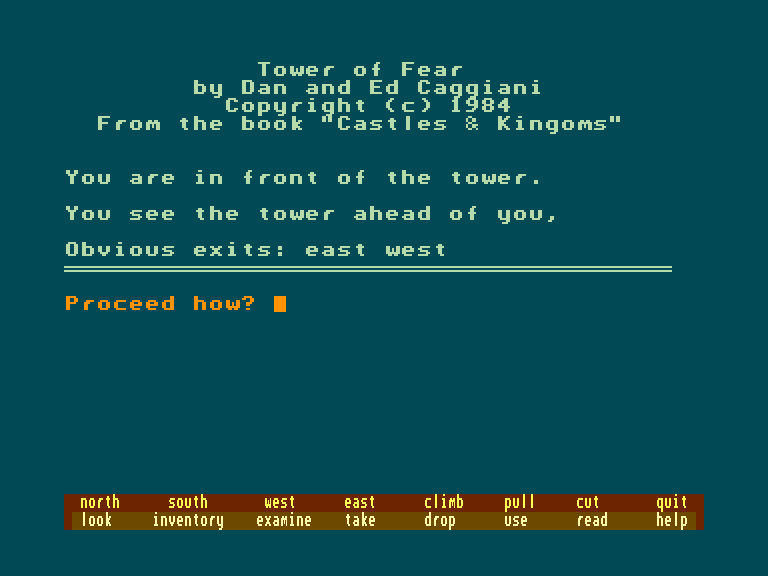
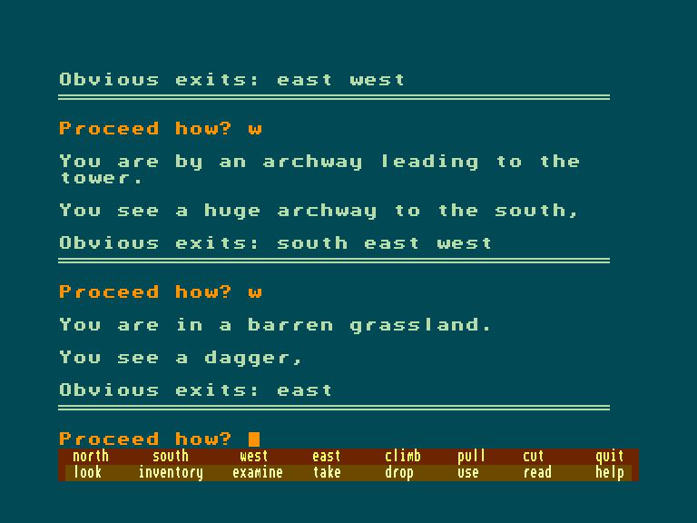
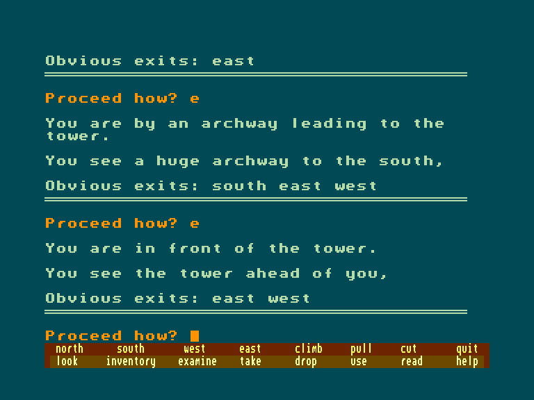

[0-9](../0/games-0.md) - [A](../a/games-a.md) - [B](../b/games-b.md) - [C](../c/games-c.md) - [D](../d/games-d.md) - [E](../e/games-e.md) - [F](../f/games-f.md) - [G](../g/games-g.md) - [H](../h/games-h.md) - [I](../i/games-i.md) - [J](../j/games-j.md) - [K](../k/games-k.md) - [L](../l/games-l.md) - [M](../m/games-m.md) - [N](../n/games-n.md) - [O](../o/games-o.md) - [P](../p/games-p.md) - [Q](../q/games-q.md) - [R](../r/games-r.md) - [S](../s/games-s.md) - [T](../t/games-t.md) - [U](../u/games-u.md) - [V](../v/games-v.md) - [W](../w/games-w.md) - [X](../x/games-x.md) - [Y](../y/games-y.md) - [Z](../z/games-z.md)

Ігри для [Enterprise 64k](../games-ep64.md) - [Enterprise 128k+RAMexp](../games-epramexp.md) - [2dfx](../games-2dfx.md)

Ігри для систем [IS-DOS](../games-is-dos.md) - [SymbOS](../games-symbos.md) - [EDC Windows](../games-edcw.md)

Ігри для емуляторів [ZX Spectrum 48k/128k](../zxemu/games-zxemu.md) - [Amstrad CPC](../cpcemu/games-cpc.md) - [Sinclair ZX81](../zx81emu/games-zx81.md) - [Videoton TVC](../tvcemu/games-tvc.md) - [Commodore VIC-20](../vic20emu/games-vic20.md)

----------

# Tower of Fear

**ID:** tower-of-fear-bas

## Скріншоти

## Опис

(temporary description generated by AI [ChatGPT])

**Опис гри:**

"Вежа Страху" - це захоплююча пригодницька гра, розташована в таємничому світі Грейлокленду, де ви, як відважний авантюрист, повинні увійти до Вежі Чарівника, перемогти ворогів і здобути скарби. Вежа, що колись належала Чорному Серцю, охороняється примарами та циклопами, які не дозволять вам пройти без бою. Лише той, хто зуміє подолати всі перешкоди, стане справжнім героєм.

**Правила гри:**

1. Ваша мета - увійти до Вежі Страху та перемогти всіх ворогів, які стоятимуть на вашому шляху.
2. Збирайте скарби та підвищуйте свої навички, щоб стати сильнішим.
3. Уникайте пасток і небезпек, які можуть призвести до вашої загибелі.
4. Якщо ви зазнаєте поразки, ви будете покарані, а ваші залишки їстимуть слизькі черв'яки підземелля.
5. Використовуйте свою кмітливість та стратегію, щоб досягти успіху та стати легендою.

Готові до виклику? Час стати героєм!

## Посилання
- [Опис на ep128.hu (угорською)](http://www.ep128.hu/Ep_Games/Leiras/Castles_and_Kingdoms.htm)
- [Інформація про гру (SolutionArchive.com)](https://solutionarchive.com/game/id%2C5487/Tower+of+Fear.html)
- [Завантажити](http://www.ep128.hu/Ep_Games/Prg/Castles_and_Kingdoms.rar)

