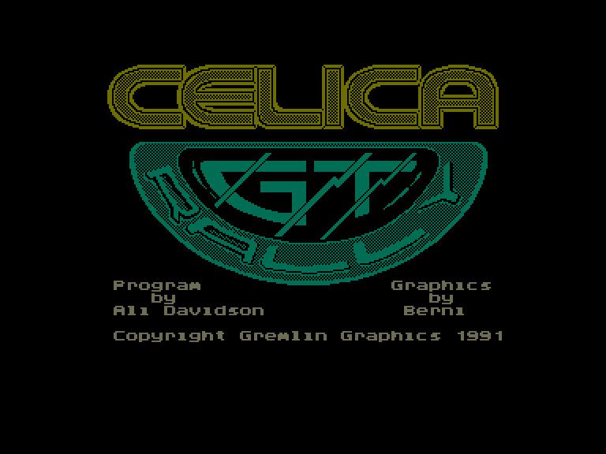
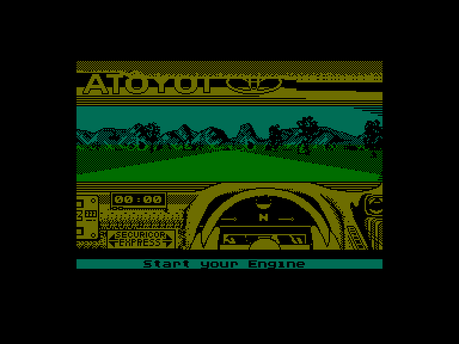
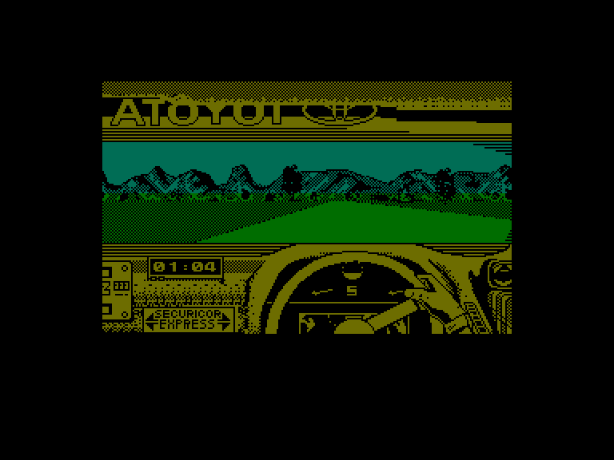

[0-9](../0/games-0.md) - [A](../a/games-a.md) - [B](../b/games-b.md) - [C](../c/games-c.md) - [D](../d/games-d.md) - [E](../e/games-e.md) - [F](../f/games-f.md) - [G](../g/games-g.md) - [H](../h/games-h.md) - [I](../i/games-i.md) - [J](../j/games-j.md) - [K](../k/games-k.md) - [L](../l/games-l.md) - [M](../m/games-m.md) - [N](../n/games-n.md) - [O](../o/games-o.md) - [P](../p/games-p.md) - [Q](../q/games-q.md) - [R](../r/games-r.md) - [S](../s/games-s.md) - [T](../t/games-t.md) - [U](../u/games-u.md) - [V](../v/games-v.md) - [W](../w/games-w.md) - [X](../x/games-x.md) - [Y](../y/games-y.md) - [Z](../z/games-z.md)

Ігри для [Enterprise 64k](../games-ep64.md) - [Enterprise 128k+RAMexp](../games-epramexp.md)

Ігри для систем [IS-DOS](../games-is-dos.md) - [SymbOS](../games-symbos.md) - [EDC Windows](../games-edcw.md)

Ігри для емуляторів [ZX Spectrum 48k/128k](../zxemu/games-zxemu.md) - [Amstrad CPC](../cpcemu/games-cpc.md) - [Sinclair ZX81](../zx81emu/games-zx81.md) - [Videoton TVC](../tvcemu/games-tvc.md) - [Commodore VIC-20](../vic20emu/games-vic20.md)

----------

# Toyota Celica GT Rally

**Альтернативні назви:**
 - Celica GT4 Rally

**ID:** toyota-celica-gt-rally-zx

## Скріншоти

## Опис

(temporary description generated by AI [Assistant])

**Опис гри:**
Toyota Celica GT Rally - це автомобільні перегони, розроблені компанією Gremlin Graphics Software Ltd. у 1991 році. Гравці беруть участь у чемпіонаті, що проходить у трьох країнах: Англії, Мексиці та Фінляндії, кожна з яких має свої унікальні умови. Гравці повинні пройти 30 етапів, змагаючись за найкращий час. Гра підтримує до 4 гравців, які можуть грати по черзі.

**Правила гри:**
1. Гравець може вибрати режим чемпіонату або практики.
2. На початку чемпіонату гравець може налаштувати кількість учасників та їхні імена.
3. Перед кожним етапом можна налаштувати інструкції для штурмана, які допоможуть у проходженні поворотів.
4. Гравець може керувати автомобілем за допомогою клавіш, які можна налаштувати.
5. Якщо автомобіль зазнає аварії, гравець отримує 20-секундний штраф і повинен перезапустити двигун.
6. Гра пропонує різні налаштування управління, включаючи автоматичну та ручну коробку передач.
7. Гравець може в будь-який момент призупинити гру або змінити налаштування.

Гравці повинні бути обережними, оскільки керування автомобілем може бути складним, а звуки в грі не завжди є приємними.

## Основна інформація
- **Оригінальна платформа:** ZX Spectrum

## Посилання
- [Опис гри на ep128.hu (угорською)](http://www.ep128.hu/Games/Toyota_Celica_GT_Rally.htm)
- [Інформація про оригінальну версію](https://spectrumcomputing.co.uk/entry/5357/ZX-Spectrum/Toyota_Celica_GT_Rally)
- [Завантажити гру](http://www.ep128.hu/Ep_Games/Prg/Toyota_Rally.rar)

**Дата генерації:** 28.07.2026

