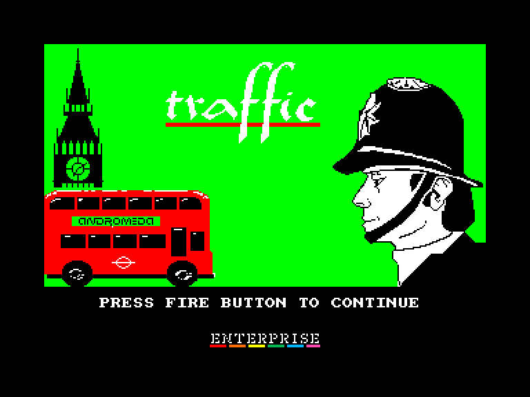
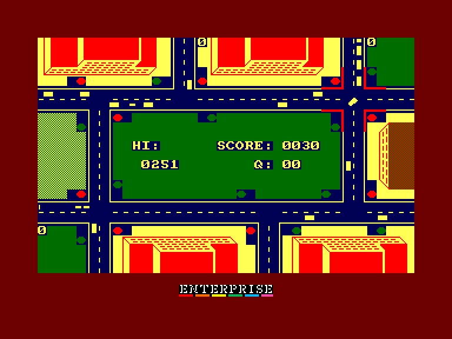
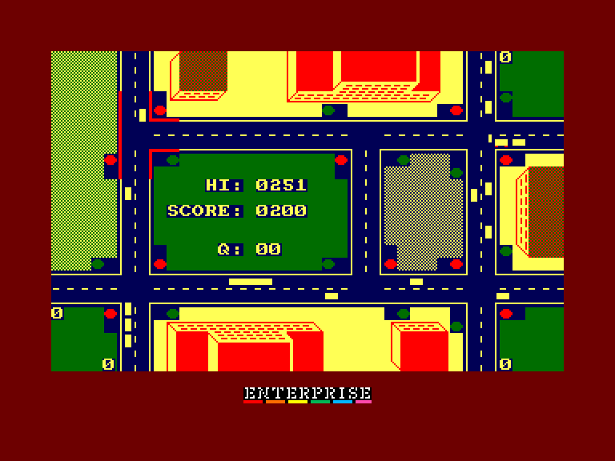
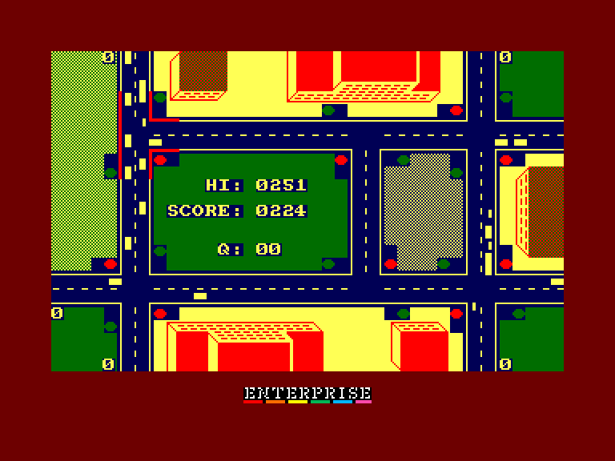

[0-9](../0/games-0.md) - [A](../a/games-a.md) - [B](../b/games-b.md) - [C](../c/games-c.md) - [D](../d/games-d.md) - [E](../e/games-e.md) - [F](../f/games-f.md) - [G](../g/games-g.md) - [H](../h/games-h.md) - [I](../i/games-i.md) - [J](../j/games-j.md) - [K](../k/games-k.md) - [L](../l/games-l.md) - [M](../m/games-m.md) - [N](../n/games-n.md) - [O](../o/games-o.md) - [P](../p/games-p.md) - [Q](../q/games-q.md) - [R](../r/games-r.md) - [S](../s/games-s.md) - [T](../t/games-t.md) - [U](../u/games-u.md) - [V](../v/games-v.md) - [W](../w/games-w.md) - [X](../x/games-x.md) - [Y](../y/games-y.md) - [Z](../z/games-z.md)

Ігри для [Enterprise 64k](../games-ep64.md) - [Enterprise 128k+RAMexp](../games-epramexp.md) - [2dfx](../games-2dfx.md)

Ігри для систем [IS-DOS](../games-is-dos.md) - [SymbOS](../games-symbos.md) - [EDC Windows](../games-edcw.md)

Ігри для емуляторів [ZX Spectrum 48k/128k](../zxemu/games-zxemu.md) - [Amstrad CPC](../cpcemu/games-cpc.md) - [Sinclair ZX81](../zx81emu/games-zx81.md) - [Videoton TVC](../tvcemu/games-tvc.md) - [Commodore VIC-20](../vic20emu/games-vic20.md)

----------

# Traffic

**ID:** traffic-cpc

## Скріншоти

## Опис

(temporary description generated by AI [your name])

**Опис гри: Traffic**

Traffic — це симулятор управління дорожнім рухом, розроблений угорською компанією Andromeda Soft. Гра вийшла на платформах C64 та Amstrad CPC, а також стала однією з небагатьох європейських ігор, що з'явилася в Японії на популярному стандарті MSX. Гравець бере на себе роль регулювальника дорожнього руху в одному з районів Лондона, керуючи світлофорами для забезпечення безперешкодного руху автомобілів. Завдання ускладнюється характерними для великих міст заторами, і гравцеві потрібно уважно стежити за кількістю автомобілів, що прибувають до перехресть.

**Правила гри:**
1. Гравець повинен регулювати світлофори на перехрестях, щоб уникнути заторів.
2. На карті відображаються вхідні дороги з лічильниками автомобілів, які не змогли вміститися на екрані.
3. Якщо лічильник досягає трьох, гравець отримує попередження; при досягненні п'яти (на важчих рівнях дев'яти) гра закінчується.
4. Гравець може перейти до наступного району, досягнувши певних балів (200, 500, 800, 1400, 2000 тощо).
5. Гра має п'ять районів, кожен з яких має вищий рівень трафіку.
6. За бажанням, гравець може змінити частоту процесора для збільшення швидкості гри та трафіку.
7. В Enterprise версії можна вибрати англійську або французьку версію гри, що відрізняються правилами руху.

**Управління:**
Гру можна контролювати за допомогою джойстика. Кнопка "вогонь" (SPACE) використовується для зміни сигналів світлофора. Гравець переміщується між перехрестями, нахиляючи джойстик у відповідному напрямку.

## Основна інформація
- **Мови:** Англійська, Французька
- **Оригінальна платформа:** Amstrad CPC

## Посилання
- [Опис на ep128.hu (угорською)](http://www.ep128.hu/Ep_Games/Leiras/Traffic.htm)
- [Тема на форумі enterpriseforever](https://enterpriseforever.com/cpc-rl/traffic/)
- [Інформація про оригінальну версію](https://www.cpc-power.com/index.php?page=detail&num=2279)
- [Завантажити](http://www.ep128.hu/Ep_Games/Prg/Traffic.rar)
- [Easy Load&Play](https://t.me/EP128k_Load_n_Play/857) *(Telegram-канал Vibrant Waves)*

