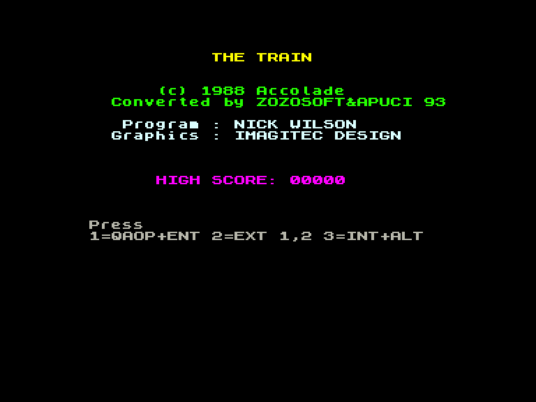
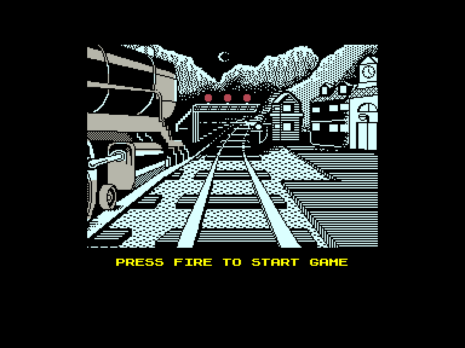
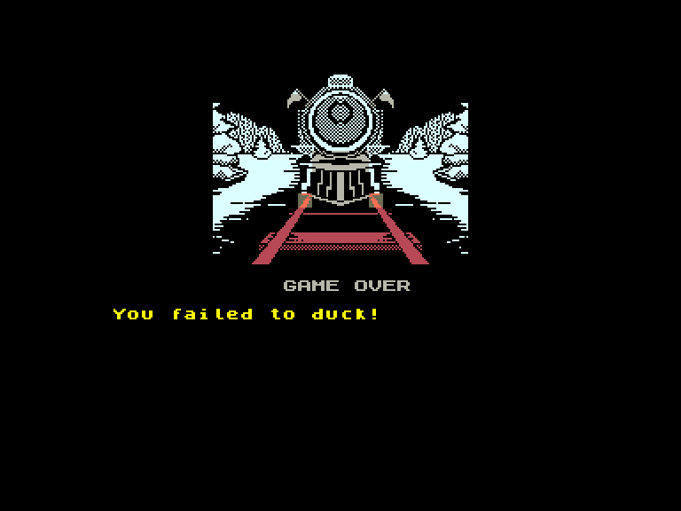

[0-9](../0/games-0.md) - [A](../a/games-a.md) - [B](../b/games-b.md) - [C](../c/games-c.md) - [D](../d/games-d.md) - [E](../e/games-e.md) - [F](../f/games-f.md) - [G](../g/games-g.md) - [H](../h/games-h.md) - [I](../i/games-i.md) - [J](../j/games-j.md) - [K](../k/games-k.md) - [L](../l/games-l.md) - [M](../m/games-m.md) - [N](../n/games-n.md) - [O](../o/games-o.md) - [P](../p/games-p.md) - [Q](../q/games-q.md) - [R](../r/games-r.md) - [S](../s/games-s.md) - [T](../t/games-t.md) - [U](../u/games-u.md) - [V](../v/games-v.md) - [W](../w/games-w.md) - [X](../x/games-x.md) - [Y](../y/games-y.md) - [Z](../z/games-z.md)

Ігри для [Enterprise 64k](../games-ep64.md) - [Enterprise 128k+RAMexp](../games-epramexp.md) - [2dfx](games-2dfx.md)

Ігри для систем [IS-DOS](../games-is-dos.md) - [SymbOS](../games-symbos.md) - [EDC Windows](../games-edcw.md)

Ігри для емуляторів [ZX Spectrum 48k/128k](../zxemu/games-zxemu.md) - [Amstrad CPC](../cpcemu/games-cpc.md) - [Sinclair ZX81](../zx81emu/games-zx81.md) - [Videoton TVC](../tvcemu/games-tvc.md) - [Commodore VIC-20](../vic20emu/games-vic20.md)

----------

# The Train: Escape to Normandy

**ID:** train-escape-from-normandy-zx

## Скріншоти

## Опис

(temporary description generated by AI [Assistant])

**Опис гри:**
"The Train: Escape from Normandy" - це захоплююча гра, що поєднує в собі елементи екшену та пригод. Гравець стає частиною опору в Нормандії 1944 року, де потрібно захистити військовослужбовця, що намагається дістатися до залізничного переїзду, поки німецькі снайпери стріляють з вікон. Після виконання цього завдання, гравець керує потягом, намагаючись уникнути атак літаків та зберегти цінні артефакти від захоплення.

**Правила гри:**
1. Виберіть режим управління: клавіатура, Kempston або Sinclair.
2. Захистіть солдата, стріляючи по німецьким снайперам з вікон.
3. Після досягнення залізничного переїзду виберіть рівень складності: легкий, середній або важкий.
4. Під час керування потягом:
   - Регулюйте швидкість за допомогою важеля.
   - Відкривайте двері печі для підкидання вугілля.
   - Використовуйте гальма обережно, щоб не пошкодити їх.
   - Слідкуйте за тиском, швидкістю та температурою.
5. Зупиняйтеся на мостах для знищення ворожих кораблів.
6. Заправляйте запаси вугілля на станціях.
7. Виконуйте завдання, щоб дізнатися інформацію про наступні цілі та ремонти.

Гра вимагає швидкості, точності та стратегічного мислення для успішного виконання місій та збереження артефактів.

## Основна інформація
- **Оригінальна платформа:** ZX Spectrum

## Посилання
- [Опис на ep128.hu (угорською)](http://www.ep128.hu/Games/Train.htm)
- [Інформація про оригінальну версію](https://spectrumcomputing.co.uk/entry/5373/ZX-Spectrum/The_Train_Escape_to_Normandy)
- [Завантажити](http://www.ep128.hu/Ep_Games/Prg/Train.rar)

