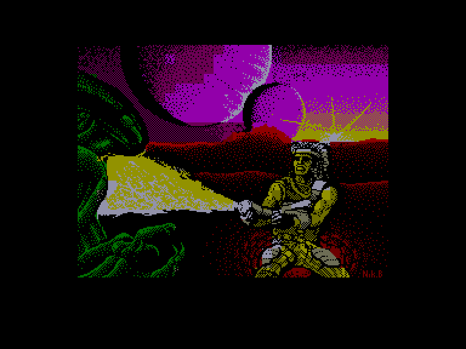
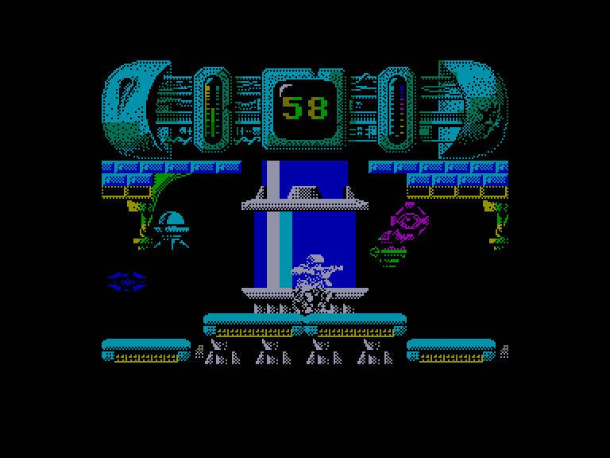
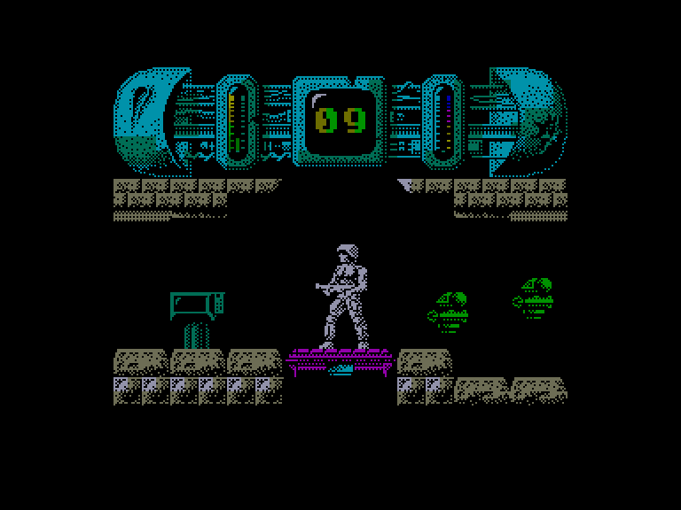
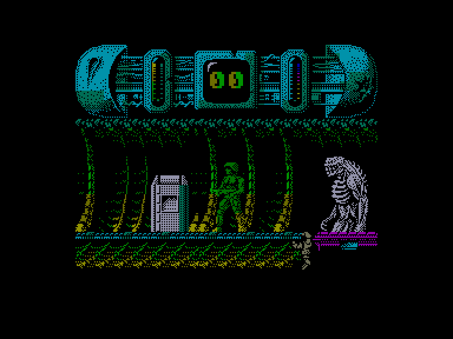

[0-9](../0/games-0.md) - [A](../a/games-a.md) - [B](../b/games-b.md) - [C](../c/games-c.md) - [D](../d/games-d.md) - [E](../e/games-e.md) - [F](../f/games-f.md) - [G](../g/games-g.md) - [H](../h/games-h.md) - [I](../i/games-i.md) - [J](../j/games-j.md) - [K](../k/games-k.md) - [L](../l/games-l.md) - [M](../m/games-m.md) - [N](../n/games-n.md) - [O](../o/games-o.md) - [P](../p/games-p.md) - [Q](../q/games-q.md) - [R](../r/games-r.md) - [S](../s/games-s.md) - [T](../t/games-t.md) - [U](../u/games-u.md) - [V](../v/games-v.md) - [W](../w/games-w.md) - [X](../x/games-x.md) - [Y](../y/games-y.md) - [Z](../z/games-z.md)

Ігри для [Enterprise 64k](../games-ep64.md) - [Enterprise 128k+RAMexp](../games-epramexp.md)

Ігри для систем [IS-DOS](../games-is-dos.md) - [SymbOS](../games-symbos.md) - [EDC Windows](../games-edcw.md)

Ігри для емуляторів [ZX Spectrum 48k/128k](../zxemu/games-zxemu.md) - [Amstrad CPC](../cpcemu/games-cpc.md) - [Sinclair ZX81](../zx81emu/games-zx81.md) - [Videoton TVC](../tvcemu/games-tvc.md) - [Commodore VIC-20](../vic20emu/games-vic20.md)

----------

# Trantor: The Last Stormtrooper

**ID:** trantor-zx

## Скріншоти

## Опис

(temporary description generated by AI [ChatGPT])

**Опис гри:**
"Trantor: Останній штурмовик" — це гра, в якій ви граєте за солдата, що вижив після катастрофи на планеті, населеній інопланетянами. Ваша мета — знайти код для активації телепорту та втекти з бази, поки не спрацювала система самознищення. На вас чекають небезпечні роботи та жахливі монстри, а також обмежений час для виконання місії.

**Правила гри:**
1. Гравець повинен знайти 8 символів для пароля, які випадковим чином генеруються на терміналах.
2. Кожен термінал надає один символ пароля, а також дозволяє скинути таймер самознищення до 90 секунд.
3. Після збору всіх символів, гравець має ввести пароль на центральному комп'ютері, щоб отримати код для активації телепорту.
4. Гравець має обмежений час для втечі та повинен уникати атакуючих роботів і монстрів.
5. Використовуйте вогнемет для захисту, але пам'ятайте, що його боєприпаси обмежені.
6. Збирайте предмети, які можуть допомогти вам: гамбургери для відновлення енергії, каністри для поповнення боєприпасів, годинники для скидання таймера та щити для тимчасового захисту.
7. Гравець має лише одне життя, тому будьте обережні у своїх діях. 

Удачі у вашій місії!

## Основна інформація
- **Оригінальна платформа:** ZX Spectrum

## Посилання
- [Опис гри на ep128.hu (угорською)](http://www.ep128.hu/Games/Trantor.htm)
- [Інформація про оригінальну версію](https://spectrumcomputing.co.uk/entry/5385/ZX-Spectrum/Trantor_The_Last_Stormtrooper)
- [Завантажити гру](http://www.ep128.hu/Ep_Games/Prg/Trantor.rar)

