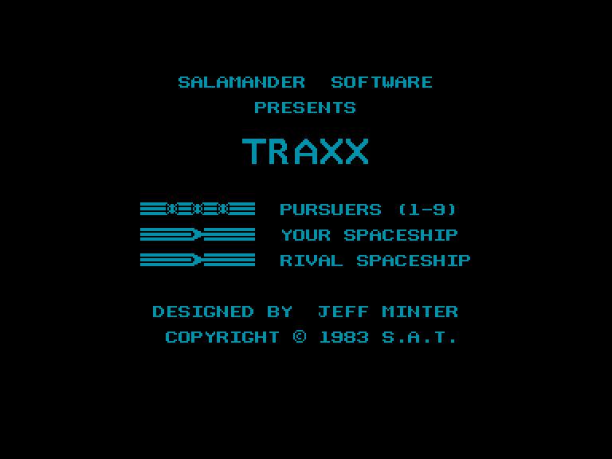
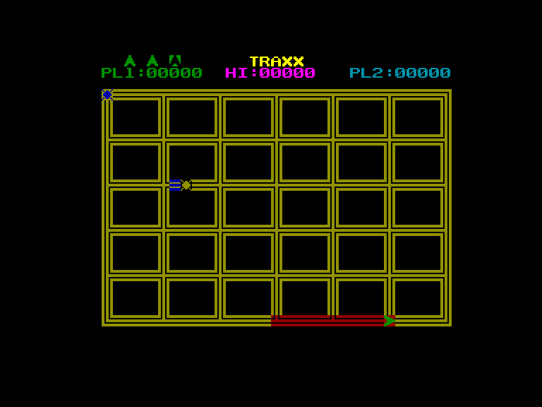
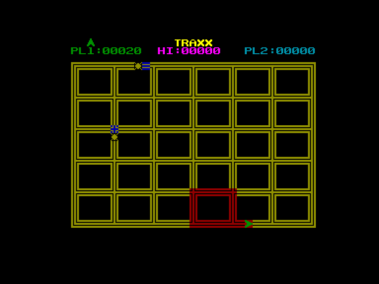
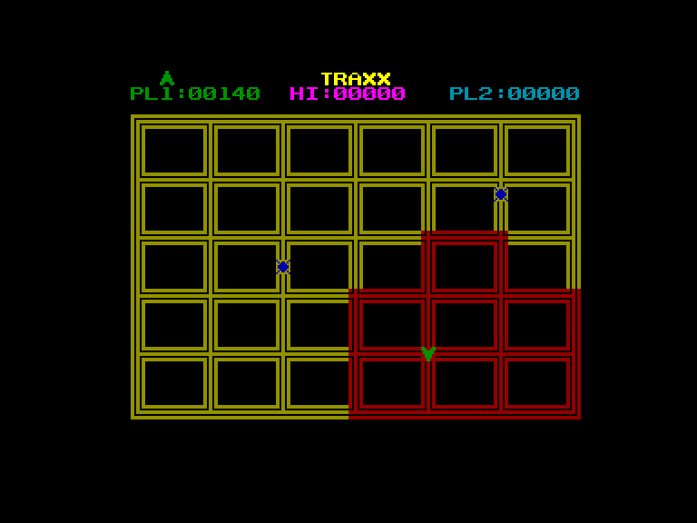

[0-9](../0/games-0.md) - [A](../a/games-a.md) - [B](../b/games-b.md) - [C](../c/games-c.md) - [D](../d/games-d.md) - [E](../e/games-e.md) - [F](../f/games-f.md) - [G](../g/games-g.md) - [H](../h/games-h.md) - [I](../i/games-i.md) - [J](../j/games-j.md) - [K](../k/games-k.md) - [L](../l/games-l.md) - [M](../m/games-m.md) - [N](../n/games-n.md) - [O](../o/games-o.md) - [P](../p/games-p.md) - [Q](../q/games-q.md) - [R](../r/games-r.md) - [S](../s/games-s.md) - [T](../t/games-t.md) - [U](../u/games-u.md) - [V](../v/games-v.md) - [W](../w/games-w.md) - [X](../x/games-x.md) - [Y](../y/games-y.md) - [Z](../z/games-z.md)

Ігри для [Enterprise 64k](../games-ep64.md) - [Enterprise 128k+RAMexp](../games-epramexp.md) - [2dfx](games-2dfx.md)

Ігри для систем [IS-DOS](../games-is-dos.md) - [SymbOS](../games-symbos.md) - [EDC Windows](../games-edcw.md)

Ігри для емуляторів [ZX Spectrum 48k/128k](../zxemu/games-zxemu.md) - [Amstrad CPC](../cpcemu/games-cpc.md) - [Sinclair ZX81](../zx81emu/games-zx81.md) - [Videoton TVC](../tvcemu/games-tvc.md) - [Commodore VIC-20](../vic20emu/games-vic20.md)

----------

# Traxx

**ID:** traxx-zx

## Скріншоти

## Опис

(temporary description generated by AI)

**Опис гри: Traxx**

Traxx — це класична гра в жанрі "захоплення території", яка вперше з'явилася на автоматах Atari. Гравець управляє уявним космічним кораблем на квадратному полі, метою якого є забарвлення всієї території в червоний колір. Гра починається з одного червоного сегмента, і, рухаючись по жовтих полях, гравець "фарбує" їх у червоний колір. Щоб захопити квадрат, всі його сторони повинні бути забарвлені в червоний. Гравець також має уникати зіткнень з ворогами, які випадковим чином пересуваються по полю.

**Правила гри:**

1. **Фарбування:** У вашому "пензлі" достатньо фарби для трьох ліній. Після цього потрібно повернутися на вже забарвлену територію, інакше нова червона лінія зникне.
2. **Повернення:** Якщо ви повертаєтеся з жовтої території під час малювання червоної лінії, нова лінія також зникне.
3. **Вороги:** Якщо ви зіткнетеся з ворогом, втрачаєте життя, але вже захоплені квадрати залишаються за вами.
4. **Налаштування перед початком гри:**
   - **Z** - Кількість гравців (1 або 2).
   - **X** - Кількість переслідувачів (від 2 до 9).
   - **C** - Швидкість гри (від 1 до 9).
5. **Управління:** Гру можна контролювати за допомогою клавіатури або джойстика. Рекомендується використовувати повільну швидкість, щоб уникнути проблем з управлінням.

Для традиції, ви можете ввести код для безсмертя: `POKE 31769,0`.

## Основна інформація
- **Оригінальна платформа:** ZX Spectrum

## Посилання
- [Опис на ep128.hu (угорською)](http://www.ep128.hu/Games/Traxx.htm)
- [Інформація про оригінальну версію](https://spectrumcomputing.co.uk/entry/5395/ZX-Spectrum/Traxx)
- [Завантажити](http://www.ep128.hu/Ep_Games/Prg/Traxx.rar)

