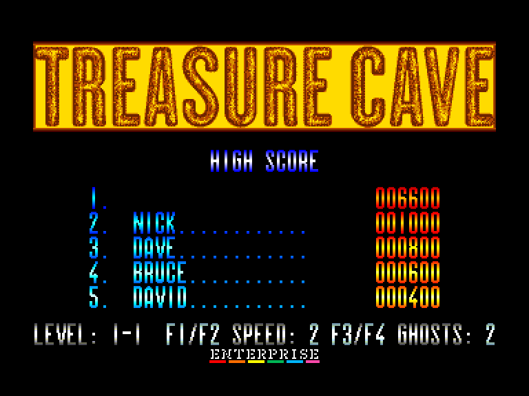
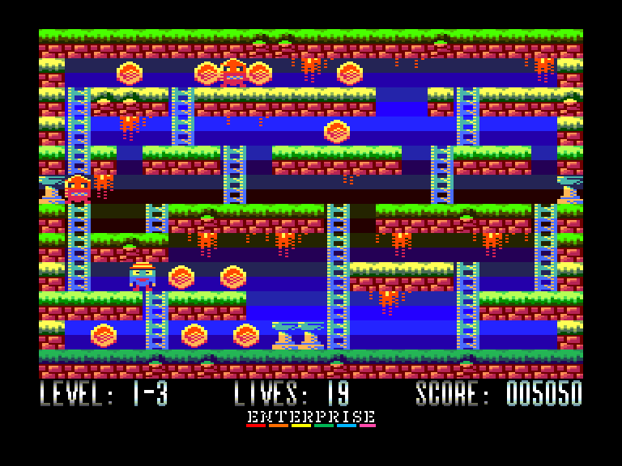
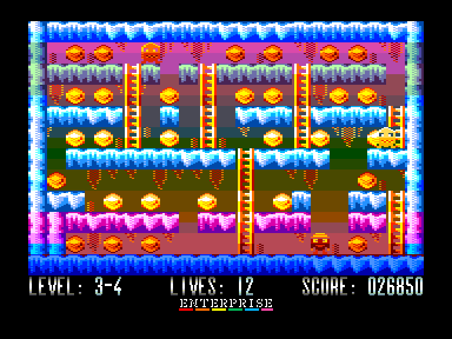
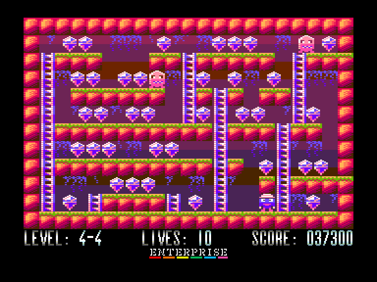

[0-9](../0/games-0.md) - [A](../a/games-a.md) - [B](../b/games-b.md) - [C](../c/games-c.md) - [D](../d/games-d.md) - [E](../e/games-e.md) - [F](../f/games-f.md) - [G](../g/games-g.md) - [H](../h/games-h.md) - [I](../i/games-i.md) - [J](../j/games-j.md) - [K](../k/games-k.md) - [L](../l/games-l.md) - [M](../m/games-m.md) - [N](../n/games-n.md) - [O](../o/games-o.md) - [P](../p/games-p.md) - [Q](../q/games-q.md) - [R](../r/games-r.md) - [S](../s/games-s.md) - [T](../t/games-t.md) - [U](../u/games-u.md) - [V](../v/games-v.md) - [W](../w/games-w.md) - [X](../x/games-x.md) - [Y](../y/games-y.md) - [Z](../z/games-z.md)

Ігри для [Enterprise 64k](../games-ep64.md) - [Enterprise 128k+RAMexp](../games-epramexp.md)

Ігри для систем [IS-DOS](../games-is-dos.md) - [SymbOS](../games-symbos.md) - [EDC Windows](../games-edcw.md)

Ігри для емуляторів [ZX Spectrum 48k/128k](../zxemu/games-zxemu.md) - [Amstrad CPC](../cpcemu/games-cpc.md) - [Sinclair ZX81](../zx81emu/games-zx81.md) - [Videoton TVC](../tvcemu/games-tvc.md) - [Commodore VIC-20](../vic20emu/games-vic20.md)

----------

# Treasure Cave

**ID:** treasure-cave

## Скріншоти

## Опис

(temporary description generated by AI [your name])

**Опис гри: Treasure Cave**

Treasure Cave - це захоплююча гра, яка пропонує гравцям досліджувати підземелля в пошуках скарбів. В новій 4K версії гри було додано багато нововведень, включаючи можливість вибору з чотирьох наборів рівнів, нові музичні треки, а також таблицю рекордів. Гравці можуть отримати тимчасову непереможність в залежності від кількості ворогів на рівні, що додає нові стратегії до ігрового процесу.

**Правила гри:**
1. Виберіть один з чотирьох наборів рівнів для початку гри.
2. Збирайте скарби та уникайте ворогів, щоб зберегти свої життя.
3. Ви можете активувати непереможність, якщо на рівні є більше одного ворога. Вона триває 5 секунд.
4. Використовуйте клавішу ESC, щоб перезапустити рівень, втрачаючи одне життя.
5. Ваші бали зберігаються в таблиці рекордів, яка оновлюється при виході з гри.

Грайте, досліджуйте та станьте володарем Treasure Cave!

## Посилання
- [Опис гри на ep128.hu (угорською)](http://www.ep128.hu/Ep_Games/Leiras/Treasure_Cave.htm)
- [Завантажити гру](http://www.ep128.hu/Ep_Games/Prg/Treasure_Cave.rar)
- [Easy Load&Play](https://t.me/EP128k_Load_n_Play/849) *(Telegram-канал Vibrant Waves)*

**Дата генерації:** 28.07.2026

## Відео

<iframe src="https://www.youtube.com/embed/wmmxRWdMrhw"  
style="width:75%; aspect-ratio:16/9;" allowfullscreen></iframe>
