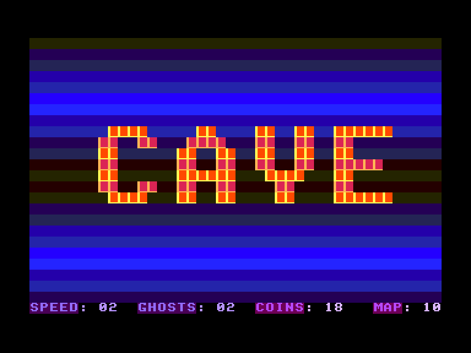
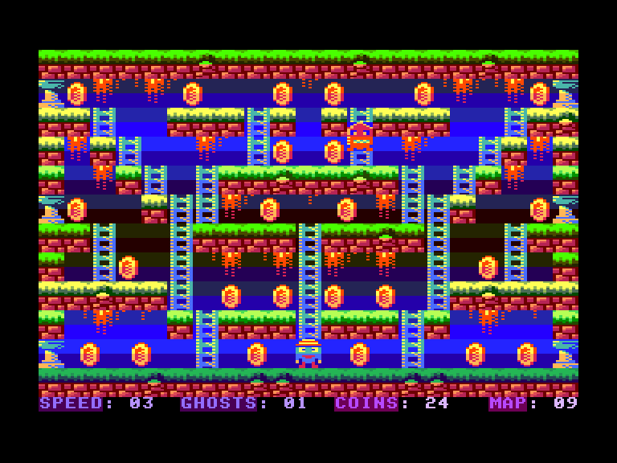
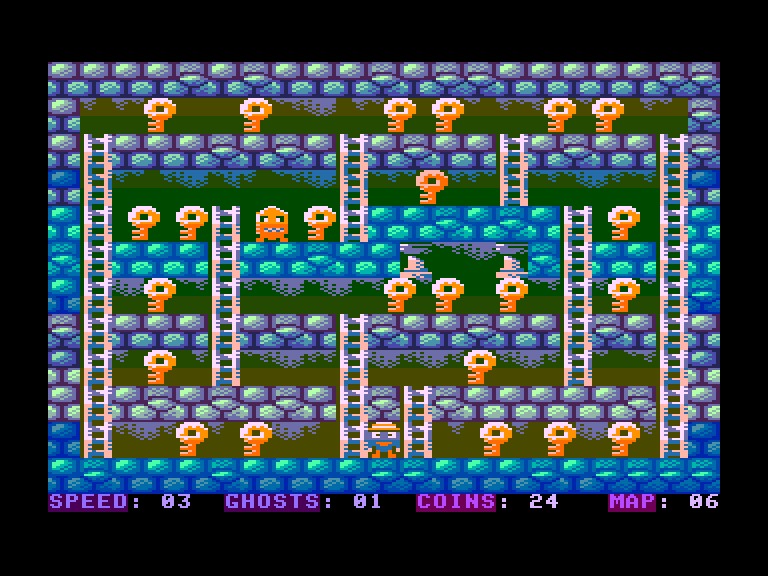
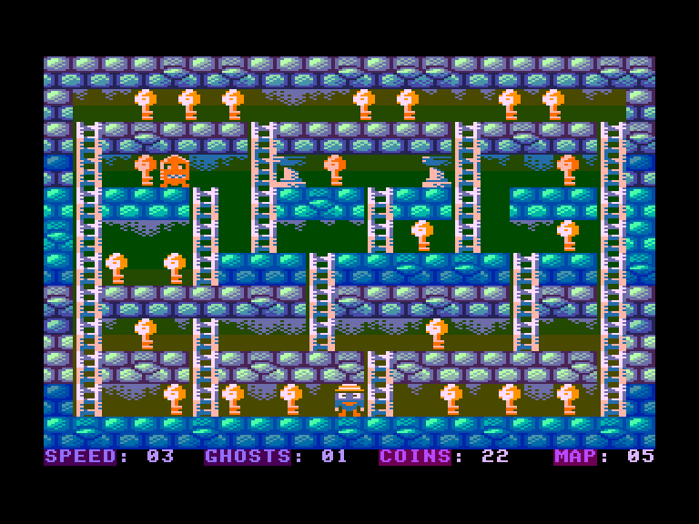

[0-9](../0/games-0.md) - [A](../a/games-a.md) - [B](../b/games-b.md) - [C](../c/games-c.md) - [D](../d/games-d.md) - [E](../e/games-e.md) - [F](../f/games-f.md) - [G](../g/games-g.md) - [H](../h/games-h.md) - [I](../i/games-i.md) - [J](../j/games-j.md) - [K](../k/games-k.md) - [L](../l/games-l.md) - [M](../m/games-m.md) - [N](../n/games-n.md) - [O](../o/games-o.md) - [P](../p/games-p.md) - [Q](../q/games-q.md) - [R](../r/games-r.md) - [S](../s/games-s.md) - [T](../t/games-t.md) - [U](../u/games-u.md) - [V](../v/games-v.md) - [W](../w/games-w.md) - [X](../x/games-x.md) - [Y](../y/games-y.md) - [Z](../z/games-z.md)

Ігри для [Enterprise 64k](../games-ep64.md) - [Enterprise 128k+RAMexp](../games-epramexp.md)

Ігри для систем [IS-DOS](../games-is-dos.md) - [SymbOS](../games-symbos.md) - [EDC Windows](../games-edcw.md)

Ігри для емуляторів [ZX Spectrum 48k/128k](../zxemu/games-zxemu.md) - [Amstrad CPC](../cpcemu/games-cpc.md) - [Sinclair ZX81](../zx81emu/games-zx81.md) - [Videoton TVC](../tvcemu/games-tvc.md) - [Commodore VIC-20](../vic20emu/games-vic20.md)

----------

# Treasure Cave 4k

**ID:** treasure-cave4k

## Скріншоти

## Опис

(temporary description generated by AI [Assistant])

**Опис гри: Treasure Cave 4K**

Treasure Cave 4K — це традиційна, але вражаюча гра в жанрі платформер, де гравець збирає монети, ключі та дорогоцінні камені, уникаючи випадкових ворогів. Гравець не може стрибати, але може підніматися та спускатися по сходах. Гра закінчується, коли зібрані всі монети на рівні. Графіка яскрава та різноманітна, з 10 різними екранами, які змінюються кожні три рівні. 

**Правила гри:**
1. Збирайте всі монети, ключі та дорогоцінні камені на рівні.
2. Уникайте ворогів, які рухаються випадковим чином.
3. Ви не можете стрибати, але можете підніматися і спускатися по сходах.
4. Ви можете падати з будь-якої висоти.
5. Гра закінчується, коли ви зберете останню монету.
6. Використовуйте клавіші:
   - SPACE: почати гру
   - F1/F2: налаштування швидкості (1 - найшвидша, 5 - найповільніша)
   - F3/F4: налаштування кількості ворогів (1-3).
   
Гра сумісна з EXOS і працює з ідеальною швидкістю навіть на 64K машинах.

## Основна інформація
### Загальні системні вимоги
- **Апаратні:** EP64, EP128

## Посилання
- [Опис гри на ep128.hu (угорською)](http://www.ep128.hu/Ep_Games/Leiras/Treasure_Cave_4K.htm)
- [Завантажити гру](http://www.ep128.hu/Ep_Games/Prg/Treasure_Cave_4K.rar)
- [Easy Load&Play](https://t.me/EP128k_Load_n_Play/849) *(Telegram-канал Vibrant Waves)*

