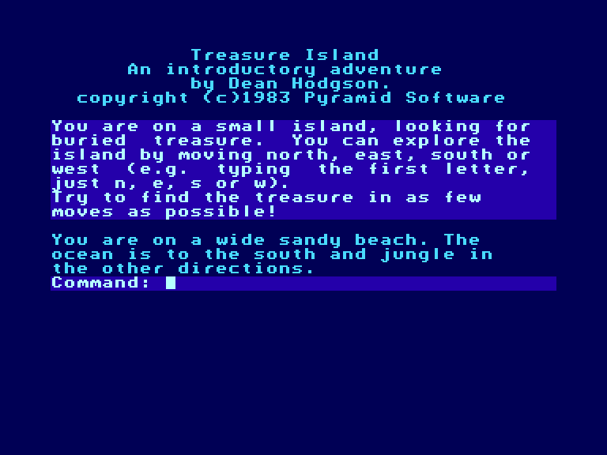
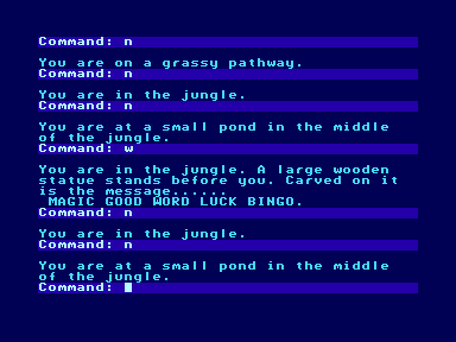
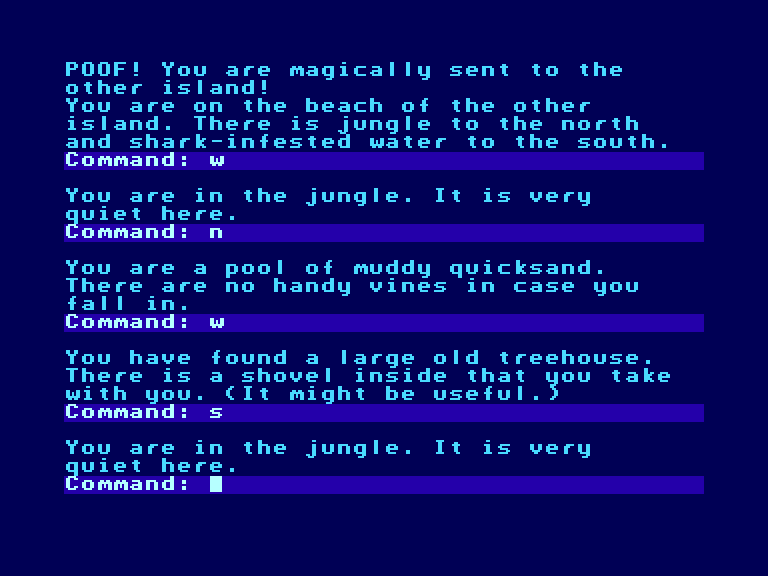

[0-9](../0/games-0.md) - [A](../a/games-a.md) - [B](../b/games-b.md) - [C](../c/games-c.md) - [D](../d/games-d.md) - [E](../e/games-e.md) - [F](../f/games-f.md) - [G](../g/games-g.md) - [H](../h/games-h.md) - [I](../i/games-i.md) - [J](../j/games-j.md) - [K](../k/games-k.md) - [L](../l/games-l.md) - [M](../m/games-m.md) - [N](../n/games-n.md) - [O](../o/games-o.md) - [P](../p/games-p.md) - [Q](../q/games-q.md) - [R](../r/games-r.md) - [S](../s/games-s.md) - [T](../t/games-t.md) - [U](../u/games-u.md) - [V](../v/games-v.md) - [W](../w/games-w.md) - [X](../x/games-x.md) - [Y](../y/games-y.md) - [Z](../z/games-z.md)

Ігри для [Enterprise 64k](../games-ep64.md) - [Enterprise 128k+RAMexp](../games-epramexp.md)

Ігри для систем [IS-DOS](../games-is-dos.md) - [SymbOS](../games-symbos.md) - [EDC Windows](../games-edcw.md)

Ігри для емуляторів [ZX Spectrum 48k/128k](../zxemu/games-zxemu.md) - [Amstrad CPC](../cpcemu/games-cpc.md) - [Sinclair ZX81](../zx81emu/games-zx81.md) - [Videoton TVC](../tvcemu/games-tvc.md) - [Commodore VIC-20](../vic20emu/games-vic20.md)

----------

# Treasure Island

**ID:** treasure-island-bas

## Скріншоти

## Опис

(temporary description generated by AI Assistant)

**Опис гри: Острів Скарбів**

У грі "Острів Скарбів" вам потрібно знайти скарби на маленькому острові. Це дуже проста та коротка гра, яка існує в кількох різних формах, включаючи версію, яка використовується як зразок пригоди в системі Pathweaver. Гра популярна як "перша пригода" у австралійських школах, а автор пізніше переробив цю ідею в гру "Jara-Tava: Острів Вогню".

**Правила гри:**
1. Ваша мета - знайти скарби, заховані на острові.
2. Використовуйте підказки та досліджуйте різні місця на острові.
3. Гра не має складних механік, що робить її ідеальною для новачків.
4. Збирайте інформацію та вирішуйте головоломки, щоб просуватися далі.
5. Насолоджуйтесь пригодою та відкривайте нові можливості!

Приготуйтеся до захоплюючої подорожі на Острів Скарбів!

## Основна інформація
- **Мови:** Англійська

## Посилання
- [Опис гри на ep128.hu (угорською)](http://www.ep128.hu/Ep_Games/Leiras/Basic_Program_Pack.htm)
- [Інформація про гру (SolutionArchive.com)](https://solutionarchive.com/game/id%2C5002/Treasure+Island.html)
- [Завантажити гру](http://www.ep128.hu/Ep_Games/Prg/Basic_Program_Pack.rar)

**Дата генерації:** 29.07.2026

