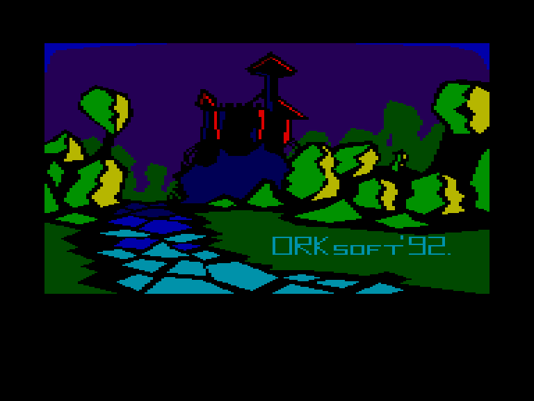
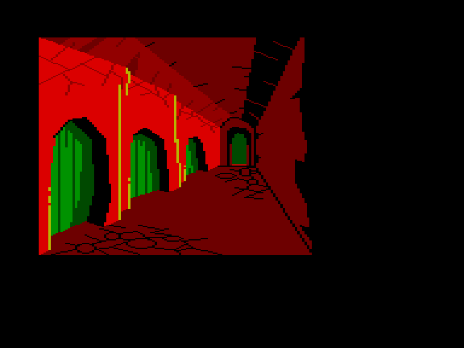
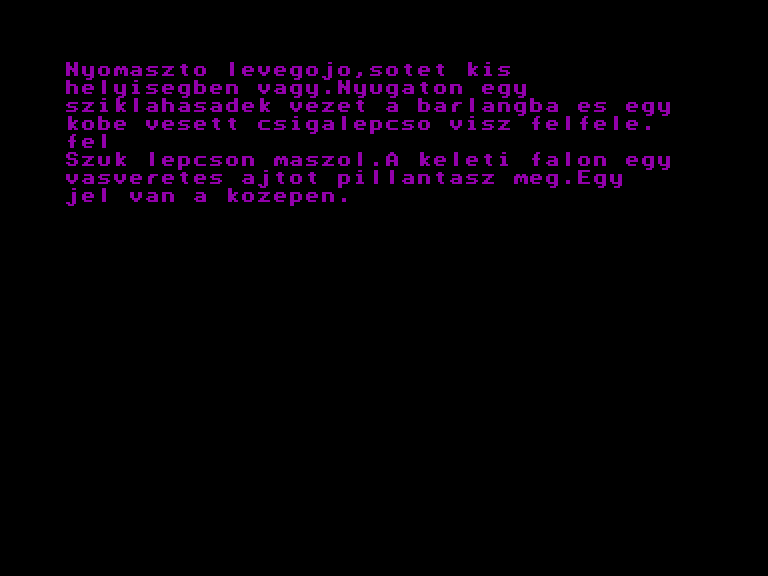
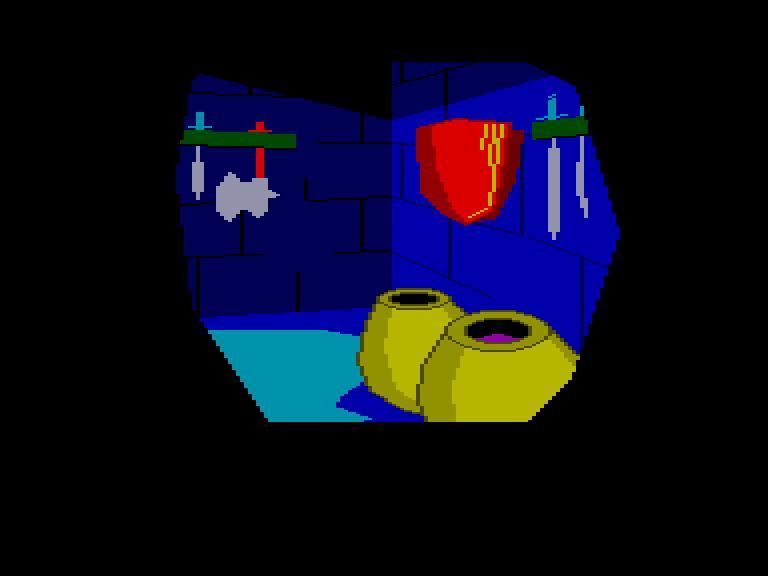

[0-9](../0/games-0.md) - [A](../a/games-a.md) - [B](../b/games-b.md) - [C](../c/games-c.md) - [D](../d/games-d.md) - [E](../e/games-e.md) - [F](../f/games-f.md) - [G](../g/games-g.md) - [H](../h/games-h.md) - [I](../i/games-i.md) - [J](../j/games-j.md) - [K](../k/games-k.md) - [L](../l/games-l.md) - [M](../m/games-m.md) - [N](../n/games-n.md) - [O](../o/games-o.md) - [P](../p/games-p.md) - [Q](../q/games-q.md) - [R](../r/games-r.md) - [S](../s/games-s.md) - [T](../t/games-t.md) - [U](../u/games-u.md) - [V](../v/games-v.md) - [W](../w/games-w.md) - [X](../x/games-x.md) - [Y](../y/games-y.md) - [Z](../z/games-z.md)

Ігри для [Enterprise 64k](../games-ep64.md) - [Enterprise 128k+RAMexp](../games-epramexp.md)

Ігри для систем [IS-DOS](../games-is-dos.md) - [SymbOS](../games-symbos.md) - [EDC Windows](../games-edcw.md)

Ігри для емуляторів [ZX Spectrum 48k/128k](../zxemu/games-zxemu.md) - [Amstrad CPC](../cpcemu/games-cpc.md) - [Sinclair ZX81](../zx81emu/games-zx81.md) - [Videoton TVC](../tvcemu/games-tvc.md) - [Commodore VIC-20](../vic20emu/games-vic20.md)

----------

# Trollok Vára

**ID:** trollok-vara

**Жанри:** Текстова пригода

## Скріншоти

## Опис

(temporary description generated by AI [Assistant])

**Опис гри:**
"Trollok Vára" - це традиційна текстова пригодницька гра, розроблена угорською компанією Ork Soft. Гравець потрапляє у світ тролів, де його захоплюють і замкнуть у підземній в'язниці. Ваша мета - втекти з в'язниці, використовуючи різні команди та предмети, які можна знайти в грі. Гра містить елементи графіки, які додають атмосфери, хоча не всі локації мають зображення.

**Правила гри:**
1. Команди вводяться угорською мовою без діакритичних знаків (наприклад, "VEDD FAKLYA").
2. Гравець може використовувати такі команди:
   - LIST - інформація про предмети
   - HOL - опис місця
   - VIZSGALD (V) - досліджувати предмет
   - К (схід), NY (захід), E (північ), D (південь) - переміщення
   - FEL, LE, MASSZ - підніматися, спускатися, лазити
   - VEDD, ADD, TEDD - брати, давати, класти
   - HASZNALD, USD, RUGD, TORD - використовувати, бити, ламати
   - NYISD, CSUKD, ZARD - відкривати, закривати, зачиняти

3. Гра не є дуже довгою, але забезпечить цікаве проведення часу для всіх шанувальників текстових пригод.

## Основна інформація
- **Мови:** Угорська
- **Оригінальна платформа:** Enterprise
### Системні вимоги
- **Програмні:** IS-Basic
### Геймплей
- **Керування:** Keyboard
- **Кількість гравців:** 1 player
- **Додаткові теги:** 16-color mode, Text40 mode
### Розробка
- **Рік випуску:** 1992
- **Автор:** Endi
- **Компанія:** Ork Software

## Посилання
- [Опис гри на ep128.hu (угорською)](http://www.ep128.hu/Ep_Games/Leiras/Trollok_Vara.htm)
- [Завантажити гру](http://www.ep128.hu/Ep_Games/Prg/Trollok_Vara.rar)

**Дата генерації:** 29.07.2026

