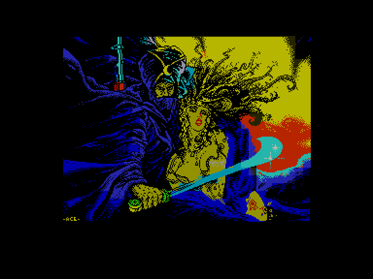
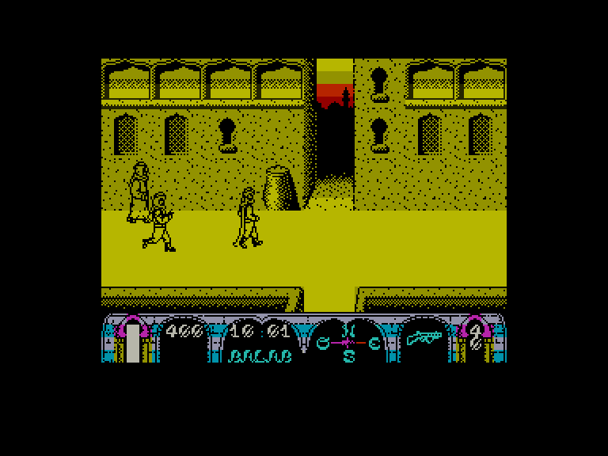
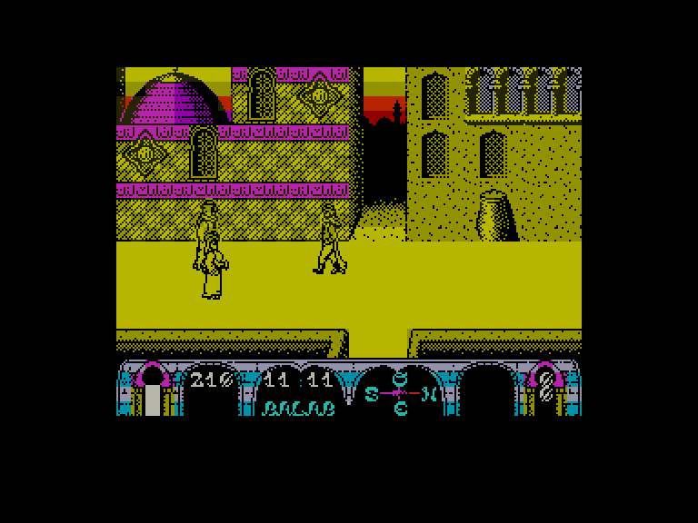
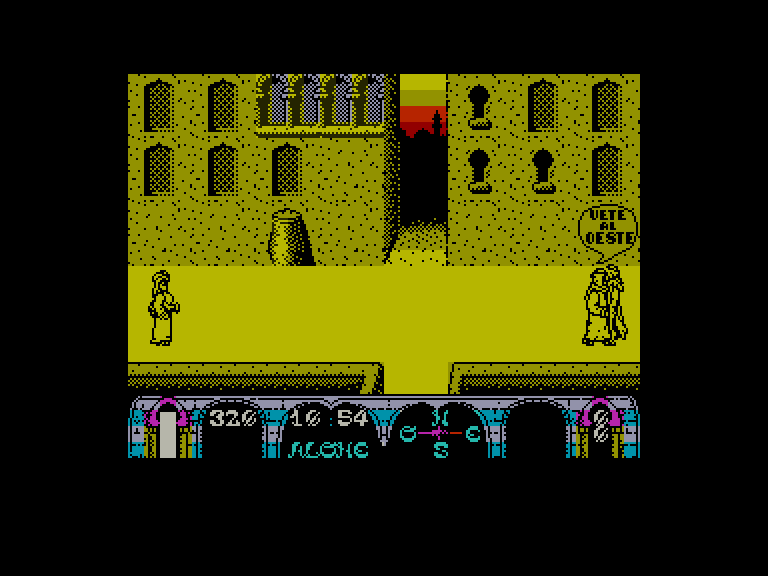

[0-9](../0/games-0.md) - [A](../a/games-a.md) - [B](../b/games-b.md) - [C](../c/games-c.md) - [D](../d/games-d.md) - [E](../e/games-e.md) - [F](../f/games-f.md) - [G](../g/games-g.md) - [H](../h/games-h.md) - [I](../i/games-i.md) - [J](../j/games-j.md) - [K](../k/games-k.md) - [L](../l/games-l.md) - [M](../m/games-m.md) - [N](../n/games-n.md) - [O](../o/games-o.md) - [P](../p/games-p.md) - [Q](../q/games-q.md) - [R](../r/games-r.md) - [S](../s/games-s.md) - [T](../t/games-t.md) - [U](../u/games-u.md) - [V](../v/games-v.md) - [W](../w/games-w.md) - [X](../x/games-x.md) - [Y](../y/games-y.md) - [Z](../z/games-z.md)

Ігри для [Enterprise 64k](../games-ep64.md) - [Enterprise 128k+RAMexp](../games-epramexp.md)

Ігри для систем [IS-DOS](../games-is-dos.md) - [SymbOS](../games-symbos.md) - [EDC Windows](../games-edcw.md)

Ігри для емуляторів [ZX Spectrum 48k/128k](../zxemu/games-zxemu.md) - [Amstrad CPC](../cpcemu/games-cpc.md) - [Sinclair ZX81](../zx81emu/games-zx81.md) - [Videoton TVC](../tvcemu/games-tvc.md) - [Commodore VIC-20](../vic20emu/games-vic20.md)

----------

# Tuareg

**ID:** tuareg-zx

## Скріншоти

## Опис

(temporary description generated by AI [Assistant])

**Опис гри: Tuareg**

Гра "Tuareg" від Topo Soft переносить гравця в Марракеш 1990 року, де потрібно врятувати доньку султана Аіт-Амарт, викрадену берберськими гірниками. Гравець, у ролі капітана султанської армії на прізвисько Чорний Тигр, має три дні, щоб знайти і звільнити принцесу. Місто, наповнене людьми, є заплутаним лабіринтом вузьких вулиць і провулків, де кожен район може бути як дружнім, так і ворожим.

**Правила гри:**

1. **Мета гри:** Знайти і врятувати принцесу в межах трьох днів.
2. **Персонажі:**
   - Мусульмани: можуть дати корисну інформацію за гроші.
   - Жінки: можуть бути джерелом грошей, але можуть стати ворогами.
   - Поліція: небезпечні, можуть забрати ваше спорядження.
   - Розбійники: охороняють двері до принцеси.
   - Спостерігачі: можуть кидати предмети у вас.
3. **Ресурси:** Гравець має обмежену енергію та боєприпаси. Важливо регулярно харчуватися і відпочивати.
4. **Час:** Деякі місця відкриті лише в певний час. Вечір – небезпечний час для прогулянок.
5. **Управління:** Використовуйте клавіші для руху, стрільби, вибору та покупки.

Гра закінчується, якщо гравець втрачає всю енергію, закінчується час або якщо принцеса врятована.

## Основна інформація
- **Мови:** Іспанська
- **Оригінальна платформа:** ZX Spectrum

## Посилання
- [Опис гри на ep128.hu (угорською)](http://www.ep128.hu/Games/Tuareg.htm)
- [Інформація про оригінальну версію](https://spectrumcomputing.co.uk/entry/5438/ZX-Spectrum/Tuareg)
- [Завантажити гру](http://www.ep128.hu/Ep_Games/Prg/Tuareg.rar)

