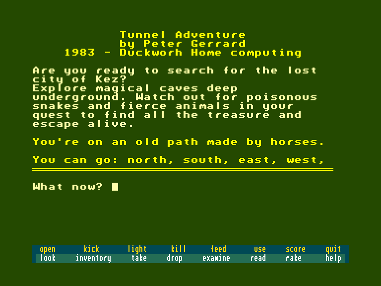
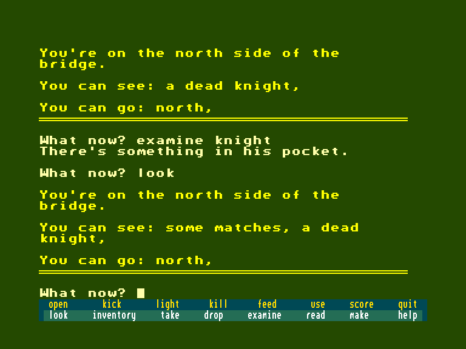
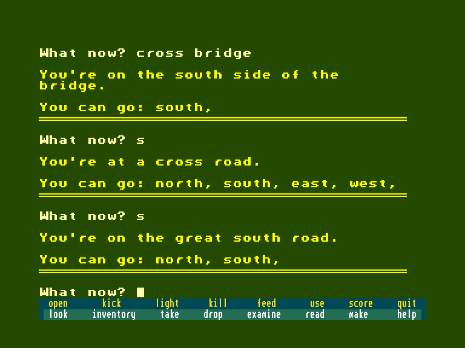

[0-9](../0/games-0.md) - [A](../a/games-a.md) - [B](../b/games-b.md) - [C](../c/games-c.md) - [D](../d/games-d.md) - [E](../e/games-e.md) - [F](../f/games-f.md) - [G](../g/games-g.md) - [H](../h/games-h.md) - [I](../i/games-i.md) - [J](../j/games-j.md) - [K](../k/games-k.md) - [L](../l/games-l.md) - [M](../m/games-m.md) - [N](../n/games-n.md) - [O](../o/games-o.md) - [P](../p/games-p.md) - [Q](../q/games-q.md) - [R](../r/games-r.md) - [S](../s/games-s.md) - [T](../t/games-t.md) - [U](../u/games-u.md) - [V](../v/games-v.md) - [W](../w/games-w.md) - [X](../x/games-x.md) - [Y](../y/games-y.md) - [Z](../z/games-z.md)

Ігри для [Enterprise 64k](../games-ep64.md) - [Enterprise 128k+RAMexp](../games-epramexp.md)

Ігри для систем [IS-DOS](../games-is-dos.md) - [SymbOS](../games-symbos.md) - [EDC Windows](../games-edcw.md)

Ігри для емуляторів [ZX Spectrum 48k/128k](../zxemu/games-zxemu.md) - [Amstrad CPC](../cpcemu/games-cpc.md) - [Sinclair ZX81](../zx81emu/games-zx81.md) - [Videoton TVC](../tvcemu/games-tvc.md) - [Commodore VIC-20](../vic20emu/games-vic20.md)

----------

# Tunnel Adventure

**ID:** tunnel-adv-bas

## Скріншоти

## Опис

(temporary description generated by AI)

**Tunnelmaze Adventure** – це захоплююча гра, в якій ви досліджуєте магічні печери глибоко під землею. У вашій подорожі вам потрібно уникати отруйних змій та диких тварин, щоб знайти всі скарби та вибратися живим.

**Правила гри:**
1. Досліджуйте підземні печери, щоб знайти скарби.
2. Уникайте небезпечних істот, які можуть вас атакувати.
3. Використовуйте свої навички програмування для створення власних пригод.
4. Грайте на різних платформах, таких як Amstrad CPC, Atari 400/800, C64/128 та інших.
5. Якщо ви не хочете вводити код гри вручну, ви можете купити її на касеті.

Приготуйтеся до захоплюючих пригод у світі Tunnelmaze!

## Основна інформація
- **Мови:** Англійська
### Геймплей
- **Керування:** Keyboard

## Посилання
- [Опис гри на ep128.hu (угорською)](http://www.ep128.hu/Ep_Games/Leiras/Basic_Program_Pack.htm)
- [Інформація про гру (SolutionArchive.com)](https://solutionarchive.com/game/id%2C560/Tunnelmaze+Adventure.html)
- [Завантажити гру](http://www.ep128.hu/Ep_Games/Prg/Basic_Program_Pack.rar)

**Дата генерації:** 29.07.2026

