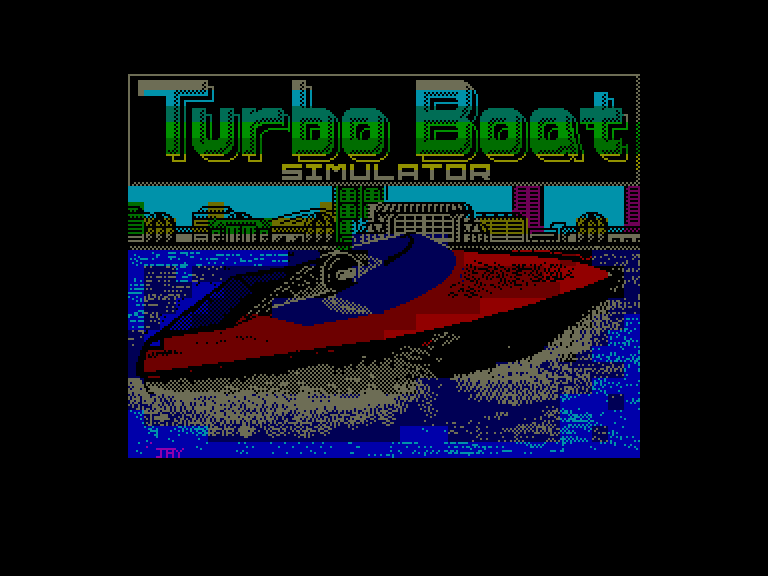
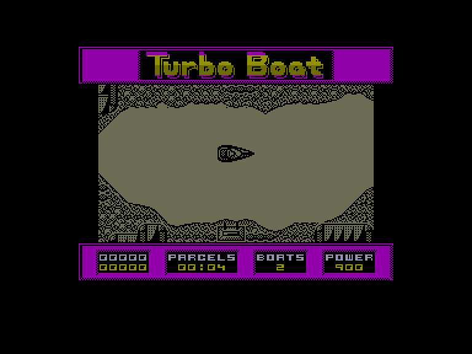
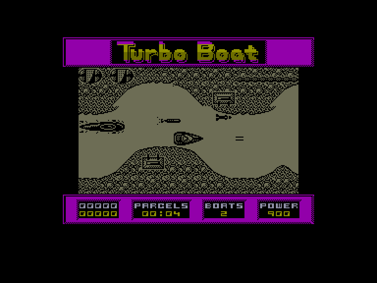
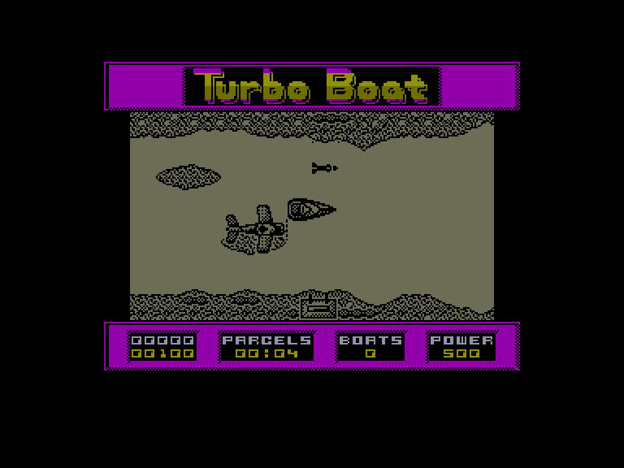

[0-9](../0/games-0.md) - [A](../a/games-a.md) - [B](../b/games-b.md) - [C](../c/games-c.md) - [D](../d/games-d.md) - [E](../e/games-e.md) - [F](../f/games-f.md) - [G](../g/games-g.md) - [H](../h/games-h.md) - [I](../i/games-i.md) - [J](../j/games-j.md) - [K](../k/games-k.md) - [L](../l/games-l.md) - [M](../m/games-m.md) - [N](../n/games-n.md) - [O](../o/games-o.md) - [P](../p/games-p.md) - [Q](../q/games-q.md) - [R](../r/games-r.md) - [S](../s/games-s.md) - [T](../t/games-t.md) - [U](../u/games-u.md) - [V](../v/games-v.md) - [W](../w/games-w.md) - [X](../x/games-x.md) - [Y](../y/games-y.md) - [Z](../z/games-z.md)

Ігри для [Enterprise 64k](../games-ep64.md) - [Enterprise 128k+RAMexp](../games-epramexp.md) - [2dfx](../games-2dfx.md)

Ігри для систем [IS-DOS](../games-is-dos.md) - [SymbOS](../games-symbos.md) - [EDC Windows](../games-edcw.md)

Ігри для емуляторів [ZX Spectrum 48k/128k](../zxemu/games-zxemu.md) - [Amstrad CPC](../cpcemu/games-cpc.md) - [Sinclair ZX81](../zx81emu/games-zx81.md) - [Videoton TVC](../tvcemu/games-tvc.md) - [Commodore VIC-20](../vic20emu/games-vic20.md)

----------

# Turbo Boat Simulator

**ID:** turbo-boat-sim-zx

## Скріншоти

## Опис

(temporary description generated by AI [Assistant])

**Опис гри: Turbo Boat Simulator**

Turbo Boat Simulator — це аркадна гра, в якій ви керуєте бойовим моторним човном. Ваше завдання — збирати сірі коробки, які скидають літаки, уникаючи при цьому ворожих підводних човнів, гелікоптерів та ракет. Гра проходить у вузькому ставку, де ви повинні знайти ділянку, де літаки регулярно скидають коробки. Кожна коробка містить шматочки карти, які вказують шлях додому. Уникайте чорних мін, які також скидають літаки.

**Правила гри:**
1. Керуйте човном за допомогою клавіш O, P, Q, A, SPACE.
2. Збирайте сірі коробки, щоб пройти на наступний рівень.
3. Уникайте зіткнень з ворогами та перешкодами, оскільки це знижує вашу енергію (початкова енергія — 900 пунктів).
4. Використовуйте стрибки, щоб уникнути деяких перешкод, але пам'ятайте, що це не приносить очок.
5. Гра може бути призупинена клавішею X, а для переходу на наступний рівень натисніть T під час паузи.
6. Після завершення 8-го рівня гра починається знову з 1-го рівня.

Удачі у вашій місії!

## Основна інформація
- **Оригінальна платформа:** ZX Spectrum

## Посилання
- [Опис на ep128.hu (угорською)](http://www.ep128.hu/Games/Turbo_Boat_Simulator.htm)
- [Інформація про оригінальну версію](https://spectrumcomputing.co.uk/entry/5456/ZX-Spectrum/Turbo_Boat_Simulator)
- [Завантажити](http://www.ep128.hu/Ep_Games/Prg/Turbo_Boat_Simulator.rar)

