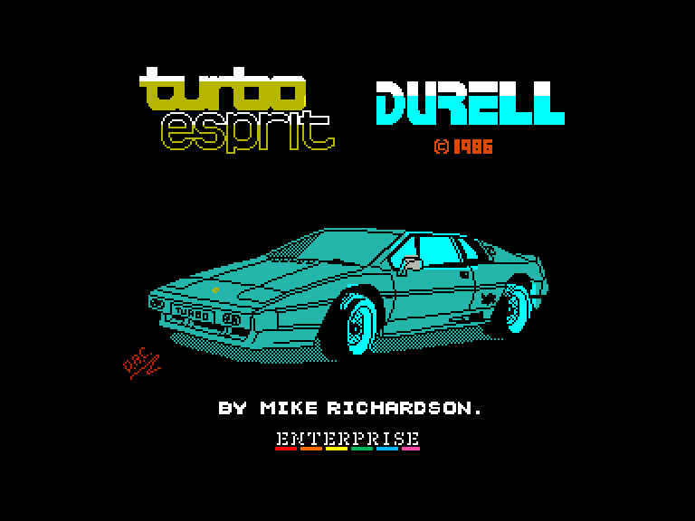
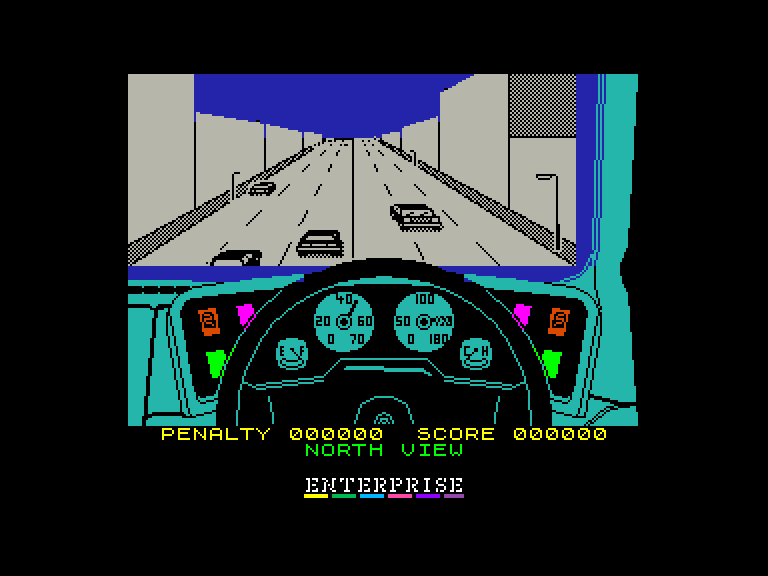
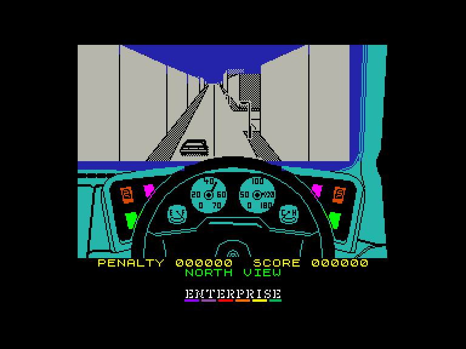
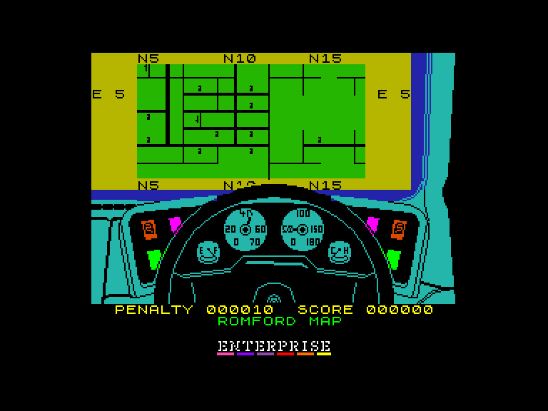

[0-9](../0/games-0.md) - [A](../a/games-a.md) - [B](../b/games-b.md) - [C](../c/games-c.md) - [D](../d/games-d.md) - [E](../e/games-e.md) - [F](../f/games-f.md) - [G](../g/games-g.md) - [H](../h/games-h.md) - [I](../i/games-i.md) - [J](../j/games-j.md) - [K](../k/games-k.md) - [L](../l/games-l.md) - [M](../m/games-m.md) - [N](../n/games-n.md) - [O](../o/games-o.md) - [P](../p/games-p.md) - [Q](../q/games-q.md) - [R](../r/games-r.md) - [S](../s/games-s.md) - [T](../t/games-t.md) - [U](../u/games-u.md) - [V](../v/games-v.md) - [W](../w/games-w.md) - [X](../x/games-x.md) - [Y](../y/games-y.md) - [Z](../z/games-z.md)

Ігри для [Enterprise 64k](../games-ep64.md) - [Enterprise 128k+RAMexp](../games-epramexp.md)

Ігри для систем [IS-DOS](../games-is-dos.md) - [SymbOS](../games-symbos.md) - [EDC Windows](../games-edcw.md)

Ігри для емуляторів [ZX Spectrum 48k/128k](../zxemu/games-zxemu.md) - [Amstrad CPC](../cpcemu/games-cpc.md) - [Sinclair ZX81](../zx81emu/games-zx81.md) - [Videoton TVC](../tvcemu/games-tvc.md) - [Commodore VIC-20](../vic20emu/games-vic20.md)

----------

# Turbo Esprit

**ID:** turbo-esprit-zx

## Скріншоти

## Опис

(temporary description generated by AI [ChatGPT])

**Опис гри: Turbo Esprit**  
Turbo Esprit - це захоплююча 3D-ігрова симуляція водіння автомобіля з елементами екшену, що відбувається у живому мегаполісі. Гравець управляє автомобілем LOTUS TURBO ESPRIT, намагаючись зупинити злочинців, які займаються наркотиками. Гра пропонує вражаючу свободу дій і унікальну механіку, що робить її однією з найкращих у своєму жанрі.

**Правила гри:**
1. Виберіть місто для виконання місії (клавіші 1-4).
2. У головному меню виберіть рівень складності (1-4) та налаштуйте клавіші управління.
3. Ваше завдання - зупинити червоний броньований автомобіль, не допускаючи його виходу з міста, завдаючи йому ушкодження.
4. Зупиняйте сині та рожеві автомобілі, які перевозять наркотики, щоб отримати бали.
5. Будьте обережні: ушкодження цивільних автомобілів та пішоходів призводять до штрафних балів.
6. Використовуйте карту для навігації, але пам'ятайте, що ваш автомобіль продовжує рухатися.
7. Гра закінчується, якщо вам вдається зупинити всі цільові автомобілі або якщо ви втрачаєте всі життя.

Зберігайте результати гри на касетному магнітофоні і завантажуйте їх у будь-який час!

## Основна інформація
- **Оригінальна платформа:** ZX Spectrum
### Системні вимоги
- **Апаратні:** EP64, EP128
### Геймплей
- **Керування:** Keyboard, Internal Joy, External Joy 1, External Joy 2

## Посилання
- [Опис гри на ep128.hu (угорською)](http://www.ep128.hu/Games/Turbo_Esprit.htm)
- [Інформація про оригінальну версію](https://spectrumcomputing.co.uk/entry/5461/ZX-Spectrum/Turbo_Esprit)
- [Завантажити гру](http://www.ep128.hu/Ep_Games/Prg/Turbo_Esprit.rar)

