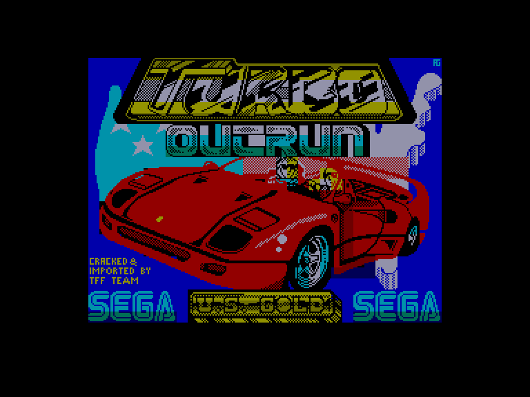
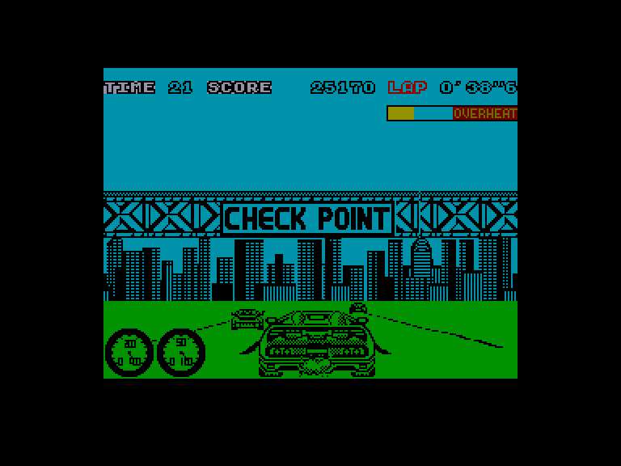
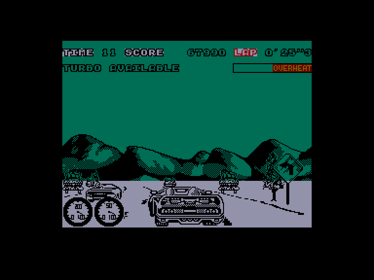
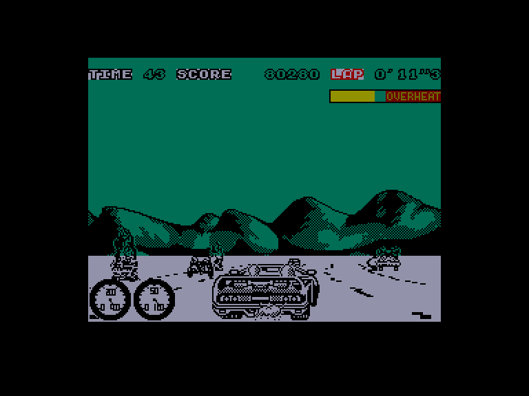

[0-9](../0/games-0.md) - [A](../a/games-a.md) - [B](../b/games-b.md) - [C](../c/games-c.md) - [D](../d/games-d.md) - [E](../e/games-e.md) - [F](../f/games-f.md) - [G](../g/games-g.md) - [H](../h/games-h.md) - [I](../i/games-i.md) - [J](../j/games-j.md) - [K](../k/games-k.md) - [L](../l/games-l.md) - [M](../m/games-m.md) - [N](../n/games-n.md) - [O](../o/games-o.md) - [P](../p/games-p.md) - [Q](../q/games-q.md) - [R](../r/games-r.md) - [S](../s/games-s.md) - [T](../t/games-t.md) - [U](../u/games-u.md) - [V](../v/games-v.md) - [W](../w/games-w.md) - [X](../x/games-x.md) - [Y](../y/games-y.md) - [Z](../z/games-z.md)

Ігри для [Enterprise 64k](../games-ep64.md) - [Enterprise 128k+RAMexp](../games-epramexp.md)

Ігри для систем [IS-DOS](../games-is-dos.md) - [SymbOS](../games-symbos.md) - [EDC Windows](../games-edcw.md)

Ігри для емуляторів [ZX Spectrum 48k/128k](../zxemu/games-zxemu.md) - [Amstrad CPC](../cpcemu/games-cpc.md) - [Sinclair ZX81](../zx81emu/games-zx81.md) - [Videoton TVC](../tvcemu/games-tvc.md) - [Commodore VIC-20](../vic20emu/games-vic20.md)

----------

# Turbo Out Run

**Альтернативні назви:**
 - Outrun 2: Turbo Outrun

**ID:** turbo-outrun-zx

## Скріншоти

## Опис

(temporary description generated by AI [ChatGPT])

**Опис гри: Outrun 2: Turbo Outrun**

Outrun 2: Turbo Outrun — це продовження легендарних автогонок, що дозволяє гравцям змагатися на різноманітних трасах по всій Америці, насолоджуючись чудовою графікою та звуковим супроводом. Гравці можуть обирати між автоматичною та ручною коробкою передач, а також використовувати турбо для підвищення швидкості. Гра включає 16 рівнів, кожен з яких має свої унікальні умови та перешкоди, від заторів у великих містах до складних поворотів у гірських районах.

**Правила гри:**
1. Гравець повинен завершити 16 рівнів у відведений час.
2. На кожному рівні є суперник, якого потрібно обігнати, щоб не втратити свою напарницю.
3. Гравець може покращувати свій автомобіль, отримуючи нові деталі після кожного четвертого рівня.
4. Використовуйте турбо, натискаючи клавішу 'SPACE', для збільшення швидкості, але будьте обережні, оскільки турбо може перегрітися.
5. Якщо час вичерпано, гравець може вибрати продовжити гру з того місця, де вона зупинилася.
6. Управління: можливе за допомогою джойстика або клавіатури. 

**Клавіші управління:**
- Q, U - прискорення
- A, H, J - гальмо
- I, X - вліво
- O, C - вправо
- Z, P - перемикання передач
- V, B, N, M, SPACE - турбо
- ENTER - пауза

Гра обіцяє захоплюючі гонки та яскраві враження!

## Основна інформація
- **Оригінальна платформа:** ZX Spectrum

## Посилання
- [Опис гри на ep128.hu (угорською)](http://www.ep128.hu/Games/Outrun2.htm)
- [Інформація про оригінальну версію](https://spectrumcomputing.co.uk/entry/3565/ZX-Spectrum/Turbo_Out_Run)
- [Завантажити гру](http://www.ep128.hu/Ep_Games/Prg/Turbo_Outrun.rar)

