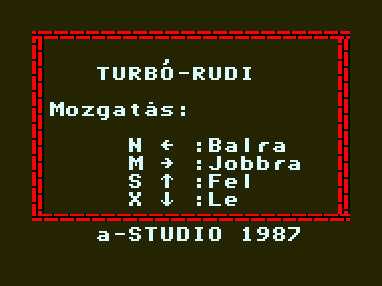
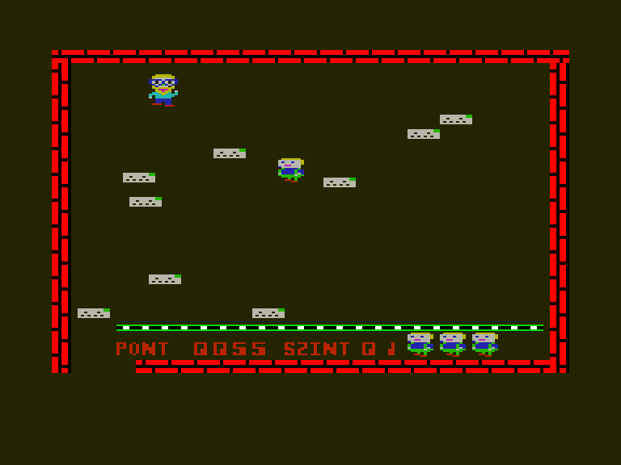
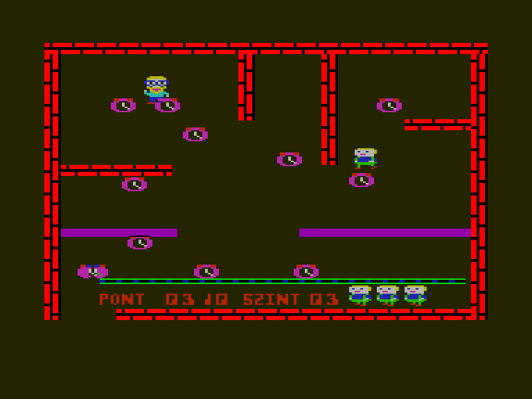
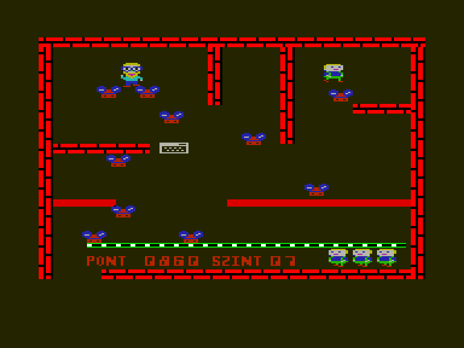

[0-9](../0/games-0.md) - [A](../a/games-a.md) - [B](../b/games-b.md) - [C](../c/games-c.md) - [D](../d/games-d.md) - [E](../e/games-e.md) - [F](../f/games-f.md) - [G](../g/games-g.md) - [H](../h/games-h.md) - [I](../i/games-i.md) - [J](../j/games-j.md) - [K](../k/games-k.md) - [L](../l/games-l.md) - [M](../m/games-m.md) - [N](../n/games-n.md) - [O](../o/games-o.md) - [P](../p/games-p.md) - [Q](../q/games-q.md) - [R](../r/games-r.md) - [S](../s/games-s.md) - [T](../t/games-t.md) - [U](../u/games-u.md) - [V](../v/games-v.md) - [W](../w/games-w.md) - [X](../x/games-x.md) - [Y](../y/games-y.md) - [Z](../z/games-z.md)

Ігри для [Enterprise 64k](../games-ep64.md) - [Enterprise 128k+RAMexp](../games-epramexp.md)

Ігри для систем [IS-DOS](../games-is-dos.md) - [SymbOS](../games-symbos.md) - [EDC Windows](../games-edcw.md)

Ігри для емуляторів [ZX Spectrum 48k/128k](../zxemu/games-zxemu.md) - [Amstrad CPC](../cpcemu/games-cpc.md) - [Sinclair ZX81](../zx81emu/games-zx81.md) - [Videoton TVC](../tvcemu/games-tvc.md) - [Commodore VIC-20](../vic20emu/games-vic20.md)

----------

# Turbó-Rudi

**ID:** turbo-rudi

**Жанри:** Аркада

## Примітка

ℹ Стара конверсія з платформи Amstrad CPC (оригінальна назва **Electro Freddy**).  
Напівофіційно продавалась в Угорщині.

## Скріншоти

## Опис

Фредді працює в магазині свого дядька, переміщуючи все комп'ютерне обладнання на конвеєрну стрічку, щоб його можна було відправити на склад. Однак його дядько — огидний і невдячний тип, який кидає в нього іншими деталями обладнання, від яких Фредді мусить ухилятися. Кожен із п'ятнадцяти рівнів містить предмети, які необхідно доштовхати до конвеєра внизу екрана, одночасно уникаючи дядька.

## Основна інформація
- **Мови:** Угорська
- **Оригінальна платформа:** Amstrad CPC
### Загальні системні вимоги
- **Апаратні:** EP64, EP128
- **Програмні:** EXOS 2.1
### Геймплей
- **Керування:** Keyboard, Internal Joy
- **Кількість гравців:** 1 player
- **Додаткові теги:** 16-color mode
### Розробка
- **Рік випуску:** 1984
- **Автор:** Marcus Altman

## Посилання
- [Опис гри на ep128.hu (угорською)](http://www.ep128.hu/Ep_Games/Leiras/Turbo_Rudi.htm)
- [Завантажити гру](http://www.ep128.hu/Ep_Games/Prg/Turbo_Rudi.rar)
- [Easy Load&Play](https://t.me/EP128k_Load_n_Play/10) *(Telegram-канал Vibrant Waves)*

## Відео

<iframe src="https://www.youtube.com/embed/ljHolnNBhFk"  
style="width:75%; aspect-ratio:16/9;" allowfullscreen></iframe>

- [Відео](https://youtu.be/9vDMxo5YxPU)

## [Керування](../controllers.md)

`Keyboard`: `N`, `M`, `S`, `X`  
`Internal Joystick`

## Детальна інформація

### Геймплей  

Штовхайте об'єкти, щоб доставити їх на конвеєр, розташований внизу екрану.  
Щоб на деякий час знешкодити супротивника штовханіть його предметом (зверху або знизу).  
Уникайте комп'ютерів, які падають з верхньої частини екрану, оскільки вони забирають ваше життя.  
Збирайте печиво що час від часу з'являється у верхньому правому куті для отримання додаткових балів (10 балів за кожне печиво).  
За 500 балів ви отримаєте додаткове життя.  
Коли всі об'єкти будуть на конвеєрі, з'явиться ключ для переходу на наступний рівень.