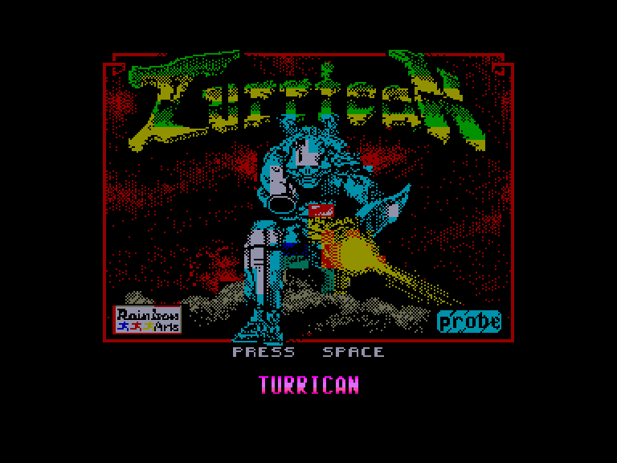
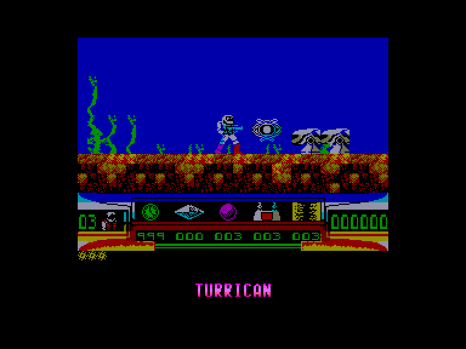
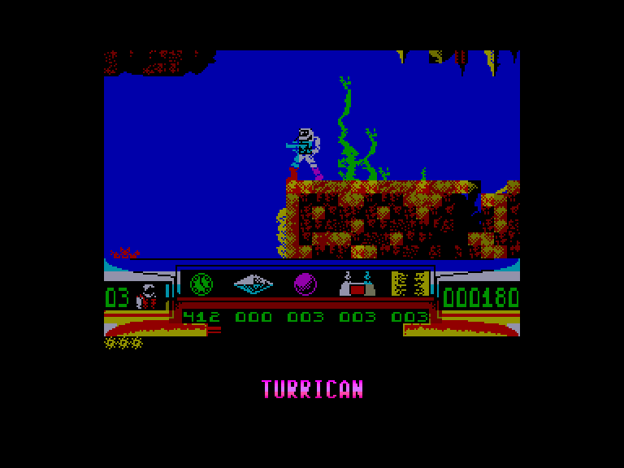
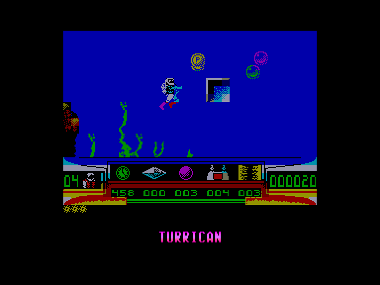

[0-9](../0/games-0.md) - [A](../a/games-a.md) - [B](../b/games-b.md) - [C](../c/games-c.md) - [D](../d/games-d.md) - [E](../e/games-e.md) - [F](../f/games-f.md) - [G](../g/games-g.md) - [H](../h/games-h.md) - [I](../i/games-i.md) - [J](../j/games-j.md) - [K](../k/games-k.md) - [L](../l/games-l.md) - [M](../m/games-m.md) - [N](../n/games-n.md) - [O](../o/games-o.md) - [P](../p/games-p.md) - [Q](../q/games-q.md) - [R](../r/games-r.md) - [S](../s/games-s.md) - [T](../t/games-t.md) - [U](../u/games-u.md) - [V](../v/games-v.md) - [W](../w/games-w.md) - [X](../x/games-x.md) - [Y](../y/games-y.md) - [Z](../z/games-z.md)

Ігри для [Enterprise 64k](../games-ep64.md) - [Enterprise 128k+RAMexp](../games-epramexp.md)

Ігри для систем [IS-DOS](../games-is-dos.md) - [SymbOS](../games-symbos.md) - [EDC Windows](../games-edcw.md)

Ігри для емуляторів [ZX Spectrum 48k/128k](../zxemu/games-zxemu.md) - [Amstrad CPC](../cpcemu/games-cpc.md) - [Sinclair ZX81](../zx81emu/games-zx81.md) - [Videoton TVC](../tvcemu/games-tvc.md) - [Commodore VIC-20](../vic20emu/games-vic20.md)

----------

# Turrican

**ID:** turrican-zx

## Скріншоти

## Опис

(temporary description generated by AI [ChatGPT])

**Опис гри "Turrican"**

"Turrican" — це динамічна аркадна гра в жанрі платформера, випущена в 1990 році. Гравець керує персонажем на ім'я Туррікан, який повинен протистояти трьохголовому демону Моргулу, що перетворює нічні жахи на реальність. Гра складається з 5 світів та 13 рівнів, де гравець має стрибати, стріляти та досліджувати різноманітні локації, збираючи 10 різних видів зброї.

**Правила гри:**
1. Гравець контролює Туррікан, використовуючи стрільбу та стрибки для подолання ворогів та перешкод.
2. Мета гри — пройти всі рівні, знищуючи ворогів і збираючи корисні предмети.
3. Гравець може збирати різні види зброї та покращення, які допоможуть у боротьбі з ворогами.
4. Кожен рівень має свої унікальні виклики та босів, яких потрібно перемогти для просування далі.
5. Гра має обмеження за часом, тому важливо діяти швидко та обачно.

Приготуйтеся до епічної битви в "Turrican"!

## Основна інформація
- **Оригінальна платформа:** ZX Spectrum

## Посилання
- [Інформація про оригінальну версію](https://spectrumcomputing.co.uk/entry/5472/ZX-Spectrum/Turrican)

**Дата генерації:** 28.07.2026

