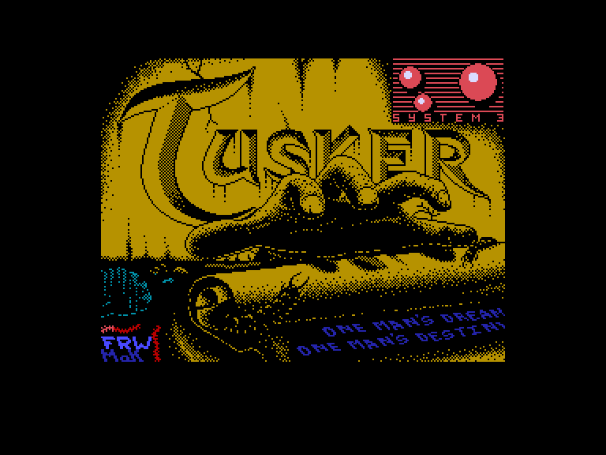
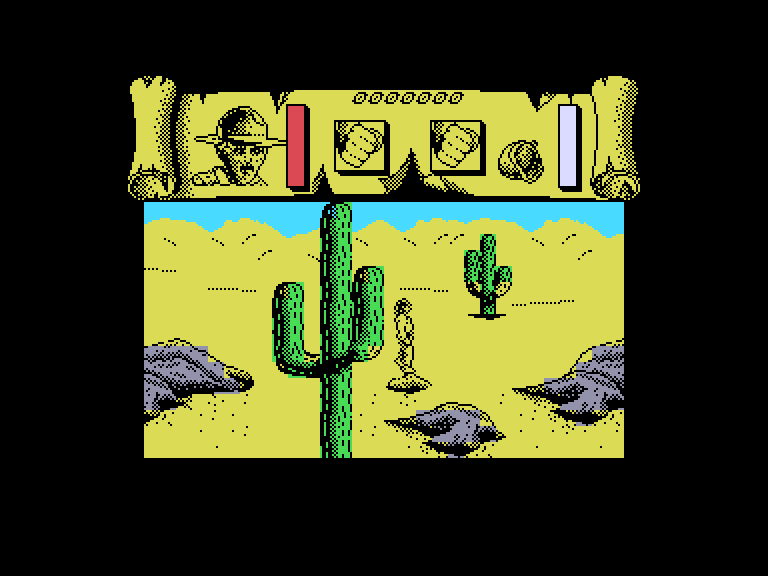
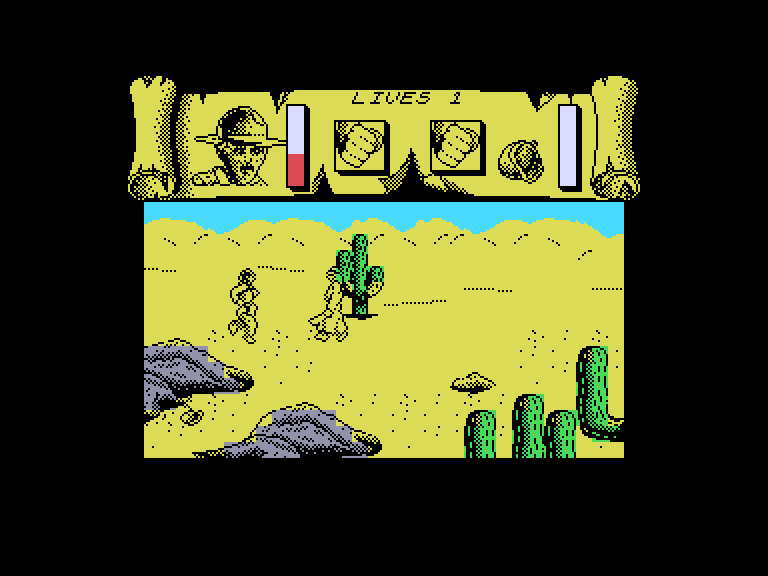
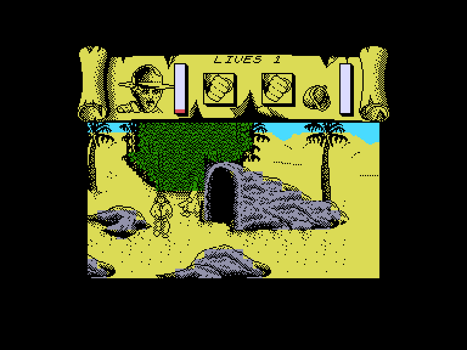

[0-9](../0/games-0.md) - [A](../a/games-a.md) - [B](../b/games-b.md) - [C](../c/games-c.md) - [D](../d/games-d.md) - [E](../e/games-e.md) - [F](../f/games-f.md) - [G](../g/games-g.md) - [H](../h/games-h.md) - [I](../i/games-i.md) - [J](../j/games-j.md) - [K](../k/games-k.md) - [L](../l/games-l.md) - [M](../m/games-m.md) - [N](../n/games-n.md) - [O](../o/games-o.md) - [P](../p/games-p.md) - [Q](../q/games-q.md) - [R](../r/games-r.md) - [S](../s/games-s.md) - [T](../t/games-t.md) - [U](../u/games-u.md) - [V](../v/games-v.md) - [W](../w/games-w.md) - [X](../x/games-x.md) - [Y](../y/games-y.md) - [Z](../z/games-z.md)

Ігри для [Enterprise 64k](../games-ep64.md) - [Enterprise 128k+RAMexp](../games-epramexp.md)

Ігри для систем [IS-DOS](../games-is-dos.md) - [SymbOS](../games-symbos.md) - [EDC Windows](../games-edcw.md)

Ігри для емуляторів [ZX Spectrum 48k/128k](../zxemu/games-zxemu.md) - [Amstrad CPC](../cpcemu/games-cpc.md) - [Sinclair ZX81](../zx81emu/games-zx81.md) - [Videoton TVC](../tvcemu/games-tvc.md) - [Commodore VIC-20](../vic20emu/games-vic20.md)

----------

# Tusker

**ID:** tusker-zx

## Скріншоти

## Опис

(temporary description generated by AI [Assistant])

**Опис гри:**
Tusker - це захоплююча аркадно-пригодницька гра, розроблена компанією System 3. Гравець виступає в ролі Tusker, який подорожує Африкою в пошуках таємничого місця, де, за легендою, гинуть слони. Гра складається з трьох епізодів, кожен з яких має різноманітні рівні з чудовою графікою та захоплюючим сюжетом. Гравець повинен збирати предмети, використовувати їх у правильних місцях і уникати небезпек, які чатують на нього на шляху.

**Правила гри:**
1. Гравець керує Tusker, використовуючи клавіші або джойстик для переміщення.
2. Предмети можна підбирати, натискаючи комбінації клавіш (праворуч/ліворуч + вогонь).
3. Для використання предметів потрібно натискати відповідні комбінації клавіш (вогонь + вгору, вогонь + праворуч/ліворуч).
4. Гравець може боротися з ворогами, використовуючи зброю або кулаки.
5. Енергія Tusker зменшується при отриманні ушкоджень; її можна відновити, використовуючи воду з фляги.
6. Для просування в грі необхідно вирішувати головоломки та збирати предмети, які допоможуть подолати перешкоди.
7. Гра закінчується, коли гравець досягає мети - таємничого храму слонів.

## Основна інформація
- **Оригінальна платформа:** ZX Spectrum

## Посилання
- [Опис гри на ep128.hu (угорською)](http://www.ep128.hu/Games/Tusker.htm)
- [Інформація про оригінальну версію](https://spectrumcomputing.co.uk/entry/5479/ZX-Spectrum/Tusker)
- [Завантажити гру](http://www.ep128.hu/Ep_Games/Prg/Tusker.rar)

**Дата генерації:** 29.07.2026

