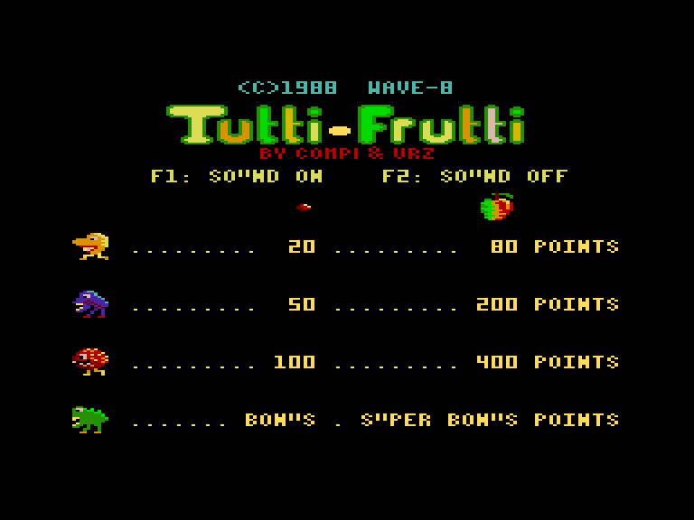
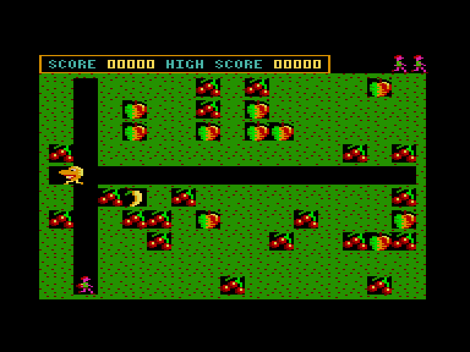
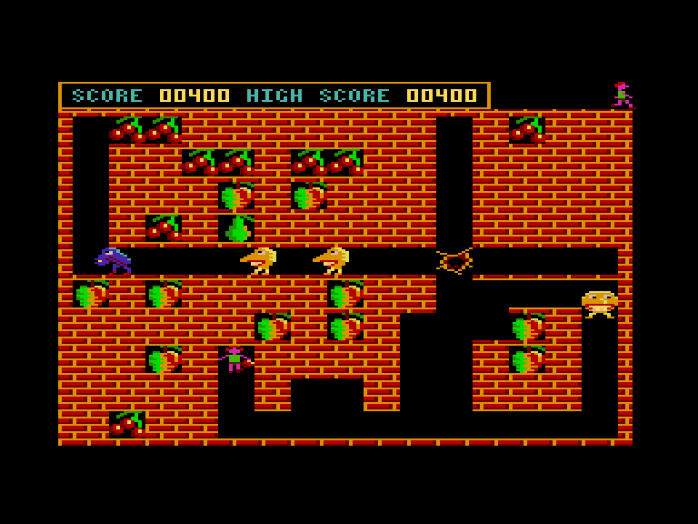
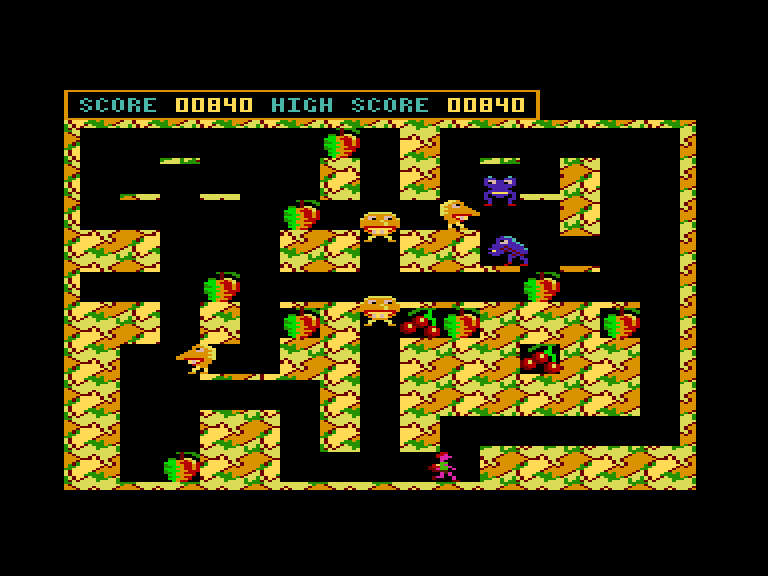

[0-9](../0/games-0.md) - [A](../a/games-a.md) - [B](../b/games-b.md) - [C](../c/games-c.md) - [D](../d/games-d.md) - [E](../e/games-e.md) - [F](../f/games-f.md) - [G](../g/games-g.md) - [H](../h/games-h.md) - [I](../i/games-i.md) - [J](../j/games-j.md) - [K](../k/games-k.md) - [L](../l/games-l.md) - [M](../m/games-m.md) - [N](../n/games-n.md) - [O](../o/games-o.md) - [P](../p/games-p.md) - [Q](../q/games-q.md) - [R](../r/games-r.md) - [S](../s/games-s.md) - [T](../t/games-t.md) - [U](../u/games-u.md) - [V](../v/games-v.md) - [W](../w/games-w.md) - [X](../x/games-x.md) - [Y](../y/games-y.md) - [Z](../z/games-z.md)

Ігри для [Enterprise 64k](../games-ep64.md) - [Enterprise 128k+RAMexp](../games-epramexp.md)

Ігри для систем [IS-DOS](../games-is-dos.md) - [SymbOS](../games-symbos.md) - [EDC Windows](../games-edcw.md)

Ігри для емуляторів [ZX Spectrum 48k/128k](../zxemu/games-zxemu.md) - [Amstrad CPC](../cpcemu/games-cpc.md) - [Sinclair ZX81](../zx81emu/games-zx81.md) - [Videoton TVC](../tvcemu/games-tvc.md) - [Commodore VIC-20](../vic20emu/games-vic20.md)

----------

# Tutti-Frutti

**ID:** tutti-frutti

## Скріншоти

## Опис

(temporary description generated by AI [Assistant])

Гра "1988 - Wave-8" є приємним збиральним ігровим досвідом, що має певну схожість з "Boulder Dash". У цій грі ваша мета - збирати їстівні фрукти, поки вас переслідують монстри. Це не оригінальна розробка, а адаптація старішої гри 1984 року під назвою "Fruity Frank".

**Правила гри:**
1. На початку гри виберіть рівень складності (швидкість гри).
2. Ваш персонаж, фіолетовий чоловічок, може пересуватися по кольорових та чорних ділянках, тоді як монстри можуть рухатися лише по чорних.
3. Коли ви рухаєтеся по кольорових ділянках, за вами залишається чорна (порожня) територія.
4. Ваш персонаж не може їсти яблука, але може їх штовхати. Якщо яблуко впаде на монстра, ви отримаєте очки.
5. Для захисту від монстрів можна використовувати метальну зброю, яка відскакує по вже викопаних чорних ділянках. Після використання зброї, нову можна отримати лише через кілька секунд.
6. Гру супроводжує приємна музика з ATARI ST, яку можна вмикати та вимикати клавішами F1-F2.

## Основна інформація
- **Оригінальна платформа:** Amstrad CPC

## Посилання
- [Опис гри на ep128.hu (угорською)](http://www.ep128.hu/Ep_Games/Leiras/Tutti_Frutti.htm)
- [Інформація про оригінальну версію](https://www.cpc-power.com/index.php?page=detail&num=930)
- [Завантажити гру](http://www.ep128.hu/Ep_Games/Prg/Tutti_Frutti.rar)
- [Easy Load&Play](https://t.me/EP128k_Load_n_Play/863) *(Telegram-канал Vibrant Waves)*

**Дата генерації:** 28.07.2026

## Відео

<iframe src="https://www.youtube.com/embed/RVsIMRLbR3Y"  
style="width:75%; aspect-ratio:16/9;" allowfullscreen></iframe>
