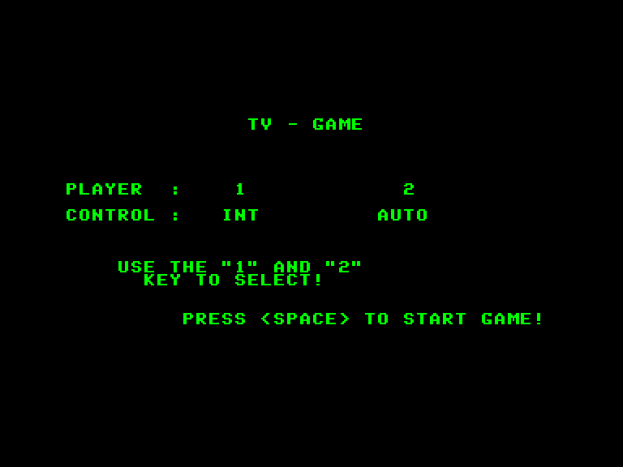
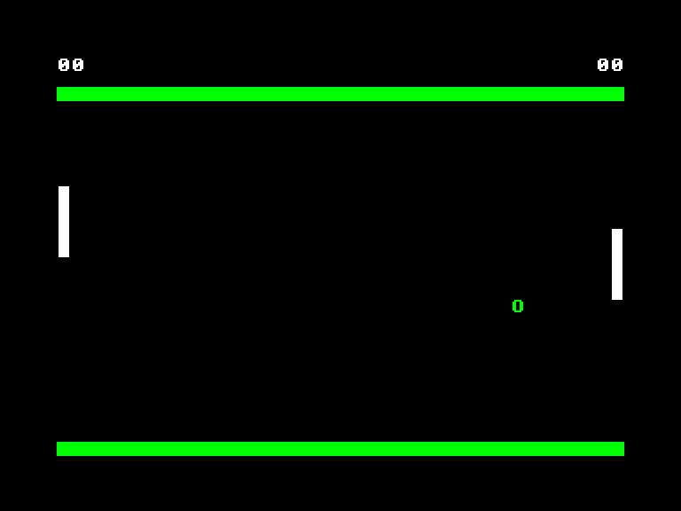
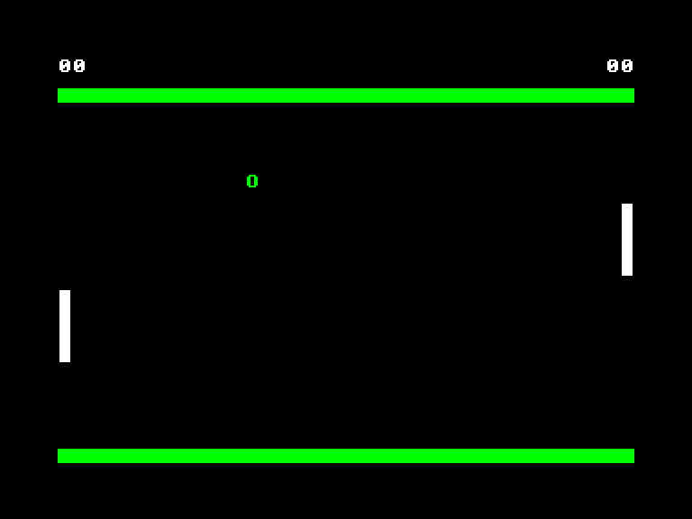

[0-9](../0/games-0.md) - [A](../a/games-a.md) - [B](../b/games-b.md) - [C](../c/games-c.md) - [D](../d/games-d.md) - [E](../e/games-e.md) - [F](../f/games-f.md) - [G](../g/games-g.md) - [H](../h/games-h.md) - [I](../i/games-i.md) - [J](../j/games-j.md) - [K](../k/games-k.md) - [L](../l/games-l.md) - [M](../m/games-m.md) - [N](../n/games-n.md) - [O](../o/games-o.md) - [P](../p/games-p.md) - [Q](../q/games-q.md) - [R](../r/games-r.md) - [S](../s/games-s.md) - [T](../t/games-t.md) - [U](../u/games-u.md) - [V](../v/games-v.md) - [W](../w/games-w.md) - [X](../x/games-x.md) - [Y](../y/games-y.md) - [Z](../z/games-z.md)

Ігри для [Enterprise 64k](../games-ep64.md) - [Enterprise 128k+RAMexp](../games-epramexp.md) - [2dfx](games-2dfx.md)

Ігри для систем [IS-DOS](../games-is-dos.md) - [SymbOS](../games-symbos.md) - [EDC Windows](../games-edcw.md)

Ігри для емуляторів [ZX Spectrum 48k/128k](../zxemu/games-zxemu.md) - [Amstrad CPC](../cpcemu/games-cpc.md) - [Sinclair ZX81](../zx81emu/games-zx81.md) - [Videoton TVC](../tvcemu/games-tvc.md) - [Commodore VIC-20](../vic20emu/games-vic20.md)

----------

# TV-Game

**ID:** tv-game

## Скріншоти

## Опис

(temporary description generated by AI [ChatGPT])

**Опис гри:**

Pong – це класична аркадна гра, що відтворює відчуття гри в першу версію від Atari. Гравці можуть змагатися один з одним або проти комп'ютера. Гра має простий інтерфейс, що дозволяє легко налаштувати управління. Мета гри – набрати 12 очок, граючи в пінг-понг, відбиваючи м’ячик.

**Правила гри:**

1. Гра може проходити у двох режимах: для двох гравців або один гравець проти комп'ютера.
2. Управління можна налаштувати: за допомогою джойстика або клавіатури (дві різні конфігурації).
3. Гравець може зупинити гру, натиснувши кнопку STOP.
4. Якщо обидва гравці налаштовані на автоматичне управління (AUTO), комп'ютер буде грати самостійно.
5. Гра триває до досягнення 12 очок одним з гравців. 
6. Гравець проти комп'ютера має шанс на перемогу, лише якщо він наблизиться до центру свого поля.

Грайте та насолоджуйтесь ностальгією класичного Pong!

## Посилання
- [Опис на ep128.hu (угорською)](http://www.ep128.hu/Ep_Games/Leiras/TVGame.htm)
- [Завантажити](http://www.ep128.hu/Ep_Games/Prg/TVGame.rar)

