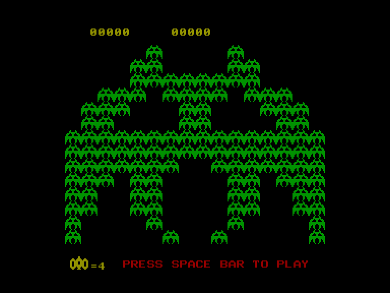
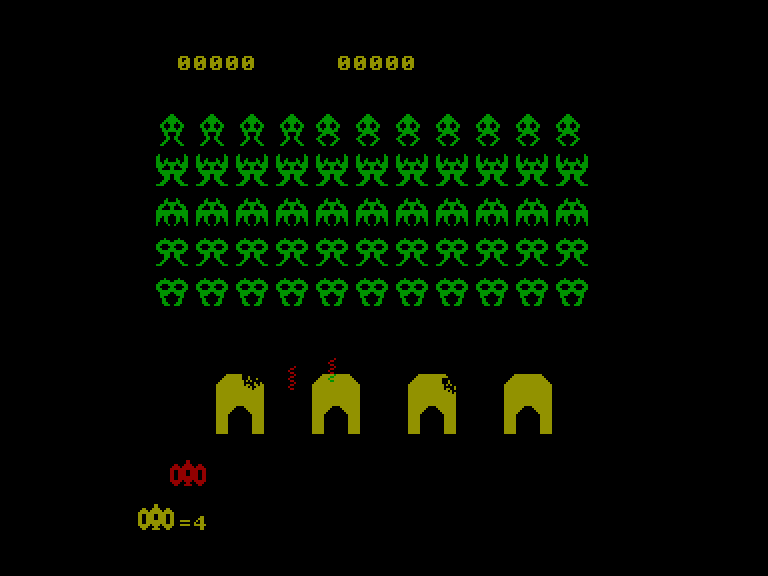
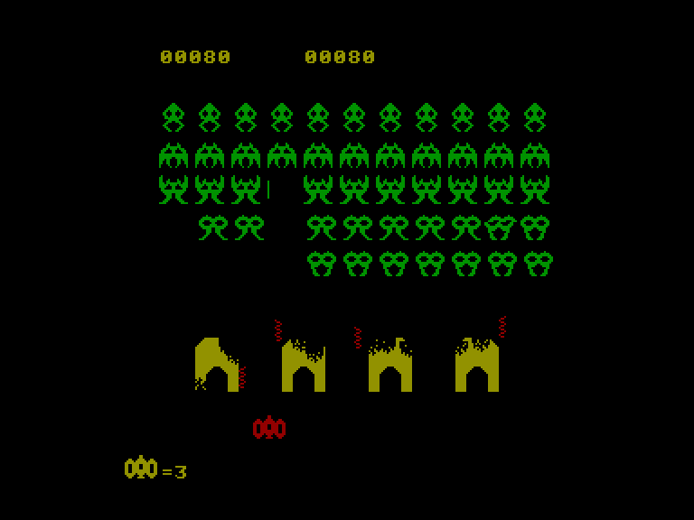
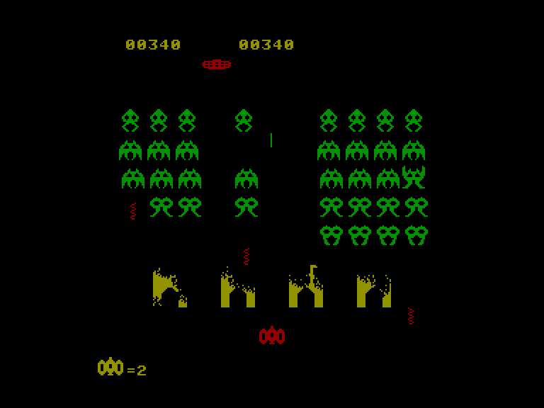

[0-9](../0/games-0.md) - [A](../a/games-a.md) - [B](../b/games-b.md) - [C](../c/games-c.md) - [D](../d/games-d.md) - [E](../e/games-e.md) - [F](../f/games-f.md) - [G](../g/games-g.md) - [H](../h/games-h.md) - [I](../i/games-i.md) - [J](../j/games-j.md) - [K](../k/games-k.md) - [L](../l/games-l.md) - [M](../m/games-m.md) - [N](../n/games-n.md) - [O](../o/games-o.md) - [P](../p/games-p.md) - [Q](../q/games-q.md) - [R](../r/games-r.md) - [S](../s/games-s.md) - [T](../t/games-t.md) - [U](../u/games-u.md) - [V](../v/games-v.md) - [W](../w/games-w.md) - [X](../x/games-x.md) - [Y](../y/games-y.md) - [Z](../z/games-z.md)

Ігри для [Enterprise 64k](../games-ep64.md) - [Enterprise 128k+RAMexp](../games-epramexp.md) - [2dfx](../games-2dfx.md)

Ігри для систем [IS-DOS](../games-is-dos.md) - [SymbOS](../games-symbos.md) - [EDC Windows](../games-edcw.md)

Ігри для емуляторів [ZX Spectrum 48k/128k](../zxemu/games-zxemu.md) - [Amstrad CPC](../cpcemu/games-cpc.md) - [Sinclair ZX81](../zx81emu/games-zx81.md) - [Videoton TVC](../tvcemu/games-tvc.md) - [Commodore VIC-20](../vic20emu/games-vic20.md)

----------

# TVC Invaders

**ID:** tvc-invaders-tvc

## Скріншоти

## Опис

(temporary description generated by AI [ChatGPT])

**Опис гри: TVC Invaders**

TVC Invaders - це класична гра в стилі "вторгнення", що почала свою історію на платформі TVC. Гравці керують космічним кораблем, намагаючись відбити атаки ворогів. Графіка не є типовою для жанру, а звукові ефекти прості, але ефектні. Гра пропонує звичний ігровий процес, проте з підвищеним рівнем складності.

**Правила гри:**
1. Гра починається натисканням клавіші SPACE.
2. Керування космічним кораблем можливе за допомогою вбудованого джойстика або EXT1 контролера.
3. Гравець повинен знищити ворогів, які з'являються на екрані, уникаючи їх атак.
4. Вороги стають все більш агресивними з кожним рівнем.

Бажаємо удачі у боротьбі з вторгненням!

## Основна інформація
- **Оригінальна платформа:** Videoton TVC
### Загальні системні вимоги
- **Апаратні:** EP64, EP128

## Посилання
- [Опис на ep128.hu (угорською)](http://www.ep128.hu/Ep_Games/Leiras/TVC_Invaders.htm)
- [Завантажити](http://www.ep128.hu/Ep_Games/Prg/TVC_Invaders.rar)

