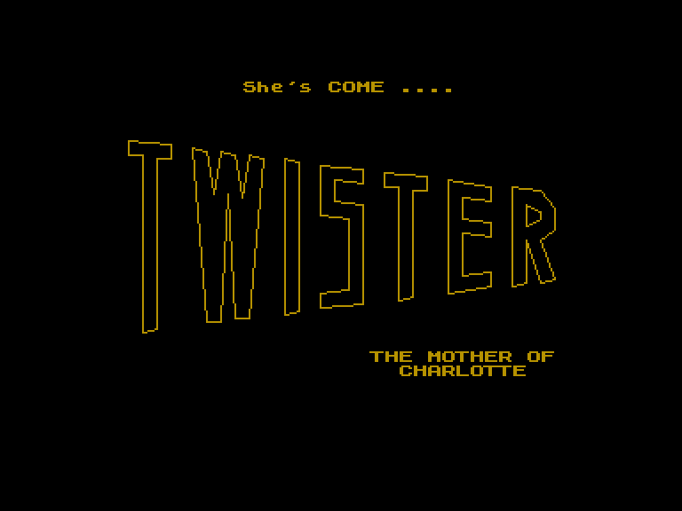
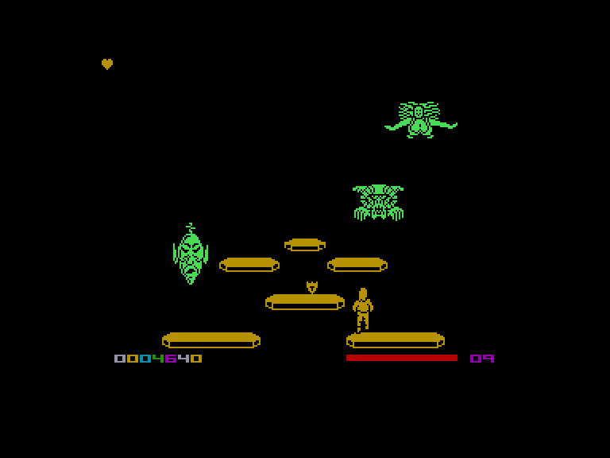
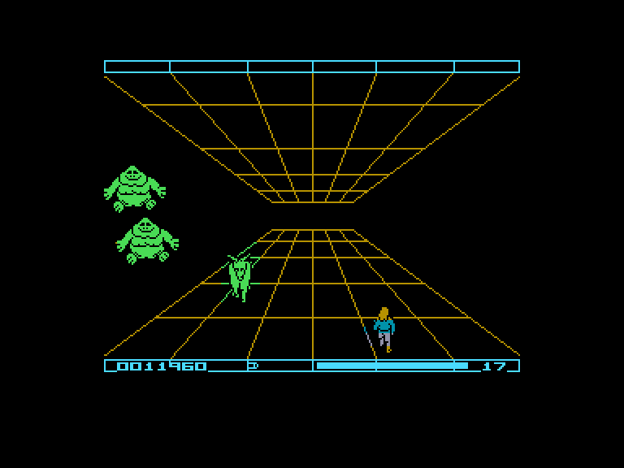
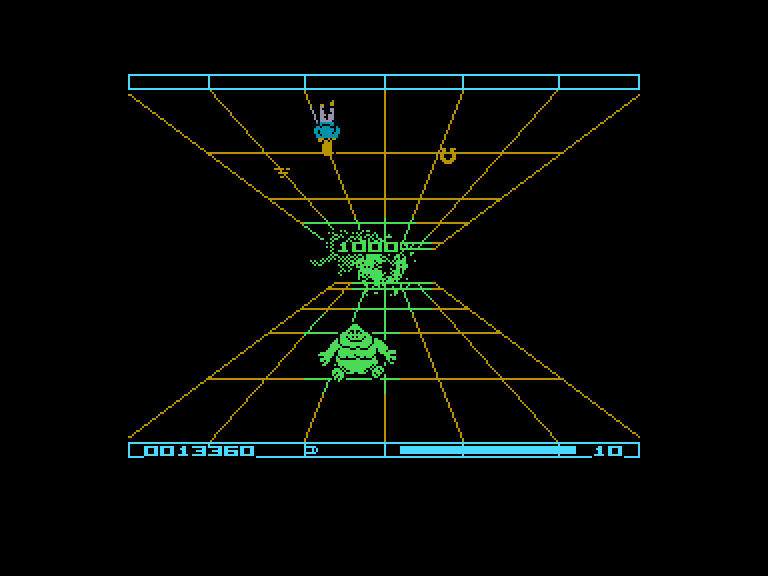

[0-9](../0/games-0.md) - [A](../a/games-a.md) - [B](../b/games-b.md) - [C](../c/games-c.md) - [D](../d/games-d.md) - [E](../e/games-e.md) - [F](../f/games-f.md) - [G](../g/games-g.md) - [H](../h/games-h.md) - [I](../i/games-i.md) - [J](../j/games-j.md) - [K](../k/games-k.md) - [L](../l/games-l.md) - [M](../m/games-m.md) - [N](../n/games-n.md) - [O](../o/games-o.md) - [P](../p/games-p.md) - [Q](../q/games-q.md) - [R](../r/games-r.md) - [S](../s/games-s.md) - [T](../t/games-t.md) - [U](../u/games-u.md) - [V](../v/games-v.md) - [W](../w/games-w.md) - [X](../x/games-x.md) - [Y](../y/games-y.md) - [Z](../z/games-z.md)

Ігри для [Enterprise 64k](../games-ep64.md) - [Enterprise 128k+RAMexp](../games-epramexp.md) - [2dfx](games-2dfx.md)

Ігри для систем [IS-DOS](../games-is-dos.md) - [SymbOS](../games-symbos.md) - [EDC Windows](../games-edcw.md)

Ігри для емуляторів [ZX Spectrum 48k/128k](../zxemu/games-zxemu.md) - [Amstrad CPC](../cpcemu/games-cpc.md) - [Sinclair ZX81](../zx81emu/games-zx81.md) - [Videoton TVC](../tvcemu/games-tvc.md) - [Commodore VIC-20](../vic20emu/games-vic20.md)

----------

# Twister

**Альтернативні назви:**
 - Twister: Mother of Charlotte
 - Twister: The Mother of Harlots

**ID:** twister-zx

## Скріншоти

## Опис

(temporary description generated by AI [your name])

**Опис гри:**
Twister — це гра, в якій ви повинні знищити одного з наймогутніших демонів, що загрожує людству. Гравець проходить через різні рівні, збираючи символи та уникаючи ворогів, які намагаються знищити вашу психічну енергію. Гра має абстрактний стиль, і дії відбуваються у підсвідомості.

**Правила гри:**
1. **Управління:** 
   - Можна використовувати джойстик KEMPSTON, CURSOR, INTERFACE 2 або клавіатуру:
     - O - вліво
     - P - вправо
     - S - вгору
     - A - вниз
     - X - вогонь

2. **Цілі:**
   - Збирати символи, які відповідають кольорам французької карти: трефи, ромби, серця та піки.
   - У різних рівнях кількість символів, які потрібно зібрати, зростає.

3. **Перешкоди:**
   - Вороги намагаються знищити вас, забираючи вашу психічну енергію.
   - Деякі предмети можуть допомогти або зашкодити:
     - Ракета (бомба) - зменшує енергію.
     - Щит - додає енергію.
     - Психонічні енергобомби - додають боєприпаси.
     - Підкова - забирає вже здобутий символ.

4. **Рівні:**
   - Кожен рівень має свої особливості: від стрибків між платформами до бігу по коридорах і збору предметів у повітрі.
   - В останньому рівні вам потрібно буде зіткнутися з демоном без збору символів.

5. **Енергія та боєприпаси:** 
   - У нижньому правому куті екрану відображається кількість боєприпасів і енергії.
   - Зібрані символи з'являються у верхньому лівому куті.

Вдачі у боротьбі з демоном!

## Основна інформація
- **Оригінальна платформа:** ZX Spectrum

## Посилання
- [Опис на ep128.hu (угорською)](http://www.ep128.hu/Games/Twister.htm)
- [Інформація про оригінальну версію](https://spectrumcomputing.co.uk/entry/5488/ZX-Spectrum/Twister)
- [Завантажити](http://www.ep128.hu/Ep_Games/Prg/Twister.rar)

