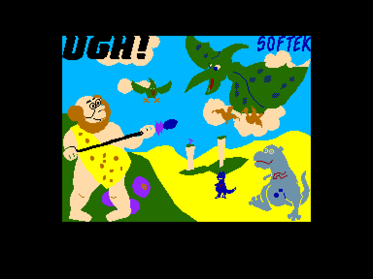
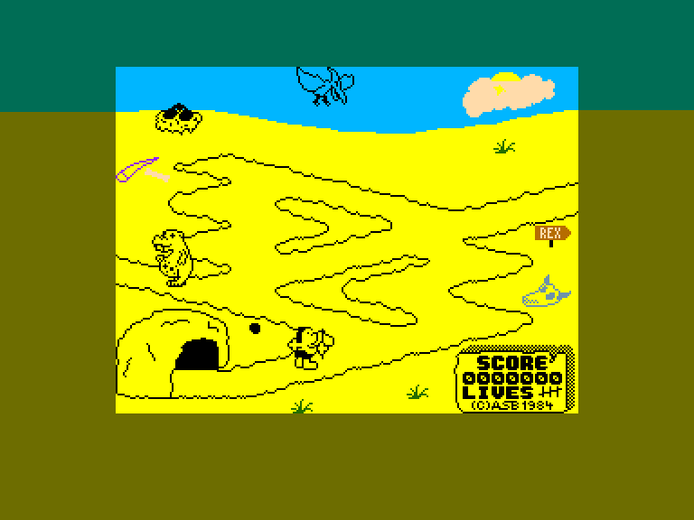
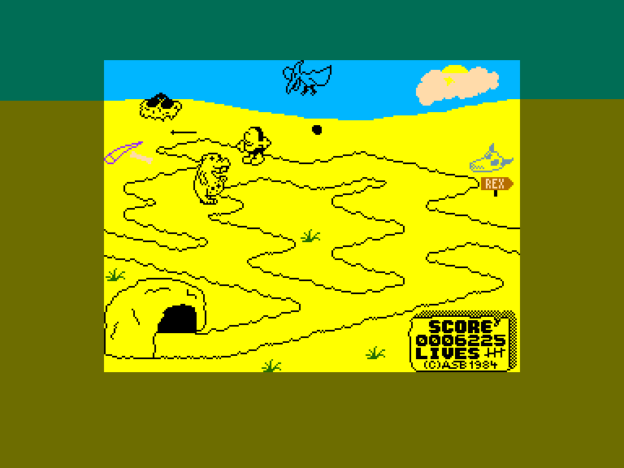
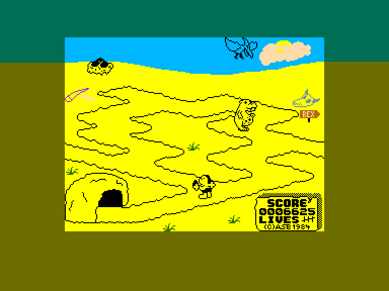

[0-9](../0/games-0.md) - [A](../a/games-a.md) - [B](../b/games-b.md) - [C](../c/games-c.md) - [D](../d/games-d.md) - [E](../e/games-e.md) - [F](../f/games-f.md) - [G](../g/games-g.md) - [H](../h/games-h.md) - [I](../i/games-i.md) - [J](../j/games-j.md) - [K](../k/games-k.md) - [L](../l/games-l.md) - [M](../m/games-m.md) - [N](../n/games-n.md) - [O](../o/games-o.md) - [P](../p/games-p.md) - [Q](../q/games-q.md) - [R](../r/games-r.md) - [S](../s/games-s.md) - [T](../t/games-t.md) - [U](../u/games-u.md) - [V](../v/games-v.md) - [W](../w/games-w.md) - [X](../x/games-x.md) - [Y](../y/games-y.md) - [Z](../z/games-z.md)

Ігри для [Enterprise 64k](../games-ep64.md) - [Enterprise 128k+RAMexp](../games-epramexp.md) - [2dfx](games-2dfx.md)

Ігри для систем [IS-DOS](../games-is-dos.md) - [SymbOS](../games-symbos.md) - [EDC Windows](../games-edcw.md)

Ігри для емуляторів [ZX Spectrum 48k/128k](../zxemu/games-zxemu.md) - [Amstrad CPC](../cpcemu/games-cpc.md) - [Sinclair ZX81](../zx81emu/games-zx81.md) - [Videoton TVC](../tvcemu/games-tvc.md) - [Commodore VIC-20](../vic20emu/games-vic20.md)

----------

# UGH!

**ID:** ugh-zx

## Скріншоти

## Опис

(temporary description generated by AI Assistant)

**Опис гри:**
У цій простій аркадній грі ви потрапляєте у дні доісторичного чоловіка, який готується до наступної льодовикової ери. Ваш герой, Птеррі, вирішив добути яйця літаючих ящірок, щоб поповнити запаси їжі. Вам потрібно викрасти яйця з гнізда, яке знаходиться неподалік, і принести їх до печери. Однак будьте обережні: на вас чекають небезпеки у вигляді Птеррі, який охороняє свої яйця, та голодного Тиранозавра Рекса, зустріч з яким може коштувати вам життя!

**Правила гри:**
1. Вам потрібно зібрати яйця, які знаходяться в гнізді, і повернутися з ними до печери.
2. Під час збору яєць уникайте Птеррі та Тиранозавра Рекса, оскільки зустріч з ними призведе до втрати життя.
3. Ви можете кидати спис у Тиранозавра, але це не завдасть йому шкоди, і ви залишитесь без зброї.
4. У грі є чотири рівні, і за збір шести яєць ви переходите на наступний рівень.
5. Для управління використовуйте клавіші: 'M' - вправо, 'I' - вниз, 'C' - вліво, 'R' - вправо, 'O' - кидок, 'SYMBOL SHIFT' - пауза.
6. Гра починається натисканням клавіші 'C'.
7. Ви можете налаштувати управління та рівень складності в меню гри.

Удачі у вашому пригоді в доісторичному світі!

## Основна інформація
- **Оригінальна платформа:** ZX Spectrum

## Посилання
- [Опис на ep128.hu (угорською)](http://www.ep128.hu/Games/UGH.htm)
- [Інформація про оригінальну версію](https://spectrumcomputing.co.uk/entry/5505/ZX-Spectrum/UGH)
- [Завантажити](http://www.ep128.hu/Ep_Games/Prg/Ugh.rar)

